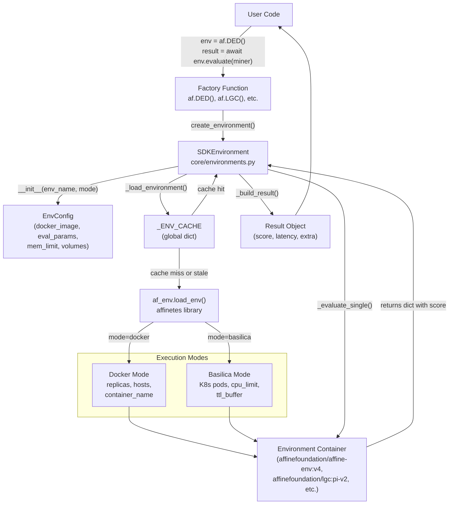
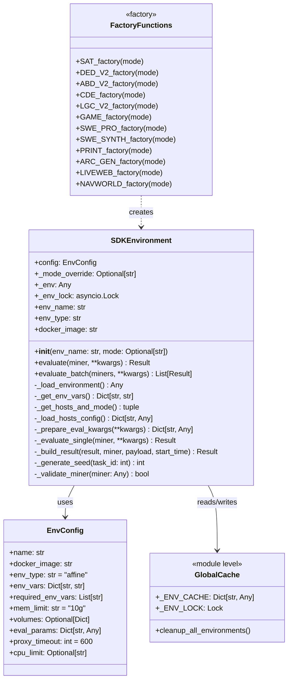
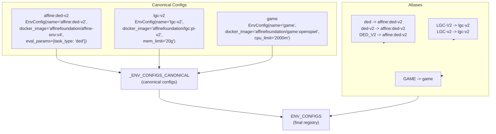
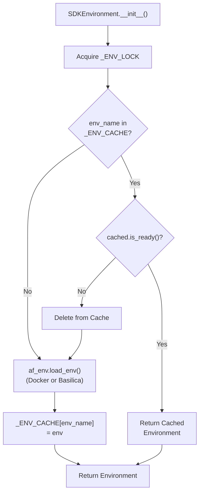

import CollapsibleAside from '../../../../components/CollapsibleAside.astro';
import SourceLink from '../../../../components/SourceLink.astro';
import Table from '../../../../components/Table.astro';

<CollapsibleAside title="Relevant Source Files">
  <SourceLink text=".env.example" href="https://github.com/AffineFoundation/affine-cortex/blob/main/.env.example" />
  <SourceLink text="README.md" href="https://github.com/AffineFoundation/affine-cortex/blob/main/README.md" />
  <SourceLink text="affine/__init__.py" href="https://github.com/AffineFoundation/affine-cortex/blob/main/affine/__init__.py" />
  <SourceLink text="affine/core/environments.py" href="https://github.com/AffineFoundation/affine-cortex/blob/main/affine/core/environments.py" />
  <SourceLink text="affine/database/system_config.json" href="https://github.com/AffineFoundation/affine-cortex/blob/main/affine/database/system_config.json" />
  <SourceLink text="affine/src/executor/config.py" href="https://github.com/AffineFoundation/affine-cortex/blob/main/affine/src/executor/config.py" />
  <SourceLink text="tests/test_private_repo_workflow.py" href="https://github.com/AffineFoundation/affine-cortex/blob/main/tests/test_private_repo_workflow.py" />
</CollapsibleAside>

This page documents how to use the Affine SDK to evaluate models against various evaluation environments. It covers the unified `SDKEnvironment` class, evaluation modes (miner-based and direct), execution modes (Docker and Basilica), environment configuration, and result handling.

For information about setting up the SDK and importing modules, see [SDK Overview & Setup](/subnets/sdk-reference/sdk-overview-setup#6.1). For querying miner metadata, see [Miner Discovery API](/subnets/sdk-reference/miner-discovery-api#6.3). For accessing historical evaluation data, see [Data Access & History](/subnets/sdk-reference/data-access-history#6.4).

## Overview

The Affine SDK provides a unified interface for evaluating language models across 12+ environments including DED-V2, ABD-V2, CDE, LGC-V2, GAME, SWE-SYNTH, PRINT, ARC-GEN, LIVEWEB, and NAVWORLD. Evaluations execute inside Docker containers or Kubernetes pods managed by the Affinetes library, ensuring reproducibility and isolation.

The SDK supports two evaluation modes:
1. **Miner-based evaluation**: Evaluate models deployed on Chutes using miner UIDs via `env.evaluate(miner)`
2. **Direct evaluation**: Evaluate any OpenAI-compatible endpoint by providing `model` and `base_url` parameters

All environments share a unified `SDKEnvironment` class with consistent APIs, while individual `EnvConfig` objects define environment-specific parameters like Docker images, timeouts, and required credentials.

Sources: <SourceLink text="affine/core/environments.py:317-613" href="https://github.com/AffineFoundation/affine-cortex/blob/main/affine/core/environments.py#L317-L613" />, <SourceLink text="affine/__init__.py:36-59" href="https://github.com/AffineFoundation/affine-cortex/blob/main/affine/__init__.py#L36-L59" />, <SourceLink text="README.md:72-87" href="https://github.com/AffineFoundation/affine-cortex/blob/main/README.md#L72-L87" />

## Architecture

### Evaluation Flow



**Figure 1: Environment Evaluation Flow**

The evaluation flow consists of four stages:

1. **Factory Creation**: User calls environment factory (e.g., `af.DED()`) which creates an `SDKEnvironment` instance
2. **Environment Loading**: `_load_environment()` checks the global cache, loads configuration, and spawns containers via Affinetes
3. **Evaluation Execution**: `_evaluate_single()` sends task payload to container and waits for response
4. **Result Building**: `_build_result()` parses container response into a `Result` object with score, latency, and metadata

Sources: <SourceLink text="affine/core/environments.py:317-528" href="https://github.com/AffineFoundation/affine-cortex/blob/main/affine/core/environments.py#L317-L528" />, <SourceLink text="affine/core/environments.py:551-586" href="https://github.com/AffineFoundation/affine-cortex/blob/main/affine/core/environments.py#L551-L586" />

### SDKEnvironment Class Structure



**Figure 2: SDKEnvironment Class Structure**

The `SDKEnvironment` class is a unified implementation that replaces the previous class hierarchy. All environments (DED, LGC, GAME, etc.) use the same class, with behavior controlled by the `EnvConfig` object. Factory functions provide convenient access while maintaining backward compatibility.

Sources: <SourceLink text="affine/core/environments.py:317-613" href="https://github.com/AffineFoundation/affine-cortex/blob/main/affine/core/environments.py#L317-L613" />, <SourceLink text="affine/core/environments.py:58-78" href="https://github.com/AffineFoundation/affine-cortex/blob/main/affine/core/environments.py#L58-L78" />, <SourceLink text="affine/core/environments.py:659-698" href="https://github.com/AffineFoundation/affine-cortex/blob/main/affine/core/environments.py#L659-L698" />

### Environment Configuration Registry



**Figure 3: Environment Configuration Registry**

The environment registry uses a two-tier system:

1. **Canonical Configs** (`_ENV_CONFIGS_CANONICAL`): Define base configurations with all parameters
2. **Aliases** (`_ENV_ALIASES`): Map multiple names to canonical configs (e.g., `"DED"`, `"ded"`, `"ded-v2"` all map to `"affine:ded-v2"`)

The final `ENV_CONFIGS` dictionary contains both canonical entries and all aliases, allowing flexible environment lookup by name.

Sources: <SourceLink text="affine/core/environments.py:83-312" href="https://github.com/AffineFoundation/affine-cortex/blob/main/affine/core/environments.py#L83-L312" />

## Evaluation Modes

### Miner-Based Evaluation

Miner-based evaluation queries models deployed on Chutes by their Bittensor UID. This mode requires a `Miner` object obtained from the `af.miners()` function.

**Basic Usage:**

```python
import asyncio
import affine as af

async def main():
    # Get miner info for UID 160
    miner = await af.miners(160)
    
    # Create environment and evaluate
    env = af.DED_V2()
    result = await env.evaluate(miner, task_id=42)
    
    print(f"Score: {result.score}")
    print(f"Latency: {result.latency_seconds}s")
    print(f"Success: {result.success}")
```

**How it works:**

1. The `Miner` object contains `model`, `slug`, `hotkey`, and `revision` attributes
2. `_evaluate_single()` constructs the payload with `base_url = f"https://{miner.slug}.chutes.ai/v1"`
3. The environment container sends requests to the Chutes endpoint
4. Result is returned as a single `Result` object with miner metadata

**Payload Construction:**

The evaluation payload includes miner information and task parameters:

```python
payload = {
    "task_id": 42,
    "seed": 123456,  # Auto-generated if not provided
    "temperature": 0.0,
    "timeout": 600,
    "model": "username/Affine-Qwen3-32B-hotkey123",
    "base_url": "https://username-model-chute.chutes.ai/v1"
}
```

Sources: <SourceLink text="affine/core/environments.py:551-586" href="https://github.com/AffineFoundation/affine-cortex/blob/main/affine/core/environments.py#L551-L586" />, <SourceLink text="affine/core/models.py:15-16" href="https://github.com/AffineFoundation/affine-cortex/blob/main/affine/core/models.py#L15-L16" />

### Direct Evaluation

Direct evaluation allows testing any OpenAI-compatible model endpoint without requiring deployment on Chutes. The `model` and `base_url` parameters are passed directly to the evaluation payload.

**Basic Usage:**

```python
import asyncio
import affine as af

async def main():
    # Evaluate without a miner object
    env = af.DED_V2()
    result = await env.evaluate(
        miner=None,  # Can be omitted
        task_id=42,
        model="deepseek-ai/DeepSeek-V3",
        base_url="https://llm.chutes.ai/v1",
        temperature=0.7
    )
    
    # Result object has empty miner metadata
    print(f"Score: {result.score}")
    print(f"Miner hotkey: {result.miner_hotkey}")  # Empty string
```

**Key differences from miner-based evaluation:**

- No `Miner` object required (pass `miner=None` or omit)
- Must provide both `model` and `base_url` in `**kwargs`
- Returns a `Result` object with empty `miner_hotkey` and `model_revision`
- Useful for local model servers (e.g., `http://localhost:8000/v1`)

**Common Use Cases:**

```python
# Local model testing
result = await env.evaluate(
    task_id=10,
    model="qwen3-32b",
    base_url="http://localhost:8000/v1"
)

# Alternative inference platform
result = await env.evaluate(
    task_id=10,
    model="meta-llama/Llama-3.3-70B-Instruct",
    base_url="https://api.together.xyz/v1"
)
```

Sources: <SourceLink text="affine/core/environments.py:551-586" href="https://github.com/AffineFoundation/affine-cortex/blob/main/affine/core/environments.py#L551-L586" />, <SourceLink text="affine/core/environments.py:556-566" href="https://github.com/AffineFoundation/affine-cortex/blob/main/affine/core/environments.py#L556-L566" />

### Batch Evaluation

Evaluate multiple miners in parallel using `evaluate()` with a dictionary or `evaluate_batch()` with a list:

**Dictionary-Based:**

```python
async def main():
    miners = await af.miners([7, 160, 180])
    env = af.LGC_V2()
    
    # Pass dict: returns Dict[str, Result]
    results = await env.evaluate(miners, task_id=50)
    
    for uid, result in results.items():
        print(f"UID {uid}: score={result.score}")
```

**List-Based:**

```python
async def main():
    miners = await af.miners([7, 160, 180])
    env = af.LGC_V2()
    
    # Pass list: returns List[Result]
    results = await env.evaluate_batch(list(miners.values()), task_id=50)
    
    for result in results:
        print(f"Score: {result.score}")
```

Sources: <SourceLink text="affine/core/environments.py:588-606" href="https://github.com/AffineFoundation/affine-cortex/blob/main/affine/core/environments.py#L588-L606" />, <SourceLink text="affine/core/environments.py:602-606" href="https://github.com/AffineFoundation/affine-cortex/blob/main/affine/core/environments.py#L602-L606" />

## Available Environments

### Environment Catalog

The SDK provides 12+ environments across different domains:

<Table>

| Factory Function | Environment Name | Docker Image | Memory | Description |
|-----------------|------------------|--------------|--------|-------------|
| `af.DED()` / `af.DED_V2()` | `affine:ded-v2` | `affinefoundation/affine-env:v4` | 10g | Deductive reasoning (DED) tasks |
| `af.ABD()` / `af.ABD_V2()` | `affine:abd-v2` | `affinefoundation/affine-env:v4` | 10g | Abductive reasoning (ABD) tasks |
| `af.CDE()` | `cde` | `affinefoundation/cde:pi` | 25g | Code debugging environment |
| `af.LGC()` | `lgc` | `affinefoundation/lgc:pi` | 20g | Logic grid puzzles (v1) |
| `af.LGC_V2()` | `lgc-v2` | `affinefoundation/lgc:pi-v2` | 20g | Logic grid puzzles (v2) |
| `af.GAME()` | `game` | `affinefoundation/game:openspiel` | 8g | Multi-agent game playing |
| `af.SWEPRO()` | `swe-pro` | `affinefoundation/swebench:pro` | 10g | SWE-bench Pro coding tasks |
| `af.SWESYNTH()` | `swe-synth` | `affinefoundation/swebench:synth` | 10g | SWE-bench Synthetic tasks |
| `af.PRINT()` | `print` | `affinefoundation/cde:print` | 10g | Print debugging tasks |
| `af.ARCGEN()` | `arc-gen` | `affinefoundation/arc:latest` | 10g | ARC-AGI generation tasks |
| `af.LIVEWEB()` | `liveweb` | `affinefoundation/liveweb-arena:latest` | 20g | Browser-based web interaction |
| `af.NAVWORLD()` | `navworld` | `affinefoundation/navworld:latest` | 5g | Travel planning with MCP tools |

</Table>


**Environment Aliases:**

Multiple names can reference the same environment:
- `"DED"`, `"ded"`, `"ded-v2"`, `"affine:ded-v2"` all map to `affine:ded-v2`
- `"LGC-V2"`, `"LGC-v2"`, `"lgc-v2"` all map to `lgc-v2`
- `"GAME"`, `"game"` both map to `game`

Sources: <SourceLink text="affine/core/environments.py:83-260" href="https://github.com/AffineFoundation/affine-cortex/blob/main/affine/core/environments.py#L83-L260" />, <SourceLink text="affine/core/environments.py:263-302" href="https://github.com/AffineFoundation/affine-cortex/blob/main/affine/core/environments.py#L263-L302" />, <SourceLink text="affine/__init__.py:36-51" href="https://github.com/AffineFoundation/affine-cortex/blob/main/affine/__init__.py#L36-L51" />

### Environment Configuration Examples

**Affine Environments (DED/ABD):**

```python
EnvConfig(
    name="affine:ded-v2",
    docker_image="affinefoundation/affine-env:v4",
    env_vars={"UVICORN_WORKERS": "10"},
    eval_params={
        "task_type": "ded",      # Sent as ENV_NAME to container
        "temperature": 0.0,
        "timeout": 600,
    }
)
```

**SWE-bench Environments (Require DOOD):**

```python
EnvConfig(
    name="swe-synth",
    docker_image="affinefoundation/swebench:synth",
    env_type="swebench",
    required_env_vars=["DOCKER_HUB_USERNAME", "DOCKER_HUB_TOKEN", "HF_TOKEN"],
    volumes={
        "/var/run/docker.sock": {
            "bind": "/var/run/docker.sock",
            "mode": "rw"
        }
    },
    eval_params={
        "max_iterations": 30,
        "temperature": 0.0,
        "timeout": 7200,
    },
    proxy_timeout=7300,
)
```

**LiveWeb Environment (Requires API Keys):**

```python
EnvConfig(
    name="liveweb",
    docker_image="affinefoundation/liveweb-arena:latest",
    env_type="liveweb",
    mem_limit="20g",
    required_env_vars=["COINGECKO_API_KEY"],
    volumes={
        "/var/lib/liveweb-arena/cache": {
            "bind": "/var/lib/liveweb-arena/cache",
            "mode": "rw",
        },
    },
    eval_params={
        "temperature": 0.0,
        "timeout": 7200,
        "max_concurrency": 10,
    },
    proxy_timeout=7300,
)
```

Sources: <SourceLink text="affine/core/environments.py:84-234" href="https://github.com/AffineFoundation/affine-cortex/blob/main/affine/core/environments.py#L84-L234" />

### Listing Available Environments

Query all available environments programmatically:

```python
from affine import tasks

# Returns dict grouped by env_type
envs = tasks.list_available_environments()

# Example output:
# {
#   "affine": ["affine:abd-v2", "affine:ded-v2", ...],
#   "swebench": ["swe-pro", "swe-synth"],
#   "liveweb": ["liveweb"],
#   "navworld": ["navworld"],
#   ...
# }

# Print all environments
for env_type, env_list in envs.items():
    print(f"{env_type}: {', '.join(env_list)}")
```

Sources: <SourceLink text="affine/core/environments.py:627-637" href="https://github.com/AffineFoundation/affine-cortex/blob/main/affine/core/environments.py#L627-L637" />, <SourceLink text="affine/__init__.py:54-59" href="https://github.com/AffineFoundation/affine-cortex/blob/main/affine/__init__.py#L54-L59" />

### Dynamic Environment Creation

Create environments by name:

```python
from affine.core.environments import create_environment

# Create by canonical name
env = create_environment("affine:ded-v2")
result = await env.evaluate(miner, task_id=10)

# Create by alias
env = create_environment("DED")  # Same as above
result = await env.evaluate(miner, task_id=10)

# With execution mode override
env = create_environment("lgc-v2", mode="basilica")
result = await env.evaluate(miner, task_id=50)
```

Sources: <SourceLink text="affine/core/environments.py:617-624" href="https://github.com/AffineFoundation/affine-cortex/blob/main/affine/core/environments.py#L617-L624" />

## Task Selection and Seeding

### Task ID Parameter

All environments support task selection via the `task_id` parameter:

```python
# Specific task
env = af.DED_V2()
result = await env.evaluate(miner, task_id=42)

# Task ID is recorded in result
print(result.task_id)  # 42
```

If `task_id` is not provided, it must be specified by the user (no automatic random selection occurs at the SDK level, though the environment container may have its own defaults).

Sources: <SourceLink text="affine/core/environments.py:536-549" href="https://github.com/AffineFoundation/affine-cortex/blob/main/affine/core/environments.py#L536-L549" />

### Deterministic Seed Generation

The SDK automatically generates deterministic seeds based on environment name and task ID:

```python
# Automatic seed generation
env = af.DED_V2()
result = await env.evaluate(miner, task_id=42)
# Seed = sha256("affine:ded-v2:42")[:8] as int

# Manual seed override
result = await env.evaluate(miner, task_id=42, seed=999999)
```

**Seed Generation Algorithm:**

The `_generate_seed()` method ensures reproducibility:

1. Concatenate environment name and task ID: `f"{env_name}:{task_id}"`
2. Compute SHA256 hash of the string
3. Take first 8 bytes and convert to integer
4. Modulo 2^32 to fit in uint32 range

This ensures the same task on the same environment always gets the same seed, making evaluations reproducible.

Sources: <SourceLink text="affine/core/environments.py:530-534" href="https://github.com/AffineFoundation/affine-cortex/blob/main/affine/core/environments.py#L530-L534" />, <SourceLink text="affine/core/environments.py:542-543" href="https://github.com/AffineFoundation/affine-cortex/blob/main/affine/core/environments.py#L542-L543" />

### Evaluation Parameters

Override default evaluation parameters per-call:

```python
# Override temperature
env = af.LGC_V2()
result = await env.evaluate(miner, task_id=10, temperature=0.7)

# Override timeout
result = await env.evaluate(miner, task_id=10, timeout=1800)

# Environment-specific parameters
game_env = af.GAME()
result = await game_env.evaluate(miner, task_id=5, temperature=0.0, timeout=7200)
```

**Parameter Merging:**

The `_prepare_eval_kwargs()` method merges parameters in priority order:

1. User-provided `**kwargs` (highest priority)
2. `EnvConfig.eval_params` (defaults from configuration)
3. Auto-generated values (seed, if not provided)

Sources: <SourceLink text="affine/core/environments.py:536-549" href="https://github.com/AffineFoundation/affine-cortex/blob/main/affine/core/environments.py#L536-L549" />

## Result Structure

### Result Object

The `Result` dataclass contains evaluation outcomes and metadata:

```python
@dataclass
class Result:
    miner_hotkey: str           # Miner's hotkey (empty for direct eval)
    model_revision: str         # HuggingFace model revision SHA
    env: str                    # Environment name (e.g., "affine:ded-v2")
    score: float                # Normalized score [0.0, 1.0]
    latency_seconds: float      # Evaluation duration
    success: bool               # Whether evaluation completed successfully
    error: Optional[str]        # Error message if failed
    task_id: Optional[int]      # Task ID if specified
    extra: Dict[str, Any]       # Additional metadata
    timestamp: float            # Unix timestamp
```

**Key Fields:**

- `miner_hotkey`: Bittensor hotkey (empty string for direct evaluation)
- `model_revision`: HuggingFace commit SHA for reproducibility
- `score`: Primary metric, typically normalized to [0.0, 1.0]
- `success`: `True` if evaluation completed without errors
- `latency_seconds`: Total time from request to response (including network)
- `extra`: Contains `image`, `request`, and environment-specific data

Sources: <SourceLink text="affine/core/models.py:15-16" href="https://github.com/AffineFoundation/affine-cortex/blob/main/affine/core/models.py#L15-L16" />, <SourceLink text="affine/core/environments.py:568-586" href="https://github.com/AffineFoundation/affine-cortex/blob/main/affine/core/environments.py#L568-L586" />

### Result Building Process

The `_build_result()` method constructs `Result` objects from container responses:

```python
# Container returns dict
container_response = {
    "score": 0.85,
    "success": True,
    "error": None,
    "extra": {"steps": 10, "reasoning": "..."}
}

# _build_result() adds metadata
result = Result(
    miner_hotkey=miner.hotkey,
    model_revision=miner.revision,
    env="affine:ded-v2",
    score=0.85,
    latency_seconds=42.3,
    success=True,
    error=None,
    task_id=42,
    extra={
        "image": "affinefoundation/affine-env:v4",
        "request": {"task_id": 42, "seed": 123456, "temperature": 0.0, ...},
        "steps": 10,
        "reasoning": "..."
    },
    timestamp=1704067200.0
)
```

**Metadata Enrichment:**

The `extra` field always includes:
- `image`: Docker image used for evaluation
- `request`: Complete request payload sent to container
- Additional fields from container response (environment-specific)

Sources: <SourceLink text="affine/core/environments.py:568-586" href="https://github.com/AffineFoundation/affine-cortex/blob/main/affine/core/environments.py#L568-L586" />

### Error Handling

Failed evaluations return `Result` objects with `success=False`:

```python
# Example: Evaluation timeout
result = Result(
    miner_hotkey="5F3sa2TJAWMqDhXG6jhV4N8ko9SxwGy8TpaNS1repo5EYjQX",
    model_revision="abc123def456",
    env="lgc-v2",
    score=0.0,
    latency_seconds=1800.0,  # Timed out at configured limit
    success=False,
    error="Evaluation timeout after 1800s",
    task_id=50,
    extra={
        "image": "affinefoundation/lgc:pi-v2",
        "request": {"task_id": 50, ...}
    },
    timestamp=1704067200.0
)

# Example: Container error
result = Result(
    miner_hotkey="5F3sa2TJAWMqDhXG6jhV4N8ko9SxwGy8TpaNS1repo5EYjQX",
    model_revision="abc123def456",
    env="swe-synth",
    score=0.0,
    success=False,
    error="Container exception: Docker daemon unavailable",
    task_id=10,
    extra={"image": "affinefoundation/swebench:synth", ...}
)
```

Sources: <SourceLink text="affine/core/environments.py:568-586" href="https://github.com/AffineFoundation/affine-cortex/blob/main/affine/core/environments.py#L568-L586" />

## Configuration

### EnvConfig Parameters

Each environment is configured via an `EnvConfig` dataclass:

<Table>

| Parameter | Type | Default | Description |
|-----------|------|---------|-------------|
| `name` | `str` | - | Environment canonical name |
| `docker_image` | `str` | - | Docker image URI |
| `env_type` | `str` | `"affine"` | Environment type classification |
| `env_vars` | `Dict[str, str]` | `{}` | Container environment variables |
| `required_env_vars` | `List[str]` | `[]` | Host env vars to forward (e.g., API keys) |
| `mem_limit` | `str` | `"10g"` | Memory limit (Docker: `"10g"`, Basilica: `"10Gi"`) |
| `volumes` | `Optional[Dict]` | `None` | Volume mounts (for DOOD, cache, etc.) |
| `eval_params` | `Dict[str, Any]` | `{"temperature": 0.0, "timeout": 600}` | Default evaluation parameters |
| `proxy_timeout` | `int` | `600` | HTTP proxy timeout (must exceed `eval_params["timeout"]`) |
| `cpu_limit` | `Optional[str]` | `None` | CPU limit for Basilica mode (e.g., `"2000m"`) |

</Table>


**Example Configuration:**

```python
EnvConfig(
    name="lgc-v2",
    docker_image="affinefoundation/lgc:pi-v2",
    mem_limit="20g",
    env_vars={"UVICORN_WORKERS": "30"},
    eval_params={
        "temperature": 0.0,
        "timeout": 1800,
    },
    proxy_timeout=1820,
)
```

Sources: <SourceLink text="affine/core/environments.py:58-78" href="https://github.com/AffineFoundation/affine-cortex/blob/main/affine/core/environments.py#L58-L78" />

### Evaluation Parameters

The `eval_params` dictionary defines default evaluation parameters merged into each request:

**Common Parameters:**

- `temperature` (float): Model sampling temperature (0.0 = greedy)
- `timeout` (int): Evaluation timeout in seconds
- `task_type` (str): Affine environments only, sets `ENV_NAME` container variable

**Environment-Specific Parameters:**

- `max_iterations` (int): SWE-bench environments, max agent iterations
- `num_train` (int): ARC-GEN environment, number of training examples
- `max_concurrency` (int): LIVEWEB environment, concurrent browser sessions

**Parameter Override:**

```python
# Use defaults from EnvConfig
env = af.LGC_V2()
result = await env.evaluate(miner, task_id=10)
# Uses temperature=0.0, timeout=1800

# Override per-evaluation
result = await env.evaluate(miner, task_id=10, temperature=0.7, timeout=3600)
```

Sources: <SourceLink text="affine/core/environments.py:70-73" href="https://github.com/AffineFoundation/affine-cortex/blob/main/affine/core/environments.py#L70-L73" />, <SourceLink text="affine/core/environments.py:536-549" href="https://github.com/AffineFoundation/affine-cortex/blob/main/affine/core/environments.py#L536-L549" />

### Required Environment Variables

Some environments require credentials or API keys from the host environment. These are specified in `required_env_vars` and automatically forwarded to the container:

**SWE-bench Environments:**

```bash
# Required for SWE-SYNTH
export DOCKER_HUB_USERNAME=myusername
export DOCKER_HUB_TOKEN=dckr_pat_xxxxx
export HF_TOKEN=hf_xxxxx
```

```python
# Automatically forwarded when creating environment
env = af.SWESYNTH()
# Raises ValueError if any required_env_vars are missing
```

**LiveWeb Environment:**

```bash
# Required for LIVEWEB
export COINGECKO_API_KEY=CG-xxxxx
```

**NavWorld Environment:**

```bash
# Required for NAVWORLD
export AMAP_MAPS_API_KEY=xxxxx
```

Sources: <SourceLink text="affine/core/environments.py:67" href="https://github.com/AffineFoundation/affine-cortex/blob/main/affine/core/environments.py#L67" />, <SourceLink text="affine/core/environments.py:348-363" href="https://github.com/AffineFoundation/affine-cortex/blob/main/affine/core/environments.py#L348-L363" />, <SourceLink text="affine/core/environments.py:172-191" href="https://github.com/AffineFoundation/affine-cortex/blob/main/affine/core/environments.py#L172-L191" />, <SourceLink text="affine/core/environments.py:215-233" href="https://github.com/AffineFoundation/affine-cortex/blob/main/affine/core/environments.py#L215-L233" />, <SourceLink text="affine/core/environments.py:239-259" href="https://github.com/AffineFoundation/affine-cortex/blob/main/affine/core/environments.py#L239-L259" />

### Volume Mounts

Some environments require volume mounts for Docker-out-of-Docker (DOOD) or persistent caching:

**SWE-bench (DOOD):**

```python
volumes={
    "/var/run/docker.sock": {
        "bind": "/var/run/docker.sock",
        "mode": "rw"
    }
}
```

**LiveWeb (Browser Cache):**

```python
volumes={
    "/var/lib/liveweb-arena/cache": {
        "bind": "/var/lib/liveweb-arena/cache",
        "mode": "rw",
    },
}
```

**NavWorld (QQR Cache):**

```python
volumes={
    "/var/lib/navworld/cache": {
        "bind": "/var/lib/navworld/cache",
        "mode": "rw",
    },
}
```

Sources: <SourceLink text="affine/core/environments.py:158-163" href="https://github.com/AffineFoundation/affine-cortex/blob/main/affine/core/environments.py#L158-L163" />, <SourceLink text="affine/core/environments.py:179-191" href="https://github.com/AffineFoundation/affine-cortex/blob/main/affine/core/environments.py#L179-L191" />, <SourceLink text="affine/core/environments.py:222-227" href="https://github.com/AffineFoundation/affine-cortex/blob/main/affine/core/environments.py#L222-L227" />, <SourceLink text="affine/core/environments.py:247-252" href="https://github.com/AffineFoundation/affine-cortex/blob/main/affine/core/environments.py#L247-L252" />

## Execution Modes

### Docker Mode vs Basilica Mode

The SDK supports two execution modes for running environment containers:

<Table>

| Mode | Backend | Use Case | Configuration |
|------|---------|----------|---------------|
| **Docker** | Local/remote Docker daemons | Development, multi-host deployment | `replicas`, `hosts`, `container_name` |
| **Basilica** | Kubernetes (Pods) | Production, auto-scaling, resource isolation | `cpu_limit`, `ttl_buffer` |

</Table>


**Mode Selection Priority:**

1. `mode` parameter passed to factory function or `SDKEnvironment.__init__()`
2. `mode` field in `affinetes_hosts.json` configuration file
3. `AFFINETES_MODE` environment variable
4. Default: `"docker"`

Sources: <SourceLink text="affine/core/environments.py:320-333" href="https://github.com/AffineFoundation/affine-cortex/blob/main/affine/core/environments.py#L320-L333" />, <SourceLink text="affine/core/environments.py:452-485" href="https://github.com/AffineFoundation/affine-cortex/blob/main/affine/core/environments.py#L452-L485" />

### Docker Mode Configuration

Docker mode deploys containers to local or remote Docker daemons with replica support for load balancing.

**Configuration File (`affinetes_hosts.json`):**

```json
{
  "lgc-v2": {
    "hosts": ["host1.example.com", "host2.example.com"],
    "mode": "docker"
  },
  "game": {
    "hosts": ["localhost"],
    "mode": "docker"
  },
  "default": {
    "hosts": ["localhost"],
    "mode": "docker"
  }
}
```

**Configuration Lookup Paths:**

1. `$AFFINETES_HOSTS_CONFIG` (env var)
2. `./affinetes_hosts.json` (current directory)
3. `~/.affine/hosts.json` (home directory)
4. `/etc/affine/hosts.json` (system-wide)

**Example Usage:**

```python
# Uses config file
env = af.LGC_V2()  # Deploys to host1 and host2 if configured

# Override mode per-environment
env = af.LGC_V2(mode="docker")

# Total replicas = DEFAULT_REPLICAS * len(hosts)
```

**Docker Mode Parameters:**

The `_load_environment()` method passes Docker-specific parameters to Affinetes:

```python
load_kwargs = {
    "image": "affinefoundation/lgc:pi-v2",
    "mode": "docker",
    "replicas": 1,  # Base replicas (multiplied by host count)
    "hosts": ["host1", "host2"],
    "container_name": "lgc-v2",
    "force_recreate": True,
    "mem_limit": "20g",
    "env_vars": {"UVICORN_WORKERS": "30", "CHUTES_API_KEY": "..."},
    "volumes": {...},  # If configured
    "pull": True,
}
```

Sources: <SourceLink text="affine/core/environments.py:407-450" href="https://github.com/AffineFoundation/affine-cortex/blob/main/affine/core/environments.py#L407-L450" />, <SourceLink text="affine/core/environments.py:493-522" href="https://github.com/AffineFoundation/affine-cortex/blob/main/affine/core/environments.py#L493-L522" />

### Basilica Mode Configuration

Basilica mode deploys to Kubernetes, providing better resource isolation and auto-scaling capabilities.

**Configuration:**

```json
{
  "game": {
    "mode": "basilica"
  },
  "navworld": {
    "mode": "basilica"
  }
}
```

**Basilica Mode Parameters:**

```python
load_kwargs = {
    "image": "affinefoundation/game:openspiel",
    "mode": "basilica",
    "cpu_limit": "2000m",      # From EnvConfig.cpu_limit or default
    "ttl_buffer": 7400,        # From EnvConfig.proxy_timeout
    "mem_limit": "8Gi",        # Converted from "8g" (Docker format)
    "env_vars": {"UVICORN_WORKERS": "50", "CHUTES_API_KEY": "..."},
    "volumes": {...},          # If configured
    "pull": True,
}
```

**Memory Format Conversion:**

Docker memory limits are automatically converted to Kubernetes format:
- `"10g"` → `"10Gi"`
- `"512m"` → `"512Mi"`

The `convert_memory_format()` utility handles this conversion transparently.

Sources: <SourceLink text="affine/core/environments.py:493-522" href="https://github.com/AffineFoundation/affine-cortex/blob/main/affine/core/environments.py#L493-L522" />, <SourceLink text="affine/core/environments.py:26-53" href="https://github.com/AffineFoundation/affine-cortex/blob/main/affine/core/environments.py#L26-L53" />

### Mode Override Examples

**Per-Environment Override:**

```python
# Force Docker mode
env = af.GAME(mode="docker")
result = await env.evaluate(miner, task_id=5)

# Force Basilica mode
env = af.GAME(mode="basilica")
result = await env.evaluate(miner, task_id=5)
```

**Environment Variable Override:**

```bash
# Set globally for all environments
export AFFINETES_MODE=basilica
```

```python
# All environments use Basilica unless overridden
env1 = af.LGC_V2()  # Uses Basilica
env2 = af.GAME()    # Uses Basilica
env3 = af.DED_V2(mode="docker")  # Override to Docker
```

Sources: <SourceLink text="affine/core/environments.py:472-485" href="https://github.com/AffineFoundation/affine-cortex/blob/main/affine/core/environments.py#L472-L485" />

## Environment Caching

### Cache Mechanism

Environments are cached at the module level to avoid repeated container initialization. The cache is keyed by environment name and uses thread-safe access via `_ENV_LOCK`.



**Figure 4: Environment Cache Strategy**

**Cache Key Structure:**

The cache key is the environment name (e.g., `"affine:ded-v2"`, `"lgc-v2"`), not the alias. Multiple `SDKEnvironment` instances for the same environment share the cached Affinetes environment object.

**Staleness Detection:**

The `is_ready()` method (from Affinetes) checks if the environment container/pod is still running. If not ready, the cache entry is removed and the environment is reloaded.

Sources: <SourceLink text="affine/core/environments.py:18-21" href="https://github.com/AffineFoundation/affine-cortex/blob/main/affine/core/environments.py#L18-L21" />, <SourceLink text="affine/core/environments.py:452-528" href="https://github.com/AffineFoundation/affine-cortex/blob/main/affine/core/environments.py#L452-L528" />

### Cache Cleanup

Manually clean up all cached environments:

```python
from affine.core.environments import cleanup_all_environments

# Clean up all cached environments
cleanup_all_environments()

# Creates new environments on next evaluation
env = af.DED_V2()  # Loads fresh environment
```

**Cleanup Process:**

The `cleanup_all_environments()` function:

1. Iterates through `_ENV_CACHE`
2. Calls `await env.cleanup()` on each environment
3. Clears the cache dictionary

This is useful for:
- Freeing resources after batch evaluations
- Forcing environment recreation with updated configuration
- Cleaning up stale containers before process exit

Sources: <SourceLink text="affine/core/environments.py:640-653" href="https://github.com/AffineFoundation/affine-cortex/blob/main/affine/core/environments.py#L640-L653" />

### Cache Behavior with Different Modes

Cached environments are mode-specific. If you create an environment with `mode="docker"`, then create the same environment with `mode="basilica"`, the cache will be invalidated and reloaded:

```python
# First call: loads Docker container
env1 = af.GAME(mode="docker")
# Cache: {"game": <Docker environment>}

# Second call with different mode: invalidates cache, loads Basilica pod
env2 = af.GAME(mode="basilica")
# Cache: {"game": <Basilica environment>}

# Third call with same mode: uses cached Basilica pod
env3 = af.GAME(mode="basilica")
# Cache hit
```

Mode changes trigger cache invalidation because the environment name remains the same, but the underlying Affinetes environment object is different.

Sources: <SourceLink text="affine/core/environments.py:452-528" href="https://github.com/AffineFoundation/affine-cortex/blob/main/affine/core/environments.py#L452-L528" />

## Advanced Usage

### Custom Environment Variables

Forward custom environment variables to containers:

```python
import os

# Set host environment variable
os.environ["MY_CUSTOM_VAR"] = "value123"

# Not automatically forwarded unless in required_env_vars
# Must modify EnvConfig or use environment-specific mechanism
```

For environments with `required_env_vars`, missing variables raise `ValueError`:

```python
# Missing required COINGECKO_API_KEY
env = af.LIVEWEB()
# ValueError: COINGECKO_API_KEY environment variable is required for environment 'liveweb'
```

Sources: <SourceLink text="affine/core/environments.py:348-363" href="https://github.com/AffineFoundation/affine-cortex/blob/main/affine/core/environments.py#L348-L363" />

### Custom Volumes

Environments with volume mounts require host directories to exist:

```bash
# Create cache directory for LiveWeb
mkdir -p /var/lib/liveweb-arena/cache

# Create cache directory for NavWorld
mkdir -p /var/lib/navworld/cache
```

```python
# Volumes automatically mounted if configured in EnvConfig
env = af.LIVEWEB()
result = await env.evaluate(miner, task_id=100)
```

Sources: <SourceLink text="affine/core/environments.py:69" href="https://github.com/AffineFoundation/affine-cortex/blob/main/affine/core/environments.py#L69" />, <SourceLink text="affine/core/environments.py:222-227" href="https://github.com/AffineFoundation/affine-cortex/blob/main/affine/core/environments.py#L222-L227" />, <SourceLink text="affine/core/environments.py:247-252" href="https://github.com/AffineFoundation/affine-cortex/blob/main/affine/core/environments.py#L247-L252" />

### Accessing Cached Environments

Access the global environment cache directly:

```python
from affine.core.environments import _ENV_CACHE

# Check if environment is cached
if "lgc-v2" in _ENV_CACHE:
    env = _ENV_CACHE["lgc-v2"]
    print(f"Cached environment ready: {env.is_ready()}")

# Manual cache manipulation (advanced)
# Not recommended unless you know what you're doing
_ENV_CACHE.pop("lgc-v2", None)  # Force reload on next use
```

Sources: <SourceLink text="affine/core/environments.py:18-21" href="https://github.com/AffineFoundation/affine-cortex/blob/main/affine/core/environments.py#L18-L21" />

### Parallel Evaluation Across Environments

Evaluate the same miner across multiple environments in parallel:

```python
import asyncio
import affine as af

async def main():
    miner = await af.miners(160)
    
    # Create multiple environments
    ded_env = af.DED_V2()
    lgc_env = af.LGC_V2()
    game_env = af.GAME()
    
    # Evaluate in parallel
    results = await asyncio.gather(
        ded_env.evaluate(miner, task_id=10),
        lgc_env.evaluate(miner, task_id=50),
        game_env.evaluate(miner, task_id=5),
    )
    
    ded_result, lgc_result, game_result = results
    print(f"DED: {ded_result.score}, LGC: {lgc_result.score}, GAME: {game_result.score}")

asyncio.run(main())
```

Sources: <SourceLink text="affine/core/environments.py:588-600" href="https://github.com/AffineFoundation/affine-cortex/blob/main/affine/core/environments.py#L588-L600" />

## Advanced Usage Examples

### Task Range Evaluation

Evaluate across a range of task IDs:

```python
async def evaluate_range(env, miner, start_id, end_id):
    results = []
    for task_id in range(start_id, end_id + 1):
        result = await env.evaluate(miner, task_id=task_id)
        results.append(result)
    return results

# Evaluate tasks 0-9
alfworld_env = af.ALFWORLD()
results = await evaluate_range(alfworld_env, miner, 0, 9)
```

Sources: <SourceLink text="scripts/evaluate_local_model.py:141-187" href="https://github.com/AffineFoundation/affine-cortex/blob/main/scripts/evaluate_local_model.py#L141-L187" />, <SourceLink text="scripts/evaluate_local_model.py:221-262" href="https://github.com/AffineFoundation/affine-cortex/blob/main/scripts/evaluate_local_model.py#L221-L262" />

### Mixed Evaluation Mode

Combine miner-based and direct evaluation:

```python
async def main():
    # Miner-based evaluation
    miner = await af.miners(7)
    ded_env = af.DED()
    result1 = await ded_env.evaluate(miner)
    
    # Direct evaluation on same environment
    result2 = await ded_env.evaluate(
        model="custom-model",
        base_url="http://localhost:8000/v1"
    )
    
    # Compare scores
    print(f"Miner score: {result1[7].score}")
    print(f"Local model score: {result2.score}")
```

Sources: <SourceLink text="examples/sdk.py:27-39" href="https://github.com/AffineFoundation/affine-cortex/blob/main/examples/sdk.py#L27-L39" />, <SourceLink text="examples/sdk2.py:20-37" href="https://github.com/AffineFoundation/affine-cortex/blob/main/examples/sdk2.py#L20-L37" />

### Custom Seed Control

Control randomization by providing explicit seeds:

```python
# Reproducible evaluation
result1 = await ded_env.evaluate(miner, seed=12345, task_id=42)
result2 = await ded_env.evaluate(miner, seed=12345, task_id=42)
# result1 and result2 should be identical

# Default behavior: random seed generated
result3 = await ded_env.evaluate(miner, task_id=42)
```

Seeds are automatically generated if not provided in `eval_kwargs`.

Sources: <SourceLink text="affine/tasks.py:229-233" href="https://github.com/AffineFoundation/affine-cortex/blob/main/affine/tasks.py#L229-L233" />

## Environment Registry

### Available Environments

List all registered environments:

```python
from affine.tasks import list_available_environments

envs = list_available_environments()
# Returns:
# {
#   "affine": ["affine:abd", "affine:ded", "affine:sat"],
#   "agentgym": ["agentgym:alfworld", "agentgym:babyai", 
#                "agentgym:sciworld", "agentgym:textcraft", 
#                "agentgym:webshop"]
# }
```

Sources: <SourceLink text="affine/tasks.py:656-668" href="https://github.com/AffineFoundation/affine-cortex/blob/main/affine/tasks.py#L656-L668" />, <SourceLink text="README.md:210-215" href="https://github.com/AffineFoundation/affine-cortex/blob/main/README.md#L210-L215" />

### Dynamic Environment Creation

Create environments by name:

```python
from affine.tasks import create_environment

# Create environment by name
env = await create_environment("affine:sat")
result = await env.evaluate(miner)

# With parameters
env = await create_environment("agentgym:alfworld", data_len=1000)
```

Sources: <SourceLink text="affine/tasks.py:635-653" href="https://github.com/AffineFoundation/affine-cortex/blob/main/affine/tasks.py#L635-L653" />

### Registration System

Environments are registered via the `@register_env` decorator:

```python
@register_env(EnvType.AFFINE, "affine:sat")
class SAT(AffineSDKEnv):
    DEFAULT_REPLICAS = 1
    DEFAULT_DATA_LEN = 500
    
    @property
    def env_name(self) -> str:
        return "affine:sat"
```

The `ENV_REGISTRY` dictionary maps environment names to classes for dynamic instantiation.

Sources: <SourceLink text="affine/tasks.py:497-510" href="https://github.com/AffineFoundation/affine-cortex/blob/main/affine/tasks.py#L497-L510" />, <SourceLink text="affine/tasks.py:514-523" href="https://github.com/AffineFoundation/affine-cortex/blob/main/affine/tasks.py#L514-L523" />
