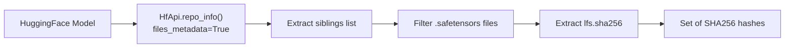
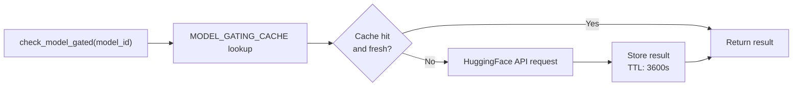

import CollapsibleAside from '../../../../components/CollapsibleAside.astro';
import SourceLink from '../../../../components/SourceLink.astro';
import Table from '../../../../components/Table.astro';

<CollapsibleAside title="Relevant Source Files">
  <SourceLink text=".env.example" href="https://github.com/AffineFoundation/affine-cortex/blob/main/.env.example" />
  <SourceLink text="README.md" href="https://github.com/AffineFoundation/affine-cortex/blob/main/README.md" />
  <SourceLink text="affine/__init__.py" href="https://github.com/AffineFoundation/affine-cortex/blob/main/affine/__init__.py" />
  <SourceLink text="tests/test_private_repo_workflow.py" href="https://github.com/AffineFoundation/affine-cortex/blob/main/tests/test_private_repo_workflow.py" />
</CollapsibleAside>

This page documents the `affine.miners()` function, which provides programmatic access to discover and query miners on the Bittensor Subnet 64 network. The API returns validated miner metadata including model information, deployment status, and blockchain commitments.

For information about evaluating miners using environments, see [Environment Evaluation](/subnets/sdk-reference/environment-evaluation#6.2). For accessing historical evaluation data, see [Data Access & History](/subnets/sdk-reference/data-access-history#6.4).

**Sources:** [affine/__init__.py:22-29](), [affine/core/miners.py]()


## Lazy Import Pattern

The `miners()` function uses a lazy import wrapper to avoid conflicts with the Bittensor CLI:

```python
def miners(*args, **kwargs):
    """Query miner information from blockchain.
    
    Lazy import wrapper to avoid bittensor CLI interference.
    See affine.core.miners.miners for full documentation.
    """
    from affine.core.miners import miners as _miners
    return _miners(*args, **kwargs)
```

This pattern ensures that Bittensor modules are only imported when the function is actually called, preventing CLI argument parsing conflicts during module initialization.

**Sources:** [affine/__init__.py:22-29]()

---

## Overview

The Miner Discovery API serves as the primary interface for:
- Querying miners by UID or discovering all active miners
- Validating miner commitments against blockchain records
- Checking model accessibility and deployment status
- Filtering duplicate or invalid miners
- Providing connection information for inference

The API integrates with multiple external systems to validate miners:
- **Bittensor Metagraph**: Source of truth for miner UIDs and hotkeys (via Subtensor)
- **HuggingFace Hub**: Model metadata, gating status, and weight hashes
- **Chutes Platform (Subnet 64)**: Deployment status and inference endpoint information

**Sources:** [affine/core/miners.py]()

---

## API Function Signature

### `af.miners()`

```python
async def miners(
    uids: Optional[Union[int, List[int]]] = None,
    netuid: int = NETUID,
    meta: object = None,
    check_validity: bool = True,
) -> Dict[int, "Miner"]
```

**Parameters:**

<Table>

| Parameter | Type | Default | Description |
|-----------|------|---------|-------------|
| `uids` | `Optional[Union[int, List[int]]]` | `None` | Specific UID(s) to query. If `None`, queries all UIDs in metagraph |
| `netuid` | `int` | `64` | Bittensor subnet ID (Subnet 64 = Chutes Platform) |
| `meta` | `object` | `None` | Pre-fetched metagraph object. If `None`, fetches automatically via `get_subtensor()` |
| `check_validity` | `bool` | `True` | Whether to perform full validation checks (Chutes status, model matching) |

</Table>


**Returns:**
- `Dict[int, Miner]`: Dictionary mapping UID to `Miner` objects for valid miners

**Sources:** [affine/core/miners.py](), [affine/core/setup.py]()

---

## The Miner Data Model

### Miner Object Structure

The `Miner` class encapsulates all metadata about a discovered miner:

```python
@dataclass
class Miner:
    uid: int                           # Bittensor UID
    hotkey: str                        # SS58 address
    model: str                         # HuggingFace model ID (e.g., "username/affine-model")
    block: int                         # Blockchain block number of commitment
    revision: Optional[str]            # HuggingFace model revision/commit hash
    slug: Optional[str]                # Chutes deployment slug
    chute: Optional[Dict]              # Full Chutes metadata
    weights_shas: Optional[set]        # SHA256 hashes of model weights
```

Key fields for inference:
- **`model`**: HuggingFace repository to load
- **`slug`**: Chutes endpoint identifier for API calls
- **`revision`**: Specific model version to use

Key fields for validation:
- **`block`**: Determines ordering for duplicate detection
- **`weights_shas`**: Used to detect identical copied models
- **`chute`**: Contains deployment status and configuration

**Sources:** [affine/core/models.py:15-17]()

---

## Discovery and Filtering Pipeline

The miner discovery process follows a multi-stage pipeline:

```mermaid
graph TD
    START["miners() called"]
    LOAD_BL["Load blacklist<br/>from AFFINE_MINER_BLACKLIST"]
    FETCH_META["Fetch metagraph<br/>get_subtensor()"]
    FETCH_COMMITS["Get blockchain commitments<br/>get_all_revealed_commitments()"]
    
    DETERMINE_UIDS["Determine UIDs to query"]
    
    PARALLEL["Parallel fetch per UID"]
    
    CHECK_BL{"Hotkey in<br/>blacklist?"}
    CHECK_COMMIT{"Has blockchain<br/>commitment?"}
    CHECK_GATED{"Model gated<br/>or inaccessible?"}
    FETCH_SHAS["Fetch weight SHAs<br/>get_weights_shas()"]
    
    CHECK_VALIDITY{"check_validity<br/>enabled?"}
    
    FETCH_CHUTE["Fetch Chutes info<br/>get_chute()"]
    CHECK_HOT{"Chute is<br/>hot?"}
    CHECK_NAME{"Model name<br/>matches chute?"}
    CHECK_AFFINE{"Chute name starts<br/>with 'affine'?"}
    CHECK_REV{"Revision<br/>matches?"}
    
    CREATE_MINER["Create Miner object"]
    
    FILTER_SHA["_filter_by_earliest_sha()<br/>Remove duplicate weights"]
    FILTER_MODEL["_filter_by_best_model()<br/>Keep earliest per model"]
    
    RETURN["Return Dict[int, Miner]"]
    
    START --> LOAD_BL
    LOAD_BL --> FETCH_META
    FETCH_META --> FETCH_COMMITS
    FETCH_COMMITS --> DETERMINE_UIDS
    DETERMINE_UIDS --> PARALLEL
    
    PARALLEL --> CHECK_BL
    CHECK_BL -->|Yes| PARALLEL
    CHECK_BL -->|No| CHECK_COMMIT
    CHECK_COMMIT -->|No| PARALLEL
    CHECK_COMMIT -->|Yes| CHECK_GATED
    CHECK_GATED -->|Yes| PARALLEL
    CHECK_GATED -->|No| FETCH_SHAS
    FETCH_SHAS --> CHECK_VALIDITY
    
    CHECK_VALIDITY -->|No| CREATE_MINER
    CHECK_VALIDITY -->|Yes| FETCH_CHUTE
    
    FETCH_CHUTE --> CHECK_HOT
    CHECK_HOT -->|No| PARALLEL
    CHECK_HOT -->|Yes| CHECK_NAME
    CHECK_NAME -->|No| PARALLEL
    CHECK_NAME -->|Yes| CHECK_AFFINE
    CHECK_AFFINE -->|No| PARALLEL
    CHECK_AFFINE -->|Yes| CHECK_REV
    CHECK_REV -->|No| PARALLEL
    CHECK_REV -->|Yes| CREATE_MINER
    
    CREATE_MINER --> FILTER_SHA
    FILTER_SHA --> FILTER_MODEL
    FILTER_MODEL --> RETURN
```



**Sources:** [affine/core/miners.py]()

---

## Validation Checks

### Blockchain Commitment Validation

Every miner must have a revealed commitment on the blockchain containing:

```json
{
  "model": "username/affine-model-name",
  "revision": "abc123def456...",
  "chute_id": "chute_xyz123"
}
```

The commitment is retrieved using `sub.get_all_revealed_commitments(netuid)` and indexed by hotkey. The subtensor connection is obtained via `get_subtensor()` which uses the configured endpoint from environment variables (`SUBTENSOR_ENDPOINT` and `SUBTENSOR_FALLBACK`).

**Sources:** [affine/core/miners.py](), [affine/utils/subtensor.py](), [.env.example:16-17]()

### Model Gating Check

The `check_model_gated()` function validates:
1. Model exists on HuggingFace
2. Model is not gated (publicly accessible)
3. Specified revision exists and is accessible with provided `HF_TOKEN`

Results are cached with a TTL of 3600 seconds to avoid rate limiting from the HuggingFace API.

**Sources:** [affine/core/miners.py]()

### Chutes Deployment Validation

When `check_validity=True`, the API verifies:

<Table>

| Check | Requirement | Code Reference |
|-------|-------------|----------------|
| Deployment exists | `get_chute(chute_id)` returns data | [affine/miners.py:309]() |
| Deployment is hot | `chute.get("hot") == True` | [affine/miners.py:311]() |
| Name matches | `model == chute.get("name")` | [affine/miners.py:315]() |
| Affine naming | Model name contains "affine" (case-insensitive, except UID 0) | [affine/core/miners.py]() |
| Revision matches | `miner_revision == chute.get("revision")` | [affine/core/miners.py]() |

</Table>


**Sources:** [affine/core/miners.py]()

### Weight SHA Deduplication

The `get_weights_shas()` function extracts SHA256 hashes of all `.safetensors` files in the model repository. These hashes are used to detect identical models:



Two miners are considered to have identical weights only if **all** SHA hashes match exactly. If any file differs, they are treated as different models.

**Sources:** [affine/core/miners.py]()

---

## Filtering Logic

### Blacklist Filtering

Hotkeys listed in the `AFFINE_MINER_BLACKLIST` environment variable are excluded during the initial fetch phase:

```bash
# In .env file
AFFINE_MINER_BLACKLIST="5ABC1234567890...,5XYZ9876543210..."
```

The blacklist is comma-separated SS58 addresses (hotkeys) that should be excluded from discovery.

**Sources:** [affine/core/miners.py]()

### SHA-Based Deduplication

`_filter_by_earliest_sha()` removes miners with identical weight sets, keeping only the earliest commitment:

1. Group miners by their `frozenset(weights_shas)`
2. For each group with multiple miners, sort by `block` number
3. Keep only the miner with the lowest block number

**Sources:** [affine/core/miners.py]()

### Model-Based Filtering

`_filter_by_best_model()` ensures only one miner per HuggingFace model ID:

1. Group miners by `model` string
2. Keep the miner with the lowest `block` number per model

This prevents the same model from being evaluated multiple times under different UIDs, which would waste computational resources and could artificially inflate weights.

**Sources:** [affine/core/miners.py]()

---

## Caching Strategy

The discovery API implements two caching mechanisms to optimize performance:

### Model Gating Cache



**Sources:** [affine/core/miners.py]()

### Weight SHA Cache

```python
WEIGHTS_SHA_CACHE: Dict[tuple, tuple] = {}
# Key: (model_id, revision)
# Value: (set_of_shas, timestamp)
# TTL: 3600 seconds
```

This cache prevents repeated `HfApi.repo_info()` calls for the same model revision, which can be expensive for large models with many `.safetensors` files.

**Sources:** [affine/core/miners.py]()

### Cache Locking

Both caches use event loop-specific `asyncio.Lock` objects to prevent race conditions during concurrent access in async contexts.

**Sources:** [affine/core/miners.py]()

---

## Concurrency Control

The discovery process uses a semaphore to limit concurrent external API requests:

```python
# Configurable via environment variable
AFFINE_META_CONCURRENCY = os.getenv("AFFINE_META_CONCURRENCY", "12")
meta_sem = asyncio.Semaphore(int(AFFINE_META_CONCURRENCY))
```

This prevents overwhelming external services (HuggingFace, Chutes) with parallel requests when discovering many miners. The default concurrency limit is 12 but can be tuned based on network conditions and rate limits.

**Sources:** [affine/core/miners.py]()

---

## Helper Functions

### `get_chute(chutes_id: str) -> Dict`

Fetches Chutes deployment metadata via API:

```python
url = f"https://api.chutes.ai/chutes/{chutes_id}"
headers = {"Authorization": CHUTES_API_KEY}
```

Returns deployment information including:
- `name`: Model name
- `hot`: Deployment status
- `revision`: Model revision
- `slug`: Endpoint identifier

**Sources:** [affine/core/miners.py]()

### `get_chute_code(identifier: str) -> Optional[str]`

Retrieves the inference code deployed on Chutes for a specific deployment.

**Sources:** [affine/core/miners.py]()

### `get_latest_chute_id(model_name: str) -> Optional[str]`

Searches for the most recent Chutes deployment matching a model name by querying the full list of user deployments.

**Sources:** [affine/core/miners.py]()

---

## Integration with HTTP Client

All external HTTP requests use the shared `aiohttp.ClientSession` from the HTTP client module:

```python
from affine.http_client import _get_client

sess = await _get_client()
async with sess.get(url, headers=headers, timeout=timeout) as r:
    # ...
```

This provides:
- Connection pooling across all API calls (up to 1000 concurrent connections)
- Configurable concurrency limits via `AFFINE_HTTP_CONCURRENCY` environment variable
- Automatic cleanup on shutdown
- Shared session across all SDK components for efficiency

**Sources:** [affine/core/miners.py](), [affine/utils/http_client.py]()

---

## Usage Context

The `miners()` function is used throughout the Affine system:

### In Validators

The sampling scheduler periodically refreshes the miner list to discover new miners and update deployment status:

```python
# Refresh miners every 5 minutes
self.miners = await miners(netuid=self.netuid, check_validity=True)
```

**Context:** Used by `SamplingScheduler` to maintain up-to-date miner registry for task distribution.

### In SDK

Users can query miner metadata programmatically:

```python
import affine

# Get all active miners on Subnet 64
all_miners = await affine.miners()

# Get specific miner by UID
miner = await affine.miners(uids=42)

# Get multiple miners
miners_dict = await affine.miners(uids=[42, 43, 44])

# Skip full validation for faster queries
miners_dict = await affine.miners(check_validity=False)
```

**Context:** Enables SDK users to discover miners before calling `env.evaluate_miner(uid=...)` or to inspect the current network state.

**Sources:** [affine/__init__.py:22-29](), [affine/core/environments.py](), [README.md:72-87]()

---

## Performance Considerations

### Time Complexity

For N miners with full validation:
- Metagraph fetch: O(1) - single call
- Commitment fetch: O(1) - single call
- Per-miner validation: O(N) parallelized with concurrency limit
- SHA filtering: O(N)
- Model filtering: O(N)

**Total:** O(N) with parallelization factor of `AFFINE_META_CONCURRENCY`

### Network Requests

Per miner with `check_validity=True`:
1. HuggingFace API: Model gating check (cached)
2. HuggingFace API: Weight SHA retrieval (cached)
3. Chutes API: Deployment status (not cached)

**Optimization:** The caching strategy significantly reduces load when the same model is deployed by multiple miners or when miners are refreshed frequently (e.g., every 5 minutes in the Scheduler service).

**Sources:** [affine/core/miners.py]()

---

## Error Handling

The discovery process is resilient to individual miner failures:

```python
async def _fetch_miner(uid: int) -> Optional["Miner"]:
    try:
        # ... validation logic ...
    except Exception as e:
        logger.trace(f"Failed to fetch miner uid={uid}: {e}")
        return None
```

Failures in fetching or validating a single miner do not affect the discovery of other miners. The function returns only successfully validated miners, with trace-level logging for debugging individual failures.

**Sources:** [affine/core/miners.py]()

---

## Special Cases

### UID 0 Handling

UID 0 receives special treatment:
- Block number is always set to 0
- Affine naming requirement is skipped

This allows validators or system operators to register a reference model at UID 0 for testing purposes without requiring "Affine" in the name.

**Sources:** [affine/core/miners.py]()

### Skip Validity Mode

When `check_validity=False`, the function returns miners with only:
- Basic blockchain commitment data
- Model gating check
- Weight SHAs

This mode is faster but does not verify Chutes deployment status or model naming conventions.

**Sources:** [affine/miners.py:298-306]()
