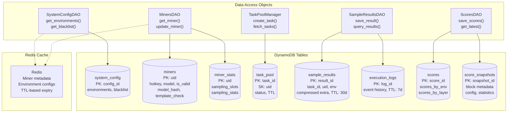
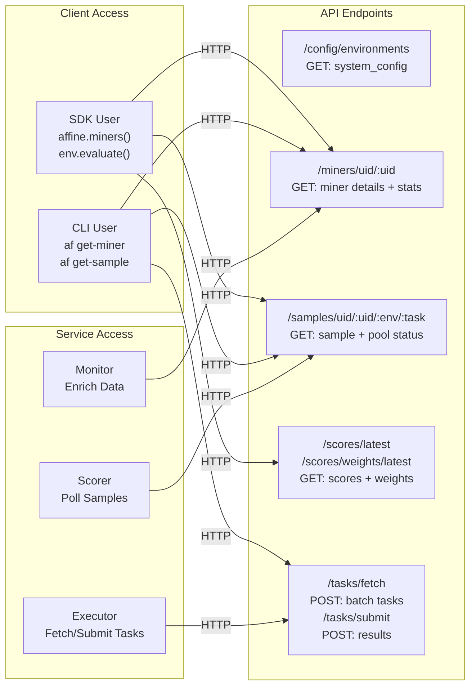
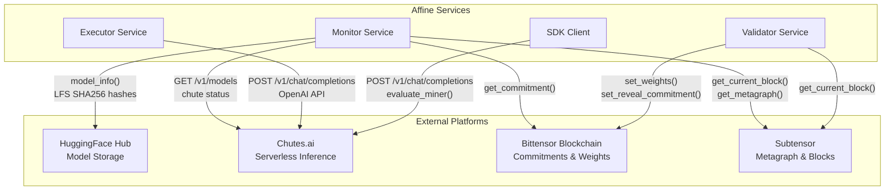
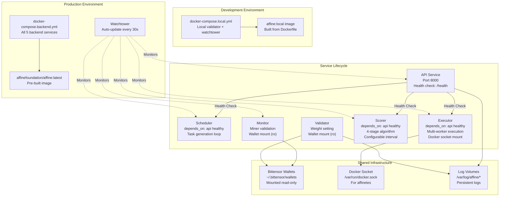

import CollapsibleAside from '../../../components/CollapsibleAside.astro';
import SourceLink from '../../../components/SourceLink.astro';
import Table from '../../../components/Table.astro';

<CollapsibleAside title="Relevant Source Files">
  <SourceLink text="affine/core/environments.py" href="https://github.com/AffineFoundation/affine-cortex/blob/main/affine/core/environments.py" />
  <SourceLink text="affine/database/system_config.json" href="https://github.com/AffineFoundation/affine-cortex/blob/main/affine/database/system_config.json" />
  <SourceLink text="affine/src/executor/config.py" href="https://github.com/AffineFoundation/affine-cortex/blob/main/affine/src/executor/config.py" />
  <SourceLink text="docker-compose.local.yml" href="https://github.com/AffineFoundation/affine-cortex/blob/main/docker-compose.local.yml" />
  <SourceLink text="docker-compose.yml" href="https://github.com/AffineFoundation/affine-cortex/blob/main/docker-compose.yml" />
  <SourceLink text="pyproject.toml" href="https://github.com/AffineFoundation/affine-cortex/blob/main/pyproject.toml" />
  <SourceLink text="uv.lock" href="https://github.com/AffineFoundation/affine-cortex/blob/main/uv.lock" />
</CollapsibleAside>

## Purpose and Scope

This document provides a comprehensive technical overview of Affine Cortex's distributed architecture on Bittensor Subnet 64. It details the microservices topology, data flows, external integrations, and deployment patterns that enable decentralized reinforcement learning model evaluation.

This page covers:
- Overall system topology and external platform integrations
- Backend microservices and their responsibilities
- Data layer architecture (DynamoDB tables, Redis caching)
- SDK and API integration patterns
- Deployment architecture using Docker Compose
- Anti-plagiarism and fairness mechanisms

For detailed information on specific subsystems, see:
- **Core terminology and concepts**: [Core Concepts](/subnets/system-architecture/core-concepts#3.1)
- **Backend microservices deep dive**: [Backend Services](/subnets/system-architecture/backend-services#3.2)
- **Task lifecycle and data flow**: [Data Flow & Lifecycle](/subnets/system-architecture/data-flow-lifecycle#3.3)
- **Security and anti-plagiarism**: [Anti-Plagiarism Architecture](/subnets/system-architecture/anti-plagiarism-architecture#3.4)

---

## Architectural Overview

Affine Cortex implements a **distributed incentivized RL evaluation platform** on Bittensor Subnet 64 with the following architecture:

1. **Miners** train Qwen3-32B models, deploy them to Chutes.ai, and commit metadata to the Bittensor blockchain
2. **Backend Services** (6 microservices) orchestrate miner validation, task scheduling, execution, scoring, and weight setting
3. **DynamoDB** provides the persistent data layer with 8 tables for configuration, miners, tasks, results, and scores
4. **External Platforms** (HuggingFace, Chutes, Bittensor) provide model storage, inference endpoints, and blockchain coordination
5. **SDK** enables programmatic access to environments and miner evaluation

The architecture separates concerns into three layers:
- **Client Layer**: SDK for environment evaluation and CLI for operations
- **Service Layer**: Six independent microservices coordinating through API gateway and shared database
- **Infrastructure Layer**: Container orchestration (Affinetes) supporting Docker and Basilica execution modes

**Sources:** [affine/core/environments.py:1-699](), [affine/database/system_config.json:1-101](), [docker-compose.yml:1-26]()

---

## System Topology

The complete system topology showing how backend services, external platforms, client tools, and infrastructure interact:

```mermaid
graph TB
    subgraph "External Platforms"
        HF["HuggingFace<br/>Model Repository"]
        Chutes["Chutes Platform<br/>Subnet 64"]
        BT["Bittensor Blockchain<br/>Commitments & Weights"]
        Subtensor["Subtensor<br/>Metagraph & Blocks"]
    end
    
    subgraph "Client Tools & SDK"
        SDK["Affine SDK<br/>Environment Factories<br/>SAT, DED, LGC, etc."]
        CLI["af CLI<br/>Miner Operations<br/>Database Admin"]
    end
    
    subgraph "Backend Microservices (Docker Compose)"
        API["API Service<br/>Port 8000<br/>REST Endpoints"]
        Validator["Validator Service<br/>Weight Setting"]
        Monitor["Monitor Service<br/>Miner Validation"]
        Scheduler["Scheduler Service<br/>Task Generation"]
        Executor["Executor Service<br/>Task Execution"]
        Scorer["Scorer Service<br/>4-Stage Algorithm"]
    end
    
    subgraph "Data Layer"
        DB[("DynamoDB<br/>8 Tables")]
        Redis["Redis Cache"]
    end
    
    subgraph "Infrastructure"
        Affinetes["Affinetes<br/>Container Orchestration"]
        Docker["Docker<br/>Environment Containers"]
    end
    
    SDK -->|"REST API"| API
    CLI -->|"REST API"| API
    CLI -->|"Deploy"| HF
    CLI -->|"Deploy"| Chutes
    CLI -->|"Commit"| BT
    
    Monitor -->|"Query"| Subtensor
    Monitor -->|"Validate Chutes"| Chutes
    Monitor -->|"Validate Models"| HF
    Monitor -->|"Save State"| DB
    
    Scheduler -->|"Create Tasks"| DB
    Scheduler -->|"Config"| DB
    
    Executor -->|"Fetch Tasks"| API
    Executor -->|"Submit Results"| API
    Executor -->|"Load Env"| Affinetes
    Affinetes -->|"Manage"| Docker
    
    Scorer -->|"Fetch Samples"| API
    Scorer -->|"Save Scores"| DB
    Scorer -->|"Get Block"| Subtensor
    
    Validator -->|"Query Scores"| DB
    Validator -->|"Set Weights"| BT
    Validator -->|"Get Metagraph"| Subtensor
    
    API --> DB
    API --> Redis
```



**Architecture Layers:**

<Table>

| Layer | Components | Key Responsibilities |
|-------|-----------|---------------------|
| **Client Layer** | SDK, CLI | Programmatic environment evaluation, miner operations, database administration |
| **Service Layer** | API, Monitor, Scheduler, Executor, Scorer, Validator | Coordinate miner validation, task distribution, execution, scoring, and weight setting |
| **Data Layer** | DynamoDB (8 tables), Redis | Persistent storage for configuration, miners, tasks, results, scores; caching layer |
| **Infrastructure Layer** | Affinetes, Docker | Container orchestration supporting Docker and Basilica execution modes |
| **External Platforms** | HuggingFace, Chutes, Bittensor, Subtensor | Model storage, inference hosting, blockchain coordination, metagraph access |

</Table>


**Data Flow Pipeline:** Miners → Monitor (validation) → Scheduler (task generation) → Executor (execution) → Scorer (scoring) → Validator (weight setting) → Blockchain commitment

**Sources:** [affine/core/environments.py:1-699](), [docker-compose.yml:1-26](), [affine/database/system_config.json:1-101]()

---

## Core Subsystems

### Backend Microservices Architecture

The backend is composed of six independent services coordinating through a shared API gateway and DynamoDB database:

```mermaid
graph TB
    subgraph "API Gateway"
        API["API Service<br/>FastAPI<br/>Port 8000"]
        Auth["Authentication<br/>verify_executor_auth<br/>X-Hotkey, X-Signature"]
        RateLimit["Rate Limiting<br/>1/min scoring<br/>higher read/write"]
    end
    
    subgraph "Validation Layer"
        Monitor["Monitor Service<br/>MinerDiscovery<br/>ValidationPipeline"]
        ArchCheck["ModelSizeChecker<br/>Qwen3-32B"]
        TemplateAudit["LLM Audit<br/>DeepSeek-V3"]
        HashCheck["model_hash<br/>SHA256 comparison"]
    end
    
    subgraph "Task Management"
        Scheduler["Scheduler Service<br/>SamplingScheduler<br/>PerMinerSamplingScheduler"]
        AntiStarve["Anti-Starvation<br/>Reserve 1 slot/env"]
        WeightedAlloc["Weighted Allocation<br/>slots × weight/sum"]
        RateLimit2["Rate Limiting<br/>allocations < rotation_rate"]
    end
    
    subgraph "Execution Layer"
        Executor["Executor Service<br/>ExecutorManager<br/>ExecutorWorker"]
        Workers["Multiprocessing<br/>Worker Pool"]
        SDKEnv["SDKEnvironment<br/>env.evaluate"]
    end
    
    subgraph "Scoring Layer"
        Scorer["Scorer Service<br/>4-Stage Algorithm"]
        Stage1["Stage 1: Data Collection<br/>normalize, validate"]
        Stage2["Stage 2: Pareto Filter<br/>anti-plagiarism"]
        Stage3["Stage 3: Subset Scoring<br/>geometric mean"]
        Stage4["Stage 4: Normalization<br/>min threshold, sum=1.0"]
    end
    
    subgraph "Weight Setting"
        ValidatorSvc["Validator Service<br/>set_weights loop"]
        FetchWeights["Fetch from<br/>score_snapshots"]
        SetChain["Set Weights<br/>Bittensor API"]
    end
    
    API --> Auth
    Auth --> RateLimit
    
    Monitor --> ArchCheck
    Monitor --> TemplateAudit
    Monitor --> HashCheck
    
    Scheduler --> AntiStarve
    Scheduler --> WeightedAlloc
    Scheduler --> RateLimit2
    
    Executor --> Workers
    Workers --> SDKEnv
    
    Scorer --> Stage1
    Stage1 --> Stage2
    Stage2 --> Stage3
    Stage3 --> Stage4
    
    ValidatorSvc --> FetchWeights
    FetchWeights --> SetChain
```



**Service Responsibilities:**

<Table>

| Service | Primary Classes/Functions | Key Responsibilities |
|---------|--------------------------|---------------------|
| **API** | `FastAPI` app, authentication middleware, rate limiters | REST endpoint gateway, request validation, rate limiting |
| **Monitor** | `MinerDiscovery`, `ModelSizeChecker`, template audit | Discover miners via metagraph, validate architecture, check templates, compute model hashes |
| **Scheduler** | `SamplingScheduler`, `PerMinerSamplingScheduler`, `MinerSlotsAdjuster` | Calculate missing tasks, weighted task allocation, anti-starvation, rate limiting |
| **Executor** | `ExecutorManager`, `ExecutorWorker`, multiprocessing pool | Fetch task batches, execute in containers via `SDKEnvironment`, submit results |
| **Scorer** | 4-stage algorithm, Pareto filter, geometric mean, normalization | Collect and normalize data, filter plagiarism, compute subset scores, normalize weights |
| **Validator** | Weight fetching, `set_weights` API | Query latest scores from snapshots, set on-chain weights via Bittensor |

</Table>


**Sources:** [affine/core/environments.py:317-699](), [affine/src/executor/config.py:1-26](), [docker-compose.yml:1-26]()

### Environment System

The environment system provides 12 evaluation tasks spanning code generation, reasoning, game playing, and web interaction:

```mermaid
graph TB
    subgraph "Environment Registry"
        EnvConfigs["ENV_CONFIGS<br/>Canonical + Aliases"]
        SDKEnv["SDKEnvironment<br/>Unified Interface"]
    end
    
    subgraph "Affine Environments (v4 image)"
        DED["affine:ded-v2<br/>Program Deduction"]
        ABD["affine:abd-v2<br/>Program Abduction"]
    end
    
    subgraph "PrimeIntellect Environments"
        CDE["cde<br/>Code Execution<br/>mem_limit: 25g"]
        LGC["lgc-v2<br/>Logic Reasoning<br/>mem_limit: 20g<br/>timeout: 1800s"]
        GAME["game<br/>OpenSpiel Games<br/>timeout: 7200s"]
        PRINT["print<br/>Print Debugging"]
    end
    
    subgraph "SWE-bench Environments (DOOD)"
        SWEPRO["swe-pro<br/>Real Repositories<br/>max_iterations: 200"]
        SWESYNTH["swe-synth<br/>Synthetic Bugs<br/>max_iterations: 30<br/>timeout: 7200s"]
    end
    
    subgraph "Specialized Environments"
        ARCGEN["arc-gen<br/>ARC Challenge<br/>num_train: 3"]
        LIVEWEB["liveweb<br/>Browser Interaction<br/>mem_limit: 20g<br/>max_concurrency: 10"]
        NAVWORLD["navworld<br/>Travel Planning<br/>MCP Tools<br/>temperature: 0.7"]
    end
    
    subgraph "Execution Modes"
        DockerMode["Docker Mode<br/>replicas, hosts<br/>container_name"]
        BasilicaMode["Basilica Mode<br/>K8s Pods<br/>cpu_limit, ttl_buffer"]
    end
    
    EnvConfigs --> SDKEnv
    
    SDKEnv --> DED
    SDKEnv --> ABD
    SDKEnv --> CDE
    SDKEnv --> LGC
    SDKEnv --> GAME
    SDKEnv --> PRINT
    SDKEnv --> SWEPRO
    SDKEnv --> SWESYNTH
    SDKEnv --> ARCGEN
    SDKEnv --> LIVEWEB
    SDKEnv --> NAVWORLD
    
    SDKEnv --> DockerMode
    SDKEnv --> BasilicaMode
```



**Environment Configuration Table:**

<Table>

| Environment | Docker Image | Memory | Timeout | Special Requirements |
|-------------|-------------|--------|---------|---------------------|
| `affine:ded-v2` | `affinefoundation/affine-env:v4` | 10g | 600s | - |
| `affine:abd-v2` | `affinefoundation/affine-env:v4` | 10g | 600s | - |
| `cde` | `affinefoundation/cde:pi` | 25g | 600s | - |
| `lgc-v2` | `affinefoundation/lgc:pi-v2` | 20g | 1800s | `UVICORN_WORKERS=30` |
| `game` | `affinefoundation/game:openspiel` | 8g | 7200s | `cpu_limit=2000m` |
| `swe-pro` | `affinefoundation/swebench:pro` | 10g | 1800s | Docker socket mount |
| `swe-synth` | `affinefoundation/swebench:synth` | 10g | 7200s | `DOCKER_HUB_USERNAME`, `HF_TOKEN` |
| `print` | `affinefoundation/cde:print` | 10g | 600s | - |
| `arc-gen` | `affinefoundation/arc:latest` | 10g | 600s | `num_train=3` |
| `liveweb` | `affinefoundation/liveweb-arena:latest` | 20g | 7200s | `COINGECKO_API_KEY` |
| `navworld` | `affinefoundation/navworld:latest` | 5g | 1200s | `AMAP_MAPS_API_KEY` |

</Table>


**Execution Modes:**
- **Docker Mode**: Multi-host replication via SSH, container management, host load balancing
- **Basilica Mode**: Kubernetes pod orchestration, auto-scaling, TTL-based cleanup

**Sources:** [affine/core/environments.py:82-260](), [affine/core/environments.py:317-529](), [affine/src/executor/config.py:6-14]()

### Data Layer Architecture

The data layer uses DynamoDB for persistent storage and Redis for caching:



**Table Characteristics:**

<Table>

| Table | Primary Key | TTL Policy | Write Pattern | Read Pattern |
|-------|-------------|-----------|---------------|--------------|
| `system_config` | `config_id` | None | Admin updates | All services |
| `miners` | `uid` | None | Monitor writes | All services |
| `miner_stats` | `uid` | None | Scheduler updates | Scheduler, Scorer |
| `task_pool` | `task_id`, `uid` (composite) | Varies by retry | Scheduler creates | Executor fetches |
| `sample_results` | `result_id` | 30 days | Executor writes | Scorer reads |
| `execution_logs` | `log_id` | 7 days | Executor writes | Debugging |
| `scores` | `score_id` | None | Scorer writes | Validator reads |
| `score_snapshots` | `snapshot_id` | None | Scorer writes | Validator, API |

</Table>


**Composite Key Pattern (task_pool):**
- Primary key: `task_id` (unique identifier)
- Sort key: `uid` (enables O(1) miner-specific cleanup)
- Enables atomic task deletion upon completion

**Sources:** [affine/database/system_config.json:1-101](), [pyproject.toml:19](), [docker-compose.yml:1-26]()

---

## API and Service Integration

### REST API Endpoints

The API service exposes REST endpoints for client access and inter-service communication:



**Endpoint Specifications:**

<Table>

| Endpoint | Method | Authentication | Rate Limit | Purpose |
|----------|--------|---------------|------------|---------|
| `/config/environments` | GET | Optional | High | Retrieve enabled environments and sampling config |
| `/miners/uid/:uid` | GET | Optional | Moderate | Get miner details with validation state |
| `/samples/uid/:uid/:env/:task` | GET | Optional | Moderate | Fetch sample results and task pool status |
| `/scores/latest` | GET | Optional | High | Get latest scores across all miners |
| `/scores/weights/latest` | GET | Optional | High | Get latest normalized weights for validators |
| `/tasks/fetch` | POST | Required | Moderate | Fetch batch of pending tasks for executor |
| `/tasks/submit` | POST | Required | Moderate | Submit completed task results |
| `/scoring` | POST | Required | 1/min | Trigger scorer computation (restricted) |

</Table>


**Authentication Mechanism:**
- **Headers**: `X-Hotkey` (validator hotkey), `X-Signature` (timestamp signature)
- **Timestamp Validation**: 60-second window prevents replay attacks
- **Signature Verification**: `verify_executor_auth()` validates signed timestamp

**Sources:** [affine/core/environments.py:317-699](), [docker-compose.yml:1-26]()

### External Platform Integration

Affine integrates with four external platforms for model storage, inference, and blockchain coordination:



**Integration Details:**

<Table>

| Platform | Purpose | Client Library | Authentication | Key Operations |
|----------|---------|---------------|----------------|----------------|
| **HuggingFace** | Model metadata, LFS hash extraction | `huggingface_hub` | `HF_TOKEN` | `HfApi.model_info()`, extract `.safetensors` SHA256 |
| **Chutes.ai** | OpenAI-compatible inference endpoints | `httpx`, `aiohttp` | `CHUTES_API_KEY` | `POST /v1/chat/completions`, `GET /v1/models` |
| **Bittensor** | On-chain commitments and weights | `bittensor` | Wallet hotkey/coldkey | `set_reveal_commitment()`, `set_weights()`, `get_commitment()` |
| **Subtensor** | Metagraph and block number queries | `bittensor` | Wallet (read-only) | `get_current_block()`, `get_metagraph()` |

</Table>


**Chutes API Flow:**
1. Miner deploys model to Chutes using `chutes deploy` command
2. Monitor validates deployment status via `GET /v1/models`
3. Executor/SDK sends evaluation requests to `https://{slug}.chutes.ai/v1/chat/completions`
4. Chutes routes to appropriate miner model based on slug

**Bittensor Commitment Flow:**
1. Miner pre-generates deterministic `chute_id` using `uuid5(NAMESPACE, hotkey)`
2. Miner commits `{model, revision, chute_id}` to blockchain before making HuggingFace repo public
3. Monitor discovers commitments via `get_commitment()` and validates against actual deployments
4. Validator sets weights via `set_weights()` after scoring computation

**Sources:** [affine/core/environments.py:348-370](), [pyproject.toml:8-9](), [pyproject.toml:22-23]()

---

## Deployment Architecture

### Docker Compose Service Orchestration

Affine uses Docker Compose to orchestrate backend microservices with strict startup ordering and automatic updates:



**Service Configuration:**

<Table>

| Service | Image | Memory | Ports | Volumes | Environment Variables |
|---------|-------|--------|-------|---------|----------------------|
| **API** | `affinefoundation/affine:latest` | 6-8GB | 8000 | None | `SERVICE_MODE=true`, `API_URL=http://api:8000` |
| **Monitor** | `affinefoundation/affine:latest` | Default | None | Wallets (ro) | Wallet credentials, `HF_TOKEN`, `CHUTES_API_KEY` |
| **Scheduler** | `affinefoundation/affine:latest` | Default | None | None | `SERVICE_MODE=true`, `API_URL` |
| **Executor** | `affinefoundation/affine:latest` | Varies | None | Docker socket | `SERVICE_MODE=true`, `API_URL`, executor config |
| **Scorer** | `affinefoundation/affine:latest` | Default | None | None | `SCORER_SAVE_TO_DB=true`, `SCORER_INTERVAL_MINUTES=60` |
| **Validator** | `affinefoundation/affine:latest` | Default | None | Wallets (ro), Logs | Wallet credentials, `SUBTENSOR_ENDPOINT` |
| **Watchtower** | `nickfedor/watchtower` | Default | None | Docker socket | Auto-update configuration |

</Table>


**Service Dependencies:**
- **API as Health Gate**: Scheduler, Executor, and Scorer declare `depends_on: api` with health check condition
- **Health Check Endpoint**: API exposes `/health` endpoint with 180-second startup grace period
- **Startup Order**: API → (Monitor, Scheduler, Executor, Scorer) → Validator

**Resource Sharing:**
- **Wallets**: Mounted read-only in Monitor and Validator for security
- **Docker Socket**: Mounted in Executor for container spawning via Affinetes
- **Logs**: Persistent volumes in `/var/log/affine/` for API and Validator

**Deployment Commands:**

```bash
# Production deployment (all backend services)
docker-compose -f docker-compose.backend.yml up -d

# Development (local image build)
docker compose -f docker-compose.yml -f docker-compose.local.yml up -d --build

# View logs
docker-compose logs -f api scheduler executor
```

**Sources:** [docker-compose.yml:1-26](), [docker-compose.local.yml:1-16](), [pyproject.toml:1-53]()

---

## Configuration Management

Configuration is managed through environment variables loaded from a `.env` file.

### Required Variables by Role

**All Roles:**
- `CHUTES_API_KEY` - Authentication for Chutes API
- `BT_WALLET_COLD` - Bittensor coldkey name (default: "default")
- `BT_WALLET_HOT` - Bittensor hotkey name (default: "default")
- `HF_TOKEN` - HuggingFace API token
- `HF_USER` - HuggingFace username

**Validators Only:**
- `R2_WRITE_ACCESS_KEY_ID` - Cloudflare R2 write access
- `R2_WRITE_SECRET_ACCESS_KEY` - Cloudflare R2 secret
- `R2_FOLDER` - R2 bucket name (default: "affine")
- `R2_BUCKET_ID` - Cloudflare account ID
- `AFFINE_R2_PUBLIC` - Use public R2.dev URLs (default: "1")

**Miners Only:**
- `CHUTE_USER` - Chutes username for deployment

**Optional:**
- `AFFINE_MINER_BLACKLIST` - Comma-separated hotkeys to exclude
- `AFFINETES_HOSTS` - Remote SSH hosts for distributed evaluation
- `USE_R2_WEIGHTS` - Download weights from R2 instead of computing locally (default: "false")
- `SUBTENSOR_ENDPOINT` - Bittensor network endpoint (default: "finney")
- `SUBTENSOR_FALLBACK` - Fallback Bittensor endpoint

**Configuration Loading:**
```python
from affine.config import get_conf

# Load with default fallback
api_key = get_conf("CHUTES_API_KEY", default=None)

# Load required (raises if missing)
wallet_cold = get_conf("BT_WALLET_COLD", default="default")
```

**Sources:** [.env.example:1-99](), [affine/config.py](), [affine/cli.py:64-66]()

---

## Summary

Affine's architecture is designed for:

1. **Decentralization** - No single point of failure; validators operate independently
2. **Scalability** - Async concurrency, distributed evaluation via Affinetes remote hosts
3. **Reproducibility** - Docker containers ensure consistent evaluation environments
4. **Security** - Cryptographic signing, blacklist filtering, Pareto-based anti-gaming
5. **Extensibility** - Plugin-based environment system, SDK for external integrations

The system's modularity allows validators to run with varying configurations:
- **Minimal Setup**: Single machine with local Docker, R2 weight download mode
- **Full Setup**: Multi-host Affinetes deployment, local weight computation, monitoring enabled
- **SDK-Only**: No validator infrastructure, just programmatic evaluation access

For deep dives into specific subsystems, see the child pages under System Architecture ([#3.1](#3.1), [#3.2](#3.2), [#3.3](#3.3), [#3.4](#3.4)).

**Sources:** [README.md:1-223](), [affine/__init__.py:1-62](), [affine/cli.py:1-473]()
