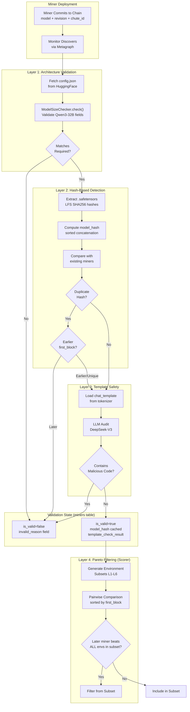
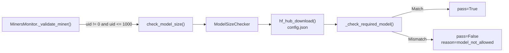
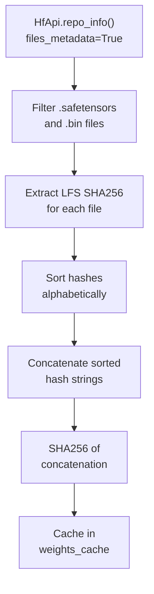
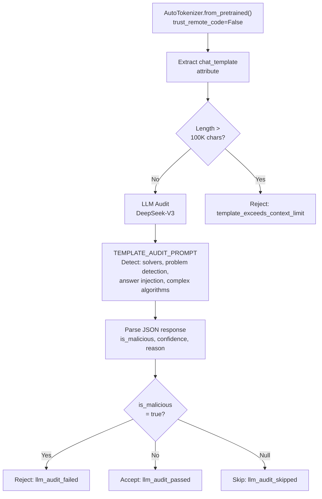
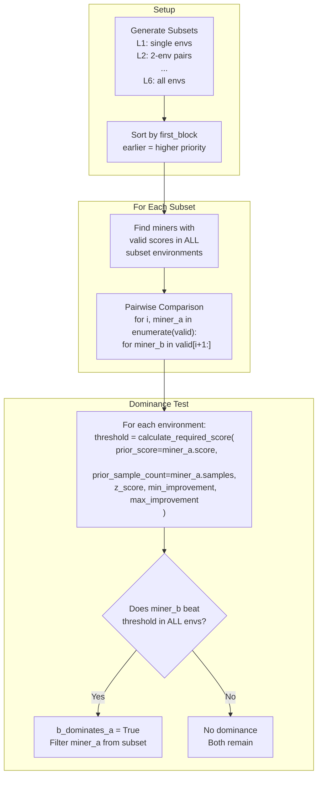
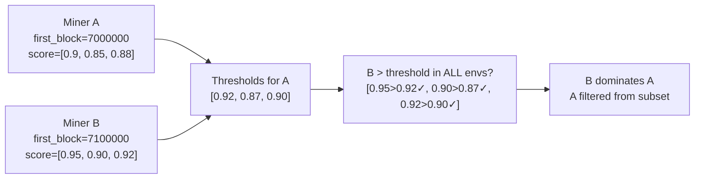
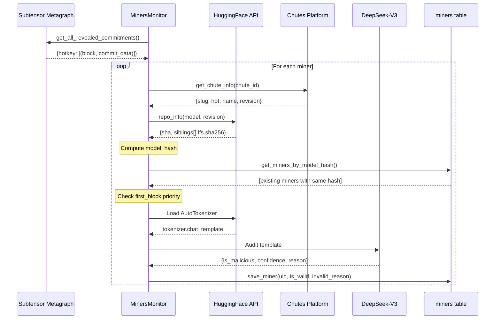
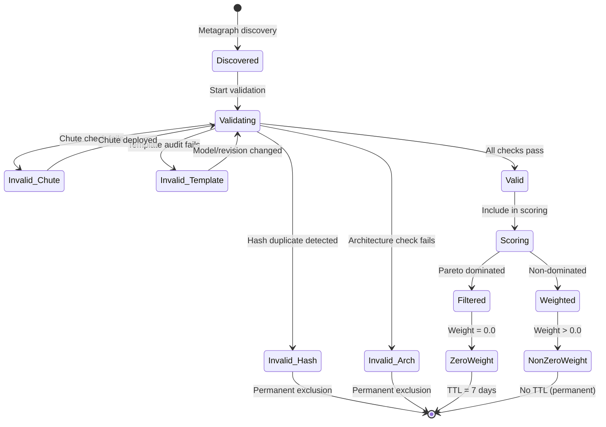

import CollapsibleAside from '../../../../components/CollapsibleAside.astro';
import SourceLink from '../../../../components/SourceLink.astro';
import Table from '../../../../components/Table.astro';

<CollapsibleAside title="Relevant Source Files">
  <SourceLink text="affine/api/routers/miners.py" href="https://github.com/AffineFoundation/affine-cortex/blob/main/affine/api/routers/miners.py" />
  <SourceLink text="affine/database/dao/miners.py" href="https://github.com/AffineFoundation/affine-cortex/blob/main/affine/database/dao/miners.py" />
  <SourceLink text="affine/database/dao/scores.py" href="https://github.com/AffineFoundation/affine-cortex/blob/main/affine/database/dao/scores.py" />
  <SourceLink text="affine/database/dao/system_config.py" href="https://github.com/AffineFoundation/affine-cortex/blob/main/affine/database/dao/system_config.py" />
  <SourceLink text="affine/src/monitor/miners_monitor.py" href="https://github.com/AffineFoundation/affine-cortex/blob/main/affine/src/monitor/miners_monitor.py" />
  <SourceLink text="affine/src/scorer/config.py" href="https://github.com/AffineFoundation/affine-cortex/blob/main/affine/src/scorer/config.py" />
  <SourceLink text="affine/src/scorer/models.py" href="https://github.com/AffineFoundation/affine-cortex/blob/main/affine/src/scorer/models.py" />
  <SourceLink text="affine/src/scorer/stage1_collector.py" href="https://github.com/AffineFoundation/affine-cortex/blob/main/affine/src/scorer/stage1_collector.py" />
  <SourceLink text="affine/src/scorer/stage2_pareto.py" href="https://github.com/AffineFoundation/affine-cortex/blob/main/affine/src/scorer/stage2_pareto.py" />
  <SourceLink text="affine/src/scorer/stage4_weights.py" href="https://github.com/AffineFoundation/affine-cortex/blob/main/affine/src/scorer/stage4_weights.py" />
  <SourceLink text="affine/src/scorer/utils.py" href="https://github.com/AffineFoundation/affine-cortex/blob/main/affine/src/scorer/utils.py" />
  <SourceLink text="affine/utils/model_size_checker.py" href="https://github.com/AffineFoundation/affine-cortex/blob/main/affine/utils/model_size_checker.py" />
  <SourceLink text="affine/utils/template_checker.py" href="https://github.com/AffineFoundation/affine-cortex/blob/main/affine/utils/template_checker.py" />
</CollapsibleAside>

This document details the multi-layered anti-plagiarism mechanisms that prevent miners from copying models and claiming rewards. The system implements defense-in-depth with four distinct validation layers, each targeting different types of plagiarism attacks.

For information about the scoring algorithm that uses these mechanisms, see [Weight Calculation System](/subnets/for-validators/weight-calculation-system#5.4). For validator operations, see [Running a Validator](/subnets/for-validators/running-a-validator#5.2). For miner deployment requirements, see [Model Requirements](/subnets/for-miners/model-requirements#4.2).

---

## Overview

The anti-plagiarism architecture operates through four independent layers, each enforced at different stages of the miner lifecycle:

<Table>

| Layer | Stage | Mechanism | Detection Type | Enforced By |
|-------|-------|-----------|----------------|-------------|
| **Layer 1** | Registration | Architecture Validation | Wrong model architecture | `MinersMonitor` |
| **Layer 2** | Registration | Hash-Based Detection | Exact weight copies | `MinersMonitor` |
| **Layer 3** | Registration | Template Safety Audit | Embedded solvers/cheating code | `MinersMonitor` |
| **Layer 4** | Scoring | Pareto Dominance Filtering | Fine-tuned copies, statistical plagiarism | `Stage2ParetoFilter` |

</Table>


**Key Design Principles:**

1. **Fail-Closed**: Any validation failure marks miner as invalid
2. **Temporal Priority**: Earlier block commitments have precedence (`first_block`)
3. **Statistical Rigor**: Uses confidence intervals and sample-size-aware thresholds
4. **Defense-in-Depth**: Multiple independent checks catch different attack vectors

**Sources:** [affine/src/monitor/miners_monitor.py:1-764](), [affine/src/scorer/stage2_pareto.py:1-215]()

---

## Multi-Layer Architecture



**Flow Summary:**

1. **Registration Phase** (Layers 1-3): Monitor service validates miners synchronously
2. **Scoring Phase** (Layer 4): Scorer service applies Pareto filtering to valid miners
3. **Persistence**: Validation state cached in `miners` table to avoid redundant checks

**Sources:** [affine/src/monitor/miners_monitor.py:288-492](), [affine/src/scorer/stage2_pareto.py:42-137]()

---

## Layer 1: Architecture Validation

Ensures miners use the required model architecture (`Qwen3-32B`). This prevents miners from submitting incompatible models or smaller/larger architectures.

### Implementation

The `ModelSizeChecker` validates models by inspecting `config.json` architecture fields:

<Table>

| Field | Required Value | Purpose |
|-------|----------------|---------|
| `model_type` | `"qwen3"` | Model family |
| `hidden_size` | `5120` | Hidden dimension |
| `num_hidden_layers` | `64` | Layer count |
| `intermediate_size` | `25600` | FFN dimension |
| `vocab_size` | `151936` | Vocabulary size |
| `num_attention_heads` | `64` | Attention heads |
| `num_key_value_heads` | `8` | KV heads (GQA) |

</Table>


**Key Properties:**

- **Quantization-Proof**: Checks architecture fields, not file size (quantized models pass)
- **Manipulation-Resistant**: Faking config fields breaks vLLM loading (model won't run)
- **Fine-Tune Compatible**: Fine-tuned variants share architecture (weights differ)

### Code Flow



**Sources:** [affine/utils/model_size_checker.py:1-123](), [affine/src/monitor/miners_monitor.py:418-429]()

### Rejection Examples

```python
# Invalid: Wrong model type
{
    "pass": False,
    "reason": "model_not_allowed:model_type=qwen2 (expected qwen3)"
}

# Invalid: Wrong layer count (smaller model)
{
    "pass": False,
    "reason": "model_not_allowed:num_hidden_layers=32 (expected 64)"
}

# Valid: Correct architecture (even if quantized)
{
    "pass": True,
    "reason": "ok"
}
```

**Sources:** [affine/utils/model_size_checker.py:43-106]()

---

## Layer 2: Hash-Based Detection

Detects exact model weight copies by computing a deterministic hash of all weight files. Uses block priority (`first_block`) to determine the original miner.

### Hash Computation



**Sources:** [affine/src/monitor/miners_monitor.py:159-262]()

### Duplicate Detection Logic

```python
# In MinersMonitor._detect_plagiarism()
# Group miners by model_hash
hash_to_miners = {}  # model_hash -> [(block, uid, miner), ...]

for miner in miners:
    if miner.is_valid and miner.model_hash:
        hash_to_miners[miner.model_hash].append(
            (miner.block, miner.uid, miner)
        )

# For each duplicate group, keep only earliest
for model_hash, group in hash_to_miners.items():
    # Sort by (block, uid) - earliest first
    group.sort(key=lambda x: (x[0], x[1]))
    earliest_block, earliest_uid, _ = group[0]
    
    # Mark later duplicates as invalid
    for block, uid, miner in group[1:]:
        miner.is_valid = False
        miner.invalid_reason = f"model_hash_duplicate:earliest_uid={earliest_uid}"
```

**Sources:** [affine/src/monitor/miners_monitor.py:493-534]()

### Database Storage

Validation results cached in `miners` table:

<Table>

| Column | Type | Purpose |
|--------|------|---------|
| `model_hash` | String | SHA256 of concatenated weight hashes |
| `first_block` | Integer | Block when miner first committed |
| `is_valid` | String | `"true"` or `"false"` |
| `invalid_reason` | String | `"model_hash_duplicate:earliest_uid=X"` |

</Table>


**Sources:** [affine/database/dao/miners.py:34-89]()

---

## Layer 3: Template Safety Audit

Detects malicious code embedded in `chat_template` that could cheat on benchmarks (e.g., built-in sudoku solvers, game-of-24 algorithms).

### Detection Strategy



**Sources:** [affine/utils/template_checker.py:76-169]()

### LLM Audit Prompt

The system uses DeepSeek-V3 to analyze templates for:

1. **Built-in solvers**: Backtracking, permutation, brute-force search
2. **Problem detection**: Logic to detect specific benchmark types
3. **Answer injection**: Direct output of solutions based on problem type
4. **Excessive complexity**: Nested loops, recursive logic, complex math

**Audit Response Format:**

```json
{
  "is_malicious": false,
  "confidence": 0.95,
  "reason": "Normal Jinja2 formatting template",
  "detected_issues": []
}
```

**Sources:** [affine/utils/template_checker.py:36-72]()

### Caching Strategy

Template check results are cached in `miners` table to avoid redundant LLM calls:

```python
# Inherit cached result if model/revision unchanged
existing = await self.dao.get_miner_by_uid(uid)
if (existing and 
    existing.get('model') == model and 
    existing.get('revision') == revision):
    cached_result = existing.get('template_check_result')
    
    if cached_result == "safe":
        # Skip check - previously passed
        pass
    elif cached_result.startswith("unsafe:"):
        # Use cached rejection
        info.is_valid = False
        info.invalid_reason = f"malicious_template:{cached_result[7:]}"
```

**Storage Format:**

<Table>

| Value | Meaning |
|-------|---------|
| `"safe"` | Template passed audit |
| `"unsafe:reason"` | Template rejected (reason included) |
| `null` | Not yet checked (will retry) |

</Table>


**Sources:** [affine/src/monitor/miners_monitor.py:333-488]()

---

## Layer 4: Pareto Dominance Filtering

Statistical anti-plagiarism detection based on multi-environment performance. Filters miners whose performance suspiciously dominates earlier miners across all environments in a subset.

### Core Algorithm



**Sources:** [affine/src/scorer/stage2_pareto.py:42-214]()

### Statistical Threshold Calculation

Uses sample-size-aware thresholds to prevent false positives:

```python
def calculate_required_score(
    prior_score: float,           # Earlier miner's score (0.0-1.0)
    prior_sample_count: int,      # Number of samples
    z_score: float = 1.5,         # Confidence level (~87%)
    min_improvement: float = 0.02, # Floor (2%)
    max_improvement: float = 0.10  # Ceiling (10%)
) -> float:
    # Standard error calculation
    p = prior_score
    se = sqrt(p * (1.0 - p) / prior_sample_count)
    
    # Gap from confidence interval
    gap = z_score * se
    
    # Apply bounds
    gap = max(gap, min_improvement)  # Floor
    gap = min(gap, max_improvement)  # Ceiling
    
    # Final threshold
    return min(prior_score + gap, 1.0)
```

**Intuition:**

- **More samples** → smaller standard error → smaller gap → easier to beat
- **Fewer samples** → larger standard error → larger gap → harder to beat
- **Floor/ceiling bounds** prevent extreme thresholds from noise or small samples

**Sources:** [affine/src/scorer/utils.py:160-224]()

### Configuration Parameters

Defined in `ScorerConfig`:

<Table>

| Parameter | Default | Purpose | Effect |
|-----------|---------|---------|--------|
| `Z_SCORE` | `1.5` | Confidence level | Higher = harder to beat (more conservative) |
| `MIN_IMPROVEMENT` | `0.02` | Minimum gap | Prevents noise-based filtering |
| `MAX_IMPROVEMENT` | `0.10` | Maximum gap | Prevents unreasonable thresholds |

</Table>


**Environment-Specific Overrides:**

```python
ENV_THRESHOLD_CONFIGS = {
    'GAME': {'z_score': 1.0},    # Easier to beat (less strict)
    'PRINT': {'z_score': 2.0},   # Harder to beat (more strict)
    'SWE-SYNTH': {'z_score': 2.0}
}
```

**Sources:** [affine/src/scorer/config.py:14-127]()

### Filtering Outcome



**Stored in `MinerData`:**

```python
miner.filtered_subsets = ["L3_sat_abd_ded", "L4_sat_abd_ded_cde"]
miner.filter_reasons = {
    "L3_sat_abd_ded": "dominated",
    "L4_sat_abd_ded_cde": "dominated"
}
```

**Sources:** [affine/src/scorer/stage2_pareto.py:108-127](), [affine/src/scorer/models.py:25-63]()

---

## Validation Pipeline Integration

### Monitor Service Workflow



**Sources:** [affine/src/monitor/miners_monitor.py:536-735]()

### Scorer Service Integration

The Scorer uses the Monitor's validation results:

```python
# Stage 1: Data Collection
# Only processes miners marked is_valid=True by Monitor
scoring_data = await api.get_scoring_data()  # Filtered by Monitor

# Stage 2: Pareto Filtering
# Applies additional statistical filtering
miners = stage1_collector.collect(scoring_data, environments)
filtered_output = stage2_pareto.filter(miners, subsets)

# Stage 3 & 4: Subset scoring and normalization
# Excluded miners contribute 0 weight
```

**Sources:** [affine/src/scorer/stage1_collector.py:39-229](), [affine/src/scorer/stage2_pareto.py:42-137]()

---

## Database Schema

### miners Table

Stores validation state and anti-plagiarism metadata:

<Table>

| Column | Type | Purpose | Example |
|--------|------|---------|---------|
| `pk` | String | `UID#{uid}` | `"UID#5"` |
| `uid` | Number | Miner UID | `5` |
| `hotkey` | String | SS58 address | `"5F3sa2T..."` |
| `model` | String | HF repo | `"user/Affine-Qwen3-32B-5F3sa"` |
| `revision` | String | Git SHA | `"a1b2c3d4..."` |
| `model_hash` | String | Weight hash | `"e5f6g7h8..."` |
| `first_block` | Number | First commit block | `7000000` |
| `is_valid` | String | Validation status | `"true"` / `"false"` |
| `invalid_reason` | String | Rejection reason | `"model_hash_duplicate:earliest_uid=3"` |
| `template_check_result` | String | Template audit result | `"safe"` / `"unsafe:reason"` / `null` |

</Table>


**Global Secondary Indexes:**

<Table>

| Index Name | Key | Purpose |
|------------|-----|---------|
| `is-valid-index` | `is_valid` | Query valid/invalid miners |
| `hotkey-index` | `hotkey` | Lookup by hotkey |

</Table>


**Sources:** [affine/database/dao/miners.py:16-227]()

### Invalid Reason Codes

<Table>

| Reason | Layer | Meaning |
|--------|-------|---------|
| `no_commit` | Pre-validation | No blockchain commitment |
| `blacklisted` | Pre-validation | Hotkey in blacklist |
| `incomplete_commit:missing_fields` | Pre-validation | Missing model/revision/chute_id |
| `multiple_commits:count=N` | Pre-validation | More than 1 commit (after block 7679000) |
| `chute_fetch_failed` | Layer 1 | Cannot fetch chute info |
| `chute_not_hot` | Layer 1 | Chute not deployed |
| `model_mismatch:chute=X` | Layer 1 | Model name mismatch |
| `model_name_missing_affine` | Layer 1 | Missing "Affine" in name |
| `repo_name_not_ending_with_hotkey` | Layer 1 | Repo doesn't end with hotkey |
| `model_check:reason` | Layer 1 | Architecture validation failed |
| `duplicate_repo:from=X` | Layer 2 | Duplicate commit detected |
| `model_hash_duplicate:earliest_uid=X` | Layer 2 | Hash matches earlier miner |
| `malicious_template:reason` | Layer 3 | Template audit failed |

</Table>


**Sources:** [affine/src/monitor/miners_monitor.py:288-663]()

---

## Configuration Reference

### Monitor Configuration

Environment variables and database config:

```bash
# Required for validation
HF_TOKEN=hf_...                    # HuggingFace API access
CHUTES_API_KEY=...                 # Chutes platform access
AFFINE_MINER_BLACKLIST=hotkey1,hotkey2  # CSV of blacklisted hotkeys

# Optional (defaults shown)
MONITOR_REFRESH_INTERVAL=300       # Seconds between refreshes
```

**Database Blacklist:**

```python
# Stored in system_config table
await config_dao.set_blacklist(["hotkey1", "hotkey2"])
await config_dao.add_to_blacklist(["hotkey3"])
await config_dao.remove_from_blacklist(["hotkey2"])
```

**Sources:** [affine/src/monitor/miners_monitor.py:63-157](), [affine/database/dao/system_config.py:223-287]()

### Scorer Configuration

Pareto filtering parameters in `ScorerConfig`:

```python
class ScorerConfig:
    # Stage 2: Pareto Frontier
    Z_SCORE = 1.5                  # Confidence level
    MIN_IMPROVEMENT = 0.02         # Floor (2%)
    MAX_IMPROVEMENT = 0.10         # Ceiling (10%)
    SCORE_PRECISION = 3            # Decimal places
    
    # Environment-specific overrides
    ENV_THRESHOLD_CONFIGS = {
        'GAME': {'z_score': 1.0},      # Easier
        'PRINT': {'z_score': 2.0},     # Harder
        'SWE-SYNTH': {'z_score': 2.0}
    }
```

**Sources:** [affine/src/scorer/config.py:11-127]()

---

## Validation State Lifecycle



**State Transitions:**

1. **Discovered → Validating**: Monitor fetches miner from metagraph
2. **Validating → Valid/Invalid**: Layers 1-3 validation
3. **Valid → Scoring**: Miner eligible for weight calculation
4. **Scoring → Filtered/Weighted**: Layer 4 Pareto filtering
5. **Weighted → Stored**: Final weights persisted to `scores` table

**Sources:** [affine/src/monitor/miners_monitor.py:536-735](), [affine/database/dao/scores.py:34-109]()

---

## Performance Characteristics

### Monitor Service

<Table>

| Operation | Latency | Caching |
|-----------|---------|---------|
| HuggingFace `repo_info()` | ~500ms | 30min TTL in `weights_cache` |
| Template LLM audit | ~5-10s | Permanent in `template_check_result` |
| Model architecture check | ~200ms | HF hub filesystem cache |
| Chute info fetch | ~100ms | No cache |
| Full refresh (256 miners) | ~2-5min | Background task every 5min |

</Table>


**Sources:** [affine/src/monitor/miners_monitor.py:74-130]()

### Scorer Service

<Table>

| Operation | Complexity | Scale |
|-----------|------------|-------|
| Subset generation | O(2^N) | N=6 envs → 63 subsets |
| Pareto comparisons | O(M² × S) | M miners, S subsets |
| Per-miner scoring | O(M × S) | Linear in subsets |
| Full scoring cycle | ~30-60s | For 256 miners, 6 envs |

</Table>


**Sources:** [affine/src/scorer/utils.py:12-61](), [affine/src/scorer/stage2_pareto.py:74-137]()

---

## Security Considerations

### Attack Vectors & Mitigations

<Table>

| Attack | Detection Layer | Mitigation |
|--------|----------------|------------|
| Exact model copy | Layer 2: Hash-Based | `first_block` priority |
| Fine-tuned copy with same weights | Layer 2: Hash-Based | Hash computed before fine-tuning |
| Fine-tuned copy with different weights | Layer 4: Pareto Filtering | Statistical dominance test |
| Embedded solver in template | Layer 3: Template Audit | LLM detection |
| Wrong architecture (smaller/larger model) | Layer 1: Architecture | Config validation |
| Quantized copy of same model | Layer 2: Hash-Based | Hash changes with quantization (different LFS hashes) |
| Model deployed to multiple UIDs | Layer 2: Hash-Based | `first_block` determines original |

</Table>


**Limitations:**

1. **Fine-tuned improvements**: If later miner genuinely improves on earlier model, may still be filtered (conservatism bias)
2. **Sample size requirements**: Small sample counts increase threshold, making it harder to beat originals
3. **LLM audit accuracy**: DeepSeek-V3 may miss sophisticated template exploits

**Sources:** [affine/src/monitor/miners_monitor.py:493-534](), [affine/src/scorer/stage2_pareto.py:139-214]()

### Temporal Priority Enforcement

The `first_block` field establishes immutable temporal ordering:

```python
# In MinersMonitor._detect_plagiarism()
# Sort by (block, uid) - earlier block wins ties
group.sort(key=lambda x: (x[0], x[1]))
earliest_block, earliest_uid, _ = group[0]

# In Stage2ParetoFilter.filter()
# Sort miners by first_block before comparison
sorted_miners = sorted(miners.values(), key=lambda m: (m.first_block, m.uid))
```

**Prevents:**
- Race conditions where two miners submit identical models simultaneously
- Later miners claiming credit for earlier work
- Multi-UID attacks (same model deployed to multiple UIDs)

**Sources:** [affine/src/monitor/miners_monitor.py:520-533](), [affine/src/scorer/stage2_pareto.py:64-69]()
