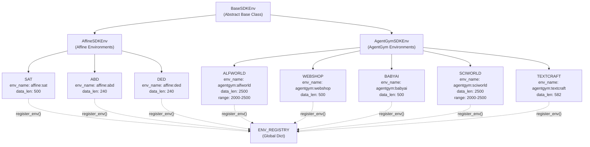
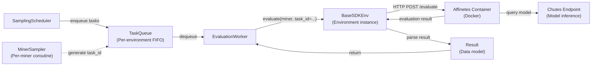
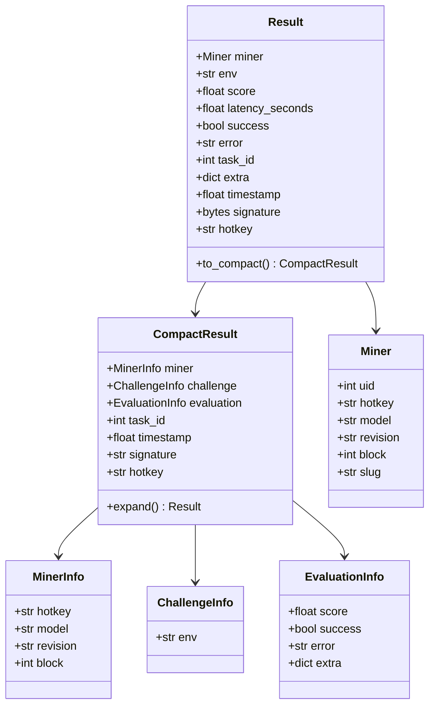
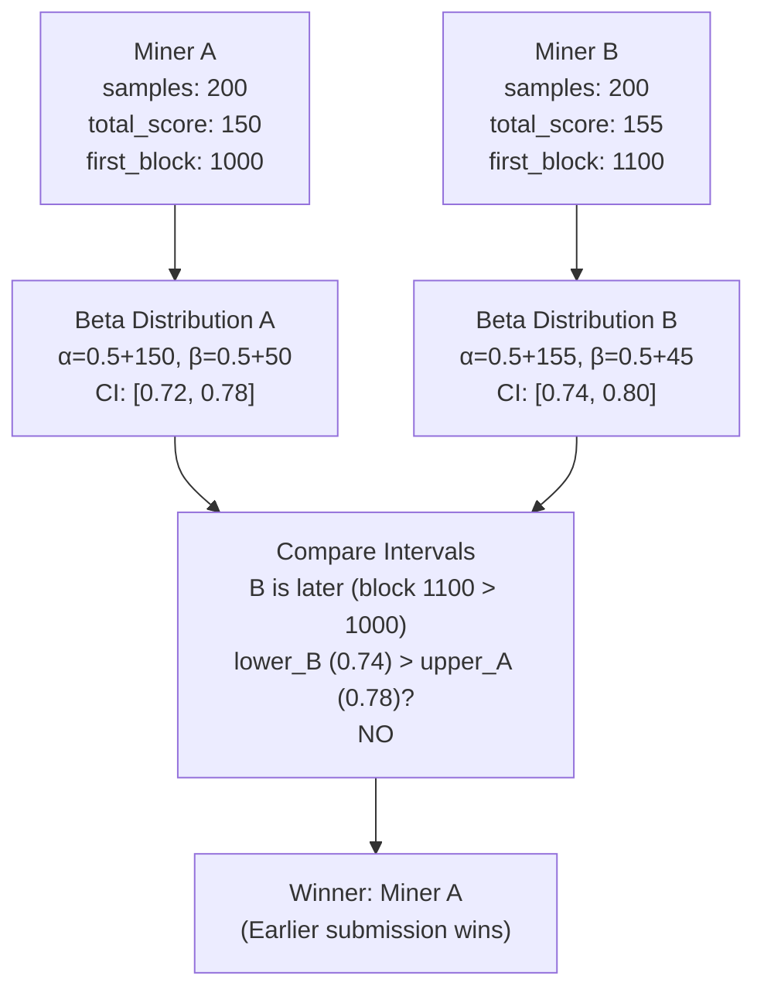
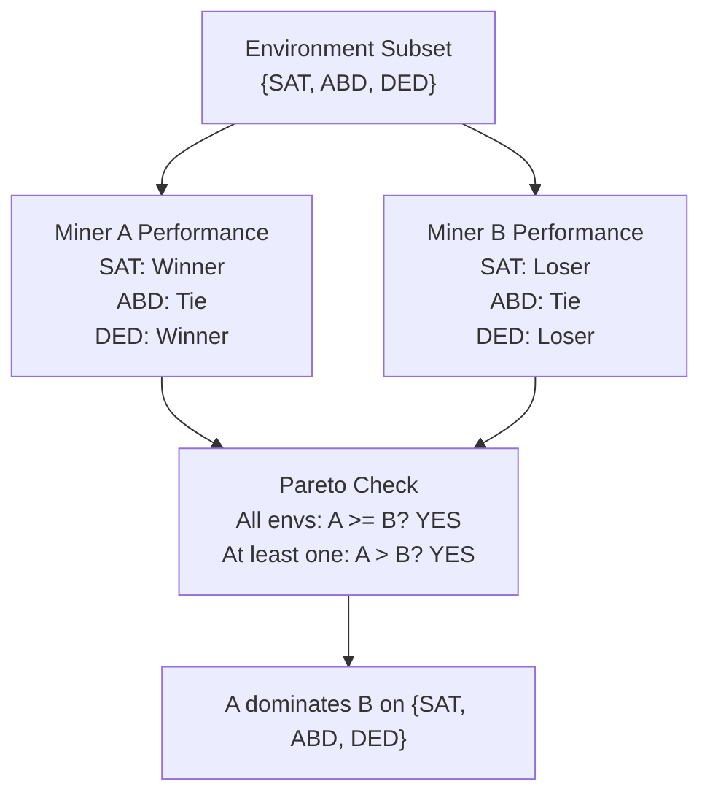

import CollapsibleAside from '../../../../components/CollapsibleAside.astro';
import SourceLink from '../../../../components/SourceLink.astro';
import Table from '../../../../components/Table.astro';

<CollapsibleAside title="Relevant Source Files">
  <SourceLink text=".env.example" href="https://github.com/AffineFoundation/affine-cortex/blob/main/.env.example" />
  <SourceLink text="README.md" href="https://github.com/AffineFoundation/affine-cortex/blob/main/README.md" />
  <SourceLink text="affine/__init__.py" href="https://github.com/AffineFoundation/affine-cortex/blob/main/affine/__init__.py" />
  <SourceLink text="affine/api/routers/miners.py" href="https://github.com/AffineFoundation/affine-cortex/blob/main/affine/api/routers/miners.py" />
  <SourceLink text="affine/database/dao/miners.py" href="https://github.com/AffineFoundation/affine-cortex/blob/main/affine/database/dao/miners.py" />
  <SourceLink text="affine/database/dao/scores.py" href="https://github.com/AffineFoundation/affine-cortex/blob/main/affine/database/dao/scores.py" />
  <SourceLink text="affine/database/dao/system_config.py" href="https://github.com/AffineFoundation/affine-cortex/blob/main/affine/database/dao/system_config.py" />
  <SourceLink text="affine/src/monitor/miners_monitor.py" href="https://github.com/AffineFoundation/affine-cortex/blob/main/affine/src/monitor/miners_monitor.py" />
  <SourceLink text="affine/utils/model_size_checker.py" href="https://github.com/AffineFoundation/affine-cortex/blob/main/affine/utils/model_size_checker.py" />
  <SourceLink text="affine/utils/template_checker.py" href="https://github.com/AffineFoundation/affine-cortex/blob/main/affine/utils/template_checker.py" />
  <SourceLink text="tests/test_private_repo_workflow.py" href="https://github.com/AffineFoundation/affine-cortex/blob/main/tests/test_private_repo_workflow.py" />
</CollapsibleAside>

## Purpose and Scope

This document defines the fundamental terminology, roles, data structures, and mechanisms that form the foundation of the Affine system. Understanding these concepts is essential for working with any part of the codebase, whether as a validator operator, miner, SDK user, or developer.

For detailed operational guides, see [For Validators](/subnets/for-validators#5) and [For Miners](/subnets/for-miners#4). For specific subsystem architectures, see [System Components](#3.2).

---

## Roles and Participants

### Validators

**Validators** are nodes responsible for evaluating miner performance and setting weights on the Bittensor blockchain. A validator continuously samples tasks, queries deployed models, stores evaluation results, and calculates weights based on Pareto dominance.

**Key responsibilities:**
- Sample evaluation tasks across multiple environments
- Query miner models via Chutes endpoints
- Sign and store evaluation results to R2
- Calculate weights using challenge-based Pareto dominance
- Set weights on Bittensor Subnet 120 (NETUID=120)

**Core classes:** `SamplingScheduler`, `SamplingOrchestrator`, `MinerSampler`, `ChallengeAlgorithm`

Sources: <SourceLink text="affine/sampling.py:600-868" href="https://github.com/AffineFoundation/affine-cortex/blob/main/affine/sampling.py#L600-L868" />, <SourceLink text="README.md:39-74" href="https://github.com/AffineFoundation/affine-cortex/blob/main/README.md#L39-L74" />

### Miners

**Miners** are participants who train machine learning models and deploy them as inference endpoints to earn rewards. Unlike traditional mining, Affine miners do not run continuous compute workloads. Instead, they:

1. Train or fine-tune a model
2. Upload model weights to HuggingFace Hub
3. Deploy the model to Chutes (serverless inference platform)
4. Commit deployment metadata to the Bittensor blockchain

**Key workflow:** `af pull` → train model → upload to HF → `af chutes_push` → `af commit`

**Data stored on-chain:** Model repository, revision SHA, Chute ID, hotkey signature

Sources: <SourceLink text="README.md:76-138" href="https://github.com/AffineFoundation/affine-cortex/blob/main/README.md#L76-L138" />, <SourceLink text="affine/miners.py" href="https://github.com/AffineFoundation/affine-cortex/blob/main/affine/miners.py" />

---

## Evaluation System

### Environments

An **environment** is a distinct evaluation domain that tests specific capabilities of language models. Each environment is implemented as a subclass of `BaseSDKEnv` and is backed by a Docker container managed through the Affinetes library.



**Environment Types:**

<Table>

| Type | Base Class | Docker Image Pattern | Timeout |
|------|-----------|---------------------|---------|
| Affine | `AffineSDKEnv` | `bignickeye/affine:v3` | 700s |
| AgentGym | `AgentGymSDKEnv` | `bignickeye/agentgym:<env>-v2` | 1300s |

</Table>


**Key properties:**
- `env_name`: Unique identifier (e.g., `"affine:sat"`, `"agentgym:alfworld"`)
- `data_len`: Total number of tasks in the dataset
- `DEFAULT_START_INDEX` / `DEFAULT_END_INDEX`: Optional range restriction for sampling
- `daily_rate`: Target sampling rate (defaults to dataset size)

Sources: <SourceLink text="affine/tasks.py:82-165" href="https://github.com/AffineFoundation/affine-cortex/blob/main/affine/tasks.py#L82-L165" />, <SourceLink text="affine/tasks.py:370-493" href="https://github.com/AffineFoundation/affine-cortex/blob/main/affine/tasks.py#L370-L493" />, <SourceLink text="affine/tasks.py:513-604" href="https://github.com/AffineFoundation/affine-cortex/blob/main/affine/tasks.py#L513-L604" />

### Tasks and Evaluations

A **task** is a specific problem instance within an environment, identified by a `task_id`. When a validator evaluates a miner, it:

1. Selects an environment and generates/selects a `task_id`
2. Constructs a payload with model endpoint, temperature, seed, and task parameters
3. Sends the payload to the environment's Docker container via Affinetes
4. Receives back an evaluation result



**Task ID Generation:**
- Sequential sampling: Validators track `next_task_id` per environment and increment after each sample
- Range constraints: Some environments restrict sampling to a subset (e.g., ALFWORLD uses indices 2000-2500)
- Random fallback: SDK users can specify random task IDs or specific IDs

Sources: <SourceLink text="affine/tasks.py:213-253" href="https://github.com/AffineFoundation/affine-cortex/blob/main/affine/tasks.py#L213-L253" />, <SourceLink text="affine/tasks.py:360-364" href="https://github.com/AffineFoundation/affine-cortex/blob/main/affine/tasks.py#L360-L364" />

---

## Result Data Model

The `Result` class is the fundamental data structure representing an evaluation outcome:



**Key fields:**
- `miner`: Metadata about the miner being evaluated (UID, hotkey, model, revision)
- `env`: Environment name (e.g., `"affine:sat"`)
- `score`: Normalized score in [0, 1] (except sciworld: [-100, 100])
- `task_id`: Specific task instance evaluated
- `timestamp`: Unix timestamp of evaluation
- `signature`: Cryptographic signature for authenticity (signed by validator)
- `extra`: Additional metadata (request payload, image version, etc.)

**Compact representation:** `CompactResult` is a space-optimized version used for storage, omitting redundant fields and large metadata.

Sources: <SourceLink text="affine/models.py" href="https://github.com/AffineFoundation/affine-cortex/blob/main/affine/models.py" />, <SourceLink text="affine/tasks.py:254-313" href="https://github.com/AffineFoundation/affine-cortex/blob/main/affine/tasks.py#L254-L313" />

---

## Scoring and Weight Calculation

### Challenge Algorithm: Bayesian Comparison

The **ChallengeAlgorithm** uses Beta distribution confidence intervals to determine winners between miners in a single environment. This approach prevents statistical variance from causing model copying exploits.

**Algorithm:**
1. For each miner, calculate Beta distribution posterior: `Beta(α + successes, β + failures)` where α=0.5, β=0.5 (Jeffrey's prior)
2. Compute confidence interval at 80% confidence level
3. Compare intervals between two miners:
   - Later submitter must have `lower_new > upper_existing` to win
   - Otherwise, earlier submitter wins (anti-plagiarism)



**Class:** `ChallengeAlgorithm` in <SourceLink text="affine/sampling.py:59-188" href="https://github.com/AffineFoundation/affine-cortex/blob/main/affine/sampling.py#L59-L188" />

**Key parameters:**
- `CONFIDENCE_LEVEL = 0.8`: 80% confidence interval
- `BETA_PRIOR_ALPHA = 0.5`, `BETA_PRIOR_BETA = 0.5`: Jeffrey's prior

Sources: [affine/sampling.py:59-188](), <SourceLink text="affine/sampling.py:105-188" href="https://github.com/AffineFoundation/affine-cortex/blob/main/affine/sampling.py#L105-L188" />

### Pareto Dominance

**Pareto dominance** is the mechanism for multi-environment comparison. Miner A dominates Miner B on a subset of environments if:
- A wins or ties on **all** environments in the subset
- A wins on **at least one** environment in the subset



**Pareto Frontier:** The set of miners not dominated by any other miner on a given environment subset.

**Method:** `MinerSampler.dominates_on()` in <SourceLink text="affine/sampling.py:251-308" href="https://github.com/AffineFoundation/affine-cortex/blob/main/affine/sampling.py#L251-L308" />

Sources: [affine/sampling.py:251-308]()

### Combinatoric Scoring with Layer Weights

Weight calculation uses combinatoric scoring across all possible environment subsets, organized into **layers** by subset size.

**Layer structure:**
- Layer s contains all C(n, s) subsets of size s
- Only evaluate top 6 layers: max(1, n-5) to n
- Layer s receives total weight: `scale × 2^s`
- Each subset in layer s receives: `(scale × 2^s) / C(n, s)`

**Example with 8 environments:**

<Table>

| Layer | Subset Size | Num Subsets | Total Weight | Weight per Subset |
|-------|-------------|-------------|--------------|-------------------|
| L3 | 3 | C(8,3)=56 | 1.0 × 2³ = 8 | 8/56 = 0.143 |
| L4 | 4 | C(8,4)=70 | 1.0 × 2⁴ = 16 | 16/70 = 0.229 |
| L5 | 5 | C(8,5)=56 | 1.0 × 2⁵ = 32 | 32/56 = 0.571 |
| L6 | 6 | C(8,6)=28 | 1.0 × 2⁶ = 64 | 64/28 = 2.286 |
| L7 | 7 | C(8,7)=8 | 1.0 × 2⁷ = 128 | 128/8 = 16.0 |
| L8 | 8 | C(8,8)=1 | 1.0 × 2⁸ = 256 | 256/1 = 256.0 |

</Table>


**Scoring algorithm:**
1. For each environment subset, find Pareto frontier
2. Calculate comprehensive score (geometric mean) for frontier members
3. Apply rank decay: `(comprehensive_score^SCORE_POWER) × (RANK_DECAY_RATE^rank)`
4. Distribute subset weight proportionally among frontier members
5. Sum across all subsets to get final miner scores

```mermaid
graph TB
    AllSubsets["Generate All Subsets<br/>(Layers 3-8 for 8 envs)"]
    
    SubsetA["Subset {SAT, ABD}<br/>Layer 2"]
    SubsetB["Subset {SAT, ABD, DED}<br/>Layer 3"]
    SubsetC["Subset {All 8 envs}<br/>Layer 8"]
    
    ParetoA["Find Pareto Frontier<br/>Winners: {M1, M3}"]
    ParetoB["Find Pareto Frontier<br/>Winners: {M1, M2}"]
    ParetoC["Find Pareto Frontier<br/>Winner: {M1}"]
    
    ScoreA["Comprehensive Scores<br/>M1: 0.85, M3: 0.78<br/>Apply rank decay"]
    ScoreB["Comprehensive Scores<br/>M1: 0.82, M2: 0.75<br/>Apply rank decay"]
    ScoreC["Comprehensive Score<br/>M1: 0.80"]
    
    DistributeA["Distribute weight<br/>K[2] proportionally"]
    DistributeB["Distribute weight<br/>K[3] proportionally"]
    DistributeC["Distribute weight<br/>K[8] = 256.0 to M1"]
    
    Aggregate["Aggregate Scores<br/>M1: Σ points from all subsets<br/>M2: Σ points from subsets<br/>M3: Σ points from subsets"]
    
    Normalize["Normalize to sum=1.0<br/>Final Weights"]
    
    AllSubsets --> SubsetA
    AllSubsets --> SubsetB
    AllSubsets --> SubsetC
    
    SubsetA --> ParetoA
    SubsetB --> ParetoB
    SubsetC --> ParetoC
    
    ParetoA --> ScoreA
    ParetoB --> ScoreB
    ParetoC --> ScoreC
    
    ScoreA --> DistributeA
    ScoreB --> DistributeB
    ScoreC --> DistributeC
    
    DistributeA --> Aggregate
    DistributeB --> Aggregate
    DistributeC --> Aggregate
    
    Aggregate --> Normalize
```



**Key parameters:**
- `SCORE_POWER = 2.0`: Amplifies differences between top performers
- `RANK_DECAY_RATE = 0.5`: Decay factor for subsequent ranks
- `SCALE = 1.0`: Base scaling for layer weights

**Methods:**
- `MinerSampler.calculate_combinatoric_scores()` in [affine/sampling.py:511-567]()
- `MinerSampler.compute_layer_weights()` in [affine/sampling.py:478-509]()
- `MinerSampler.calculate_decayed_scores()` in <SourceLink text="affine/sampling.py:356-402" href="https://github.com/AffineFoundation/affine-cortex/blob/main/affine/sampling.py#L356-L402" />

Sources: <SourceLink text="affine/sampling.py:478-567" href="https://github.com/AffineFoundation/affine-cortex/blob/main/affine/sampling.py#L478-L567" />, [affine/sampling.py:356-402]()

### Task ID Deduplication

To ensure fair evaluation, the system deduplicates samples by `task_id`:
- Each miner can evaluate each `task_id` at most once
- When multiple evaluations exist for same `task_id`, keep the one with latest timestamp
- Small datasets (&lt;400 tasks): duplicate each result ×2 after deduplication
- Large datasets (≥400 tasks): use deduplicated samples directly

This prevents miners from gaming the system by repeatedly sampling the same easy tasks.

**Implementation:** `SamplingOrchestrator._deduplicate_samples_by_task_id()` in <SourceLink text="affine/sampling.py:683-737" href="https://github.com/AffineFoundation/affine-cortex/blob/main/affine/sampling.py#L683-L737" />

Sources: [affine/sampling.py:683-737]()

---

## External Integrations

### Bittensor (Subnet 120)

**Bittensor** is the blockchain substrate that coordinates the Affine network. Key functions:

- **Metagraph:** Registry of all participants (UIDs, hotkeys, stakes)
- **Commitments:** On-chain records of model deployments (repository, revision, Chute ID)
- **Weights:** Validator-set scores that determine emission distribution

**NETUID:** `120` (Subnet ID for Affine)

**Key operations:**
- `st.metagraph(NETUID)`: Fetch current metagraph state
- `st.get_all_revealed_commitments(NETUID)`: Fetch miner commitments
- `st.set_weights(wallet, netuid, weights, uids)`: Set validator weights

Sources: <SourceLink text="affine/setup.py" href="https://github.com/AffineFoundation/affine-cortex/blob/main/affine/setup.py" />, <SourceLink text="affine/set_weights.py:97-168" href="https://github.com/AffineFoundation/affine-cortex/blob/main/affine/set_weights.py#L97-L168" />

### Chutes

**Chutes** (`chutes.ai`) is a serverless inference platform that hosts deployed models. Each miner registers a Chute that serves their model via a standardized API.

**Key concepts:**
- **Chute ID:** Unique identifier for a deployment
- **Slug:** DNS-friendly identifier (e.g., `model-name-v1.chutes.ai`)
- **API Endpoint:** Models are queried at `https://{slug}.chutes.ai/v1`
- **Gating:** Validators check if a Chute is "hot" (active) before sampling

**Miner workflow:**
1. Register Chute account with same hotkey as Bittensor
2. Fund account with $TAO
3. Deploy model using `af chutes_push --repo <user/repo> --revision <sha>`
4. Commit Chute ID on-chain using `af commit`

**Validator integration:**
- Query `https://api.chutes.ai/v1/chutes/{chute_id}` to check status
- Cache gating status for performance
- Skip miners with cold/unavailable Chutes

Sources: <SourceLink text="README.md:85-138" href="https://github.com/AffineFoundation/affine-cortex/blob/main/README.md#L85-L138" />, <SourceLink text="affine/miners.py" href="https://github.com/AffineFoundation/affine-cortex/blob/main/affine/miners.py" />

### HuggingFace Hub

**HuggingFace Hub** is the model storage system. Miners upload trained model weights as repositories with specific revision SHAs.

**Key concepts:**
- **Repository:** Model storage location (e.g., `user/Affine-model-v1`)
- **Revision:** Git commit SHA identifying specific model version
- **Model naming:** Must start with "affine" (case-insensitive) for validator acceptance

**Validator integration:**
- Query HF API to verify repository existence
- Check that committed revision matches deployed revision
- Filter miners with invalid or missing models

Sources: <SourceLink text="README.md:111-115" href="https://github.com/AffineFoundation/affine-cortex/blob/main/README.md#L111-L115" />, <SourceLink text="affine/miners.py" href="https://github.com/AffineFoundation/affine-cortex/blob/main/affine/miners.py" />

### Cloudflare R2

**Cloudflare R2** is the object storage system for evaluation results and weight summaries. It provides two access patterns:

- **Public read:** Anyone can read results via `https://affine.publicvm.com`
- **Authenticated write:** Validators write results using R2 credentials

**Storage structure:**
- `results_{block_start}_{block_end}.json`: Evaluation results for block range
- `weights_summary_{block}.json`: Weight calculation summary for specific block
- `index.json`: Manifest of available data blocks

**Key operations:**
- `dataset(tail)`: Async iterator over historical results
- `sink(results)`: Batch upload evaluation results
- `save_summary(block, data)`: Save weight calculation summary
- `load_summary(block)`: Load weight summary

Sources: <SourceLink text="affine/storage.py" href="https://github.com/AffineFoundation/affine-cortex/blob/main/affine/storage.py" />, <SourceLink text="affine/cal_weights.py:226-434" href="https://github.com/AffineFoundation/affine-cortex/blob/main/affine/cal_weights.py#L226-L434" />

---

## Configuration Parameters

### Sampling Configuration

The `SamplingConfig` class centralizes all tunable parameters:

```python
class SamplingConfig:
    TAIL = 40_000                    # Evaluation window (blocks)
    SCALE = 1.0                      # Layer weight scaling
    CONFIDENCE_LEVEL = 0.8           # Beta distribution confidence
    BETA_PRIOR_ALPHA = 0.5           # Prior parameter
    BETA_PRIOR_BETA = 0.5            # Prior parameter
    SCORE_POWER = 2.0                # Score amplification exponent
    RANK_DECAY_RATE = 0.5            # Rank decay factor
    SMALL_DATASET_THRESHOLD = 400    # Dataset size threshold
```

**Environment-specific parameters:**

<Table>

| Environment | Dataset Size | Sampling Range | Score Range |
|-------------|--------------|----------------|-------------|
| affine:sat | 500 | 0-500 | [0, 1] |
| affine:abd | 240 | 0-240 | [0, 1] |
| affine:ded | 240 | 0-240 | [0, 1] |
| agentgym:alfworld | 2500 | 2000-2500 | [0, 1] |
| agentgym:webshop | 500 | 0-500 | [0, 1] |
| agentgym:babyai | 500 | 0-500 | [0, 1] |
| agentgym:sciworld | 2500 | 2000-2500 | [-100, 100] |
| agentgym:textcraft | 582 | 0-582 | [0, 1] |

</Table>


Sources: <SourceLink text="affine/sampling.py:12-57" href="https://github.com/AffineFoundation/affine-cortex/blob/main/affine/sampling.py#L12-L57" />, <SourceLink text="affine/tasks.py:513-604" href="https://github.com/AffineFoundation/affine-cortex/blob/main/affine/tasks.py#L513-L604" />

---

## Summary

The Affine system is built on these core concepts:

1. **Roles:** Validators evaluate, miners deploy models
2. **Environments:** Docker-backed evaluation domains (`BaseSDKEnv` subclasses)
3. **Tasks:** Specific problem instances identified by `task_id`
4. **Results:** Standardized evaluation outcomes (`Result`, `CompactResult`)
5. **Scoring:** Bayesian confidence intervals + Pareto dominance + combinatoric weighting
6. **Storage:** R2-backed persistence for results and summaries
7. **Integration:** Bittensor (coordination), Chutes (inference), HuggingFace (storage)

These concepts are referenced throughout the codebase and documentation. For operational details, see subsequent sections on specific subsystems.

Sources: <SourceLink text="affine/sampling.py" href="https://github.com/AffineFoundation/affine-cortex/blob/main/affine/sampling.py" />, <SourceLink text="affine/tasks.py" href="https://github.com/AffineFoundation/affine-cortex/blob/main/affine/tasks.py" />, <SourceLink text="affine/models.py" href="https://github.com/AffineFoundation/affine-cortex/blob/main/affine/models.py" />, <SourceLink text="affine/storage.py" href="https://github.com/AffineFoundation/affine-cortex/blob/main/affine/storage.py" />, <SourceLink text="README.md" href="https://github.com/AffineFoundation/affine-cortex/blob/main/README.md" />
