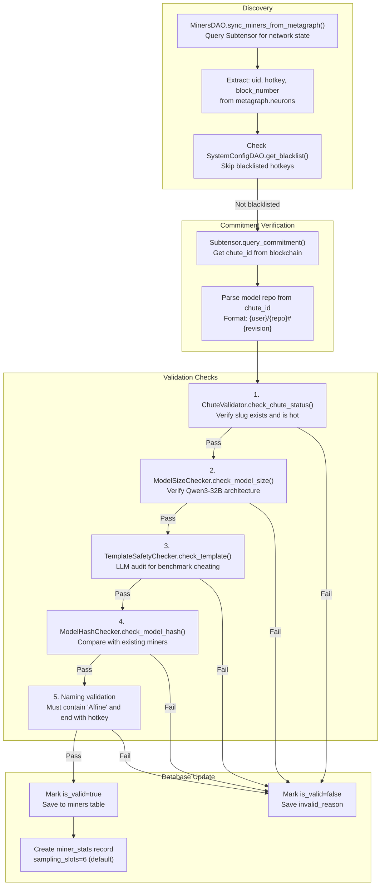
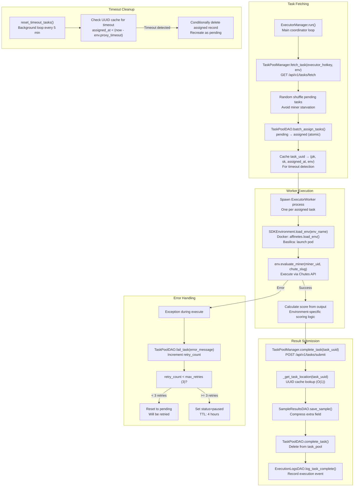
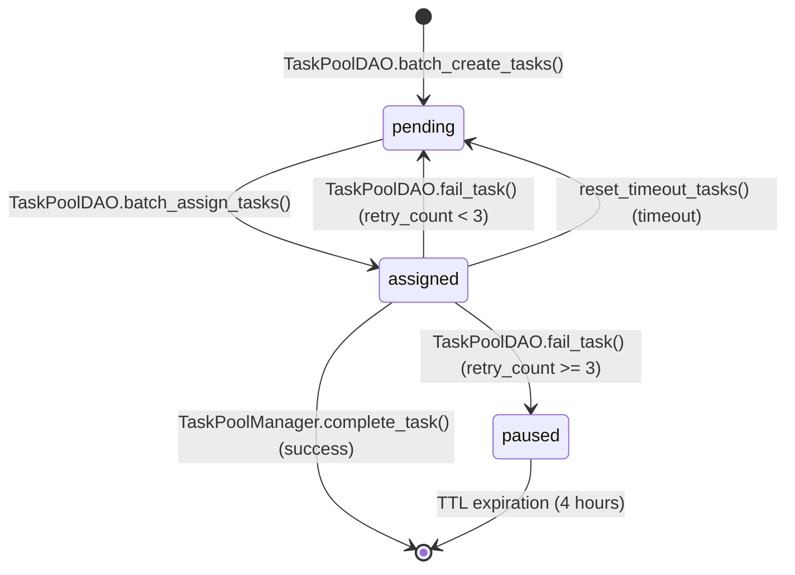
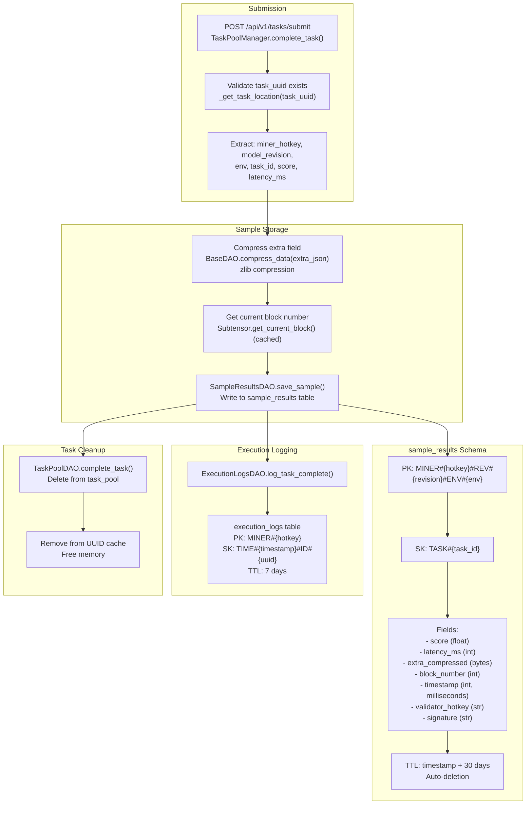
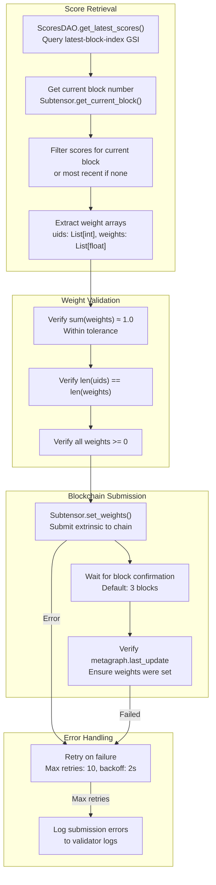

import CollapsibleAside from '../../../../components/CollapsibleAside.astro';
import SourceLink from '../../../../components/SourceLink.astro';
import Table from '../../../../components/Table.astro';

<CollapsibleAside title="Relevant Source Files">
  <SourceLink text="affine/api/dependencies.py" href="https://github.com/AffineFoundation/affine-cortex/blob/main/affine/api/dependencies.py" />
  <SourceLink text="affine/api/services/task_pool.py" href="https://github.com/AffineFoundation/affine-cortex/blob/main/affine/api/services/task_pool.py" />
  <SourceLink text="affine/database/cli.py" href="https://github.com/AffineFoundation/affine-cortex/blob/main/affine/database/cli.py" />
  <SourceLink text="affine/database/dao/__init__.py" href="https://github.com/AffineFoundation/affine-cortex/blob/main/affine/database/dao/__init__.py" />
  <SourceLink text="affine/database/dao/execution_logs.py" href="https://github.com/AffineFoundation/affine-cortex/blob/main/affine/database/dao/execution_logs.py" />
  <SourceLink text="affine/database/dao/sample_results.py" href="https://github.com/AffineFoundation/affine-cortex/blob/main/affine/database/dao/sample_results.py" />
  <SourceLink text="affine/database/dao/task_pool.py" href="https://github.com/AffineFoundation/affine-cortex/blob/main/affine/database/dao/task_pool.py" />
  <SourceLink text="affine/database/schema.py" href="https://github.com/AffineFoundation/affine-cortex/blob/main/affine/database/schema.py" />
  <SourceLink text="affine/database/tables.py" href="https://github.com/AffineFoundation/affine-cortex/blob/main/affine/database/tables.py" />
  <SourceLink text="affine/src/scheduler/sampling_scheduler.py" href="https://github.com/AffineFoundation/affine-cortex/blob/main/affine/src/scheduler/sampling_scheduler.py" />
  <SourceLink text="compose/docker-compose.backend.yml" href="https://github.com/AffineFoundation/affine-cortex/blob/main/compose/docker-compose.backend.yml" />
</CollapsibleAside>

This page documents how data flows through the Affine system, from miner registration to weight setting on the blockchain. It covers the complete lifecycle of evaluation data: validation, task allocation, execution, storage, and scoring.

For implementation details of specific services, see [Backend Services](/subnets/system-architecture/backend-services#3.2). For weight calculation algorithms, see [Weight Calculation System](/subnets/for-validators/weight-calculation-system#5.4). For database schema details, see [Database Schema](/subnets/database-storage/database-schema#8.1).

## Overview

The Affine data lifecycle consists of six major stages:

<Table>

| Stage | Services | Database Tables | Purpose |
|-------|----------|-----------------|---------|
| **Miner Validation** | Monitor | `miners`, `miner_stats` | Discover and validate miners from blockchain |
| **Task Allocation** | Scheduler | `task_pool`, `system_config` | Generate tasks with weighted slot allocation |
| **Task Execution** | Executor, API | `task_pool` | Execute tasks via Chutes and submit results |
| **Result Storage** | API | `sample_results`, `execution_logs` | Store compressed samples with TTL |
| **Weight Calculation** | Scorer | `scores`, `score_snapshots` | 4-stage scoring algorithm with Pareto filtering |
| **Weight Setting** | Validator | Blockchain | Set weights via Bittensor API |

</Table>


**Sources**: [affine/src/monitor/monitor.py:1-50](), [affine/src/scheduler/sampling_scheduler.py:1-100](), [affine/src/executor/executor_worker.py:1-50](), [affine/database/dao/sample_results.py:1-50](), [affine/src/scorer/scorer.py:1-50]()

---

## Complete Data Flow

```mermaid
graph TB
    subgraph "1. Miner Validation (Monitor Service)"
        METAGRAPH["Subtensor.get_metagraph()<br/>Query blockchain"]
        VALIDATE["MinerValidator.validate_miner()<br/>Check chute, model, template, hash"]
        MINERS_TABLE["miners table<br/>is_valid, model_hash, first_block"]
        STATS_TABLE["miner_stats table<br/>sampling_slots (3-10)"]
    end
    
    subgraph "2. Task Allocation (Scheduler Service)"
        SCHEDULER["PerMinerSamplingScheduler<br/>_schedule_all_miners()"]
        SLOTS["Get sampling_slots from miner_stats<br/>Default: 6, Range: 3-10"]
        WEIGHTED["Weighted allocation<br/>by scheduling_weight config"]
        TASK_POOL["task_pool table<br/>PK: MINER#hotkey#REV#revision<br/>SK: ENV#env#STATUS#pending#TASK_ID"]
    end
    
    subgraph "3. Task Execution (Executor Service)"
        FETCH["TaskPoolManager.fetch_task()<br/>GET /api/v1/tasks/fetch"]
        ASSIGN["TaskPoolDAO.batch_assign_tasks()<br/>pending → assigned"]
        EXECUTE["ExecutorWorker.execute_single_task()<br/>SDKEnvironment.evaluate()"]
        COMPLETE["TaskPoolManager.complete_task()<br/>POST /api/v1/tasks/submit"]
    end
    
    subgraph "4. Result Storage (API Service)"
        SAVE_SAMPLE["SampleResultsDAO.save_sample()<br/>Compress extra field"]
        SAMPLE_RESULTS["sample_results table<br/>PK: MINER#hotkey#REV#revision#ENV#env<br/>SK: TASK#task_id<br/>TTL: 30 days"]
        EXEC_LOGS["execution_logs table<br/>Task completion/failure events<br/>TTL: 7 days"]
    end
    
    subgraph "5. Weight Calculation (Scorer Service)"
        BATCH_QUERY["SampleResultsDAO.get_scoring_samples_batch()<br/>Query by miner + env ranges"]
        STAGE1["Stage 1: Data Collection<br/>Normalize, validate completeness"]
        STAGE2["Stage 2: Pareto Filter<br/>Filter plagiarism by dominance"]
        STAGE3["Stage 3: Subset Scoring<br/>Geometric mean, rank decay"]
        STAGE4["Stage 4: Normalization<br/>Sum=1.0, min threshold=0.01"]
        SCORES_TABLE["scores table<br/>scores_by_env, scores_by_layer"]
        SNAPSHOTS["score_snapshots table<br/>Block metadata, config snapshot"]
    end
    
    subgraph "6. Weight Setting (Validator Service)"
        FETCH_SCORES["ScoresDAO.get_latest_scores()<br/>Query latest-block-index"]
        SET_WEIGHTS["Subtensor.set_weights()<br/>Submit to blockchain"]
        BLOCKCHAIN["Bittensor Blockchain<br/>Weight distribution → TAO rewards"]
    end
    
    METAGRAPH --> VALIDATE
    VALIDATE --> MINERS_TABLE
    VALIDATE --> STATS_TABLE
    
    MINERS_TABLE --> SCHEDULER
    STATS_TABLE --> SLOTS
    SLOTS --> WEIGHTED
    WEIGHTED --> TASK_POOL
    
    TASK_POOL --> FETCH
    FETCH --> ASSIGN
    ASSIGN --> EXECUTE
    EXECUTE --> COMPLETE
    
    COMPLETE --> SAVE_SAMPLE
    SAVE_SAMPLE --> SAMPLE_RESULTS
    SAVE_SAMPLE --> EXEC_LOGS
    
    SAMPLE_RESULTS --> BATCH_QUERY
    BATCH_QUERY --> STAGE1
    STAGE1 --> STAGE2
    STAGE2 --> STAGE3
    STAGE3 --> STAGE4
    STAGE4 --> SCORES_TABLE
    STAGE4 --> SNAPSHOTS
    
    SCORES_TABLE --> FETCH_SCORES
    FETCH_SCORES --> SET_WEIGHTS
    SET_WEIGHTS --> BLOCKCHAIN
```



**Sources**: [affine/src/monitor/monitor.py:1-200](), [affine/src/scheduler/sampling_scheduler.py:125-189](), [affine/api/services/task_pool.py:397-513](), [affine/database/dao/sample_results.py:62-128](), [affine/src/scorer/scorer.py:1-100]()

---

## Miner Registration & Validation

Before task allocation, miners must be validated by the Monitor service.

### Validation Pipeline



### Anti-Plagiarism Hash Check

The `model_hash` is computed from LFS SHA256 hashes of all `.safetensors` files:

```python
# Extract LFS hashes from .safetensors.index.json
weight_map = index_json["weight_map"]
lfs_hashes = [get_lfs_hash(file) for file in set(weight_map.values())]

# Compute deterministic hash
model_hash = hashlib.sha256("".join(sorted(lfs_hashes)).encode()).hexdigest()
```

**Priority Rules**:
- If `model_hash` matches existing miner: compare `first_block`
- Earlier `first_block` wins (keeps original, marks duplicate as invalid)
- Identical `first_block`: both kept (simultaneous registration)

**Sources**: [affine/src/monitor/monitor.py:1-200](), [affine/src/monitor/miner_validator.py:1-100](), [affine/database/dao/miners.py:1-100]()

---

## Task Allocation & Scheduling

The Scheduler service allocates tasks using **per-miner weighted scheduling** with anti-starvation guarantees.

### Scheduling Algorithm

```mermaid
graph TB
    subgraph "Miner Loop (every 10s)"
        LOOP["PerMinerSamplingScheduler._schedule_all_miners()"]
        MINERS["MinersDAO.get_valid_miners()<br/>Query is_valid=true"]
        CLEANUP["Detect removed miners<br/>Cleanup their pending tasks"]
    end
    
    subgraph "Per-Miner Allocation"
        GET_SLOTS["MinerStatsDAO.get_miner_slots(hotkey, revision)<br/>Returns 3-10, default 6"]
        ACTIVE["TaskPoolDAO.get_pending_task_ids_for_miner()<br/>Count active tasks (pending + assigned)"]
        CAPACITY["Check: total_active < slots?"]
    end
    
    subgraph "Missing Tasks Calculation"
        SAMPLING_LIST["SystemConfigDAO.get_param_value('environments')<br/>Get sampling_list per env"]
        COMPLETED["SampleResultsDAO.get_completed_task_ids()<br/>Query sample_results"]
        PENDING["TaskPoolDAO.get_pending_task_ids_for_miner()<br/>Query task_pool"]
        MISSING["missing = sampling_list - completed - pending"]
    end
    
    subgraph "Weighted Allocation Strategy"
        WEIGHTS["Get scheduling_weight from sampling_config<br/>Default: 1.0 per env"]
        TARGET["target_slots = total_slots × (weight / sum_weights)<br/>Floor + remainder distribution"]
        DEFICIT["deficit = target - active_count<br/>Allocate to highest deficit first"]
        ANTISTARVATION["Anti-starvation: If active=0 and missing>0<br/>Reserve 1 slot (random sampling)"]
        ROUNDROBIN["Round-robin: Remaining capacity<br/>Distributed across envs with missing tasks"]
    end
    
    subgraph "Rate Limiting"
        ALLOCATIONS["Track allocations in last hour<br/>_allocation_timestamps dict"]
        ROTATION["rotation_rate × RATE_MARGIN (1.2)<br/>Prevent memorization attacks"]
        MINRATE["Minimum: sampling_count / 48<br/>Guarantee completion in 2 days"]
        ALLOWED["allowed_rate = max(rotation_rate, min_rate)"]
        SKIP["Skip if allocation_count >= allowed_rate"]
    end
    
    subgraph "Task Creation"
        CREATE["TaskPoolDAO.batch_create_tasks()<br/>status=pending, TTL=3 days"]
        RECORD["Record allocation timestamps<br/>For rate limiting"]
    end
    
    LOOP --> MINERS
    MINERS --> CLEANUP
    CLEANUP --> GET_SLOTS
    GET_SLOTS --> ACTIVE
    ACTIVE --> CAPACITY
    CAPACITY -->|"Has capacity"| SAMPLING_LIST
    SAMPLING_LIST --> COMPLETED
    COMPLETED --> PENDING
    PENDING --> MISSING
    MISSING -->|"Has missing tasks"| WEIGHTS
    WEIGHTS --> TARGET
    TARGET --> DEFICIT
    DEFICIT --> ANTISTARVATION
    ANTISTARVATION --> ROUNDROBIN
    ROUNDROBIN --> ALLOCATIONS
    ALLOCATIONS --> ROTATION
    ROTATION --> MINRATE
    MINRATE --> ALLOWED
    ALLOWED --> SKIP
    SKIP -->|"Not rate limited"| CREATE
    CREATE --> RECORD
```



### Slot Allocation Examples

**Example 1: 3 environments, total_slots=6, weights: &#123;game: 2.0, lgc: 1.0, print: 1.0&#125;**

<Table>

| Environment | Weight | Raw Target | Floor | Remainder | Final Target | Current Active | Deficit | Allocation |
|-------------|--------|------------|-------|-----------|--------------|----------------|---------|------------|
| game | 2.0 | 3.0 | 3 | 0.0 | 3 | 1 | 2 | 2 |
| lgc | 1.0 | 1.5 | 1 | 0.5 | 2 | 0 | 2 | 2 |
| print | 1.0 | 1.5 | 1 | 0.5 | 1 | 2 | -1 | 0 |

</Table>


**Total allocated**: 4 tasks (within 5 available slots after anti-starvation)

**Example 2: Anti-starvation trigger (print has active=0, missing>0)**

1. Reserve 1 slot for print (random sampling from missing tasks)
2. Allocate remaining 5 slots by deficit (game: 2, lgc: 2, print: 1 from reservation)

**Sources**: [affine/src/scheduler/sampling_scheduler.py:125-469](), [affine/database/dao/task_pool.py:44-103](), [affine/database/dao/miner_stats.py:1-50]()

---

## Task Execution

The Executor service fetches tasks from the API, executes them via Docker/Basilica environments, and submits results.

### Execution Pipeline



### Task State Transitions



**Key Features**:
- **Random Shuffling**: All pending tasks shuffled before selection to prevent miner starvation ([affine/api/services/task_pool.py:438-442]())
- **UUID Cache**: O(1) lookup during completion, avoiding expensive Scan operations ([affine/api/services/task_pool.py:148-150]())
- **Per-Environment Timeout**: Each environment has custom timeout (e.g., SWE-PRO: 600s, SAT: 60s) ([affine/core/environments.py:1-50]())
- **Multiprocessing**: Separate process per task for isolation and parallel execution ([affine/src/executor/executor_manager.py:1-100]())

**Sources**: [affine/api/services/task_pool.py:397-678](), [affine/src/executor/executor_worker.py:1-200](), [affine/database/dao/task_pool.py:265-486]()

---

## Result Storage

Results are stored directly in DynamoDB via the API service with compression and TTL.

### Storage Flow



### Compression Strategy

The `extra` field contains full conversation data (prompt, response, evaluation details) and is compressed before storage:

```python
# Compress extra data (typical 80% size reduction)
extra_json = json.dumps(extra, separators=(',', ':'))  # Minimize whitespace
extra_compressed = zlib.compress(extra_json.encode('utf-8'))

# Decompress when needed (e.g., for debugging)
extra_json = zlib.decompress(extra_compressed).decode('utf-8')
extra = json.loads(extra_json)
```

**Storage Efficiency**:
- Uncompressed: ~5KB per sample (with full conversation)
- Compressed: ~1KB per sample (80% reduction)
- TTL: 30 days (automatic cleanup)
- For 256 miners × 12 envs × 400 samples = ~1.2M samples ≈ 1.2 GB

**Sources**: [affine/api/services/task_pool.py:515-678](), [affine/database/dao/sample_results.py:62-128](), [affine/database/base_dao.py:1-50]()

---

## Weight Calculation

The Scorer service queries DynamoDB samples and applies a 4-stage scoring algorithm.

### Scoring Pipeline

```mermaid
graph TB
    subgraph "Stage 0: Data Loading"
        QUERY["SampleResultsDAO.get_scoring_samples_batch()<br/>Batch query for all miners × envs"]
        MINERS["Get valid miners from miners table<br/>is_valid=true"]
        RANGES["Get dataset_range per env<br/>from system_config"]
        FILTER["Server-side FilterExpression<br/>task_id >= start_id AND task_id < end_id"]
        SAMPLES["Dict[hotkey#revision][env] → List[samples]"]
    end
    
    subgraph "Stage 1: Data Collection & Normalization"
        NORMALIZE["Normalize scores by env<br/>score_normalized = (score - min) / (max - min)"]
        VALIDATE["Check completeness<br/>min_completeness threshold per env"]
        STATS["Build statistics:<br/>samples_count, avg_score per miner/env"]
        ELIGIBLE["Filter eligible miners<br/>Has samples in all scoring-enabled envs"]
    end
    
    subgraph "Stage 2: Pareto Anti-Plagiarism Filter"
        LAYERS["Generate subset layers<br/>L1: singles, L2: pairs, ..., L6: all"]
        COMPARE["For each layer and miner pair:<br/>sorted by first_block (temporal priority)"]
        DOMINANCE["Check dominance:<br/>later miner beats earlier in ALL envs?"]
        THRESHOLD["Threshold = earlier_avg + z_score × SE<br/>Bounded by MIN/MAX_IMPROVEMENT"]
        FILTER_COPY["If dominated: filter later miner<br/>Add to filtered_subsets"]
        KEEP["Non-dominated: keep both miners"]
    end
    
    subgraph "Stage 3: Subset Scoring"
        GEOMETRIC["For each subset:<br/>geometric_mean(scores across envs in subset)"]
        RANK["Rank miners by geometric mean<br/>within each subset"]
        DECAY["Apply rank-based decay:<br/>score² × decay^rank<br/>decay = 0.95 (configurable)"]
        AGGREGATE["Aggregate across subsets:<br/>scores_by_layer, scores_by_env"]
    end
    
    subgraph "Stage 4: Weight Normalization"
        SUM["Sum all scores across miners"]
        NORMALIZE_WEIGHTS["Normalize: weight = score / total_score"]
        THRESHOLD_MIN["Reassign weights < 0.01 to UID 0<br/>Avoid tail model rewards"]
        RENORMALIZE["Renormalize to sum=1.0"]
        BURN["Optional validator burn<br/>Scale × (1 - burn_percentage)"]
    end
    
    subgraph "Persistence"
        SCORES_TABLE["scores table<br/>PK: MINER#{hotkey}#REV#{revision}<br/>SK: BLOCK#{block_number}"]
        SNAPSHOTS["score_snapshots table<br/>Block metadata, config, statistics"]
    end
    
    QUERY --> MINERS
    MINERS --> RANGES
    RANGES --> FILTER
    FILTER --> SAMPLES
    
    SAMPLES --> NORMALIZE
    NORMALIZE --> VALIDATE
    VALIDATE --> STATS
    STATS --> ELIGIBLE
    
    ELIGIBLE --> LAYERS
    LAYERS --> COMPARE
    COMPARE --> DOMINANCE
    DOMINANCE --> THRESHOLD
    THRESHOLD --> FILTER_COPY
    THRESHOLD --> KEEP
    
    KEEP --> GEOMETRIC
    GEOMETRIC --> RANK
    RANK --> DECAY
    DECAY --> AGGREGATE
    
    AGGREGATE --> SUM
    SUM --> NORMALIZE_WEIGHTS
    NORMALIZE_WEIGHTS --> THRESHOLD_MIN
    THRESHOLD_MIN --> RENORMALIZE
    RENORMALIZE --> BURN
    
    BURN --> SCORES_TABLE
    BURN --> SNAPSHOTS
```



### Pareto Filtering Example

**Setup**: 3 miners, 2 environments, same `model_hash`, sorted by `first_block`

<Table>

| Miner | First Block | ENV1 Score | ENV2 Score | Model Hash |
|-------|-------------|------------|------------|------------|
| A | 1000 | 0.70 | 0.65 | abc123 |
| B | 1050 | 0.75 | 0.80 | abc123 (duplicate) |
| C | 1100 | 0.72 | 0.90 | abc123 (duplicate) |

</Table>


**Thresholds** (assuming z_score=1.96, SE derived from samples):
- ENV1 threshold for B: 0.70 + 1.96 × SE = 0.73 (example)
- ENV2 threshold for B: 0.65 + 1.96 × SE = 0.68 (example)

**Comparison**:
1. B vs A: B beats A in both ENV1 (0.75 > 0.73) AND ENV2 (0.80 > 0.68) → **B filters A**
2. C vs B: C does NOT beat B in ENV1 (0.72 &lt; 0.75) → **Both kept**

**Result**: Miner A filtered (plagiarism), B and C both scored.

**Sources**: [affine/src/scorer/scorer.py:1-500](), [affine/src/scorer/scorer_config.py:1-100](), [affine/database/dao/sample_results.py:256-328]()


---

## Data Format Transformations

Data transforms through several formats as it flows through the system:

```mermaid
graph LR
    subgraph "Task Pool"
        TASK_POOL["task_pool record<br/>{miner_hotkey, model_revision,<br/>env, task_id, status, chute_id}"]
    end
    
    subgraph "Execution"
        TASK_FETCH["Fetched task<br/>{task_uuid, miner_uid, chute_slug,<br/>env, task_id, assigned_to}"]
        RESULT["Execution result<br/>{score, latency_ms, extra,<br/>task_uuid, success, error}"]
    end
    
    subgraph "Storage"
        SAMPLE["sample_results record<br/>{miner_hotkey, model_revision, env,<br/>task_id, score, latency_ms,<br/>extra_compressed, block_number, timestamp}"]
    end
    
    subgraph "Scoring"
        QUERY_RESULT["Query result<br/>{task_id, score, timestamp}<br/>(projection, no extra)"]
        STATS["Aggregated stats<br/>{hotkey: {env: {samples_count,<br/>avg_score, first_block}}}"]
    end
    
    subgraph "Weights"
        SCORES["scores record<br/>{hotkey, revision, block_number,<br/>total_score, scores_by_env,<br/>scores_by_layer, rank}"]
        WEIGHTS["Weight arrays<br/>uids: torch.Tensor[int]<br/>weights: torch.Tensor[float]"]
    end
    
    TASK_POOL -->|"fetch_task()"| TASK_FETCH
    TASK_FETCH -->|"evaluate()"| RESULT
    RESULT -->|"complete_task()"| SAMPLE
    
    SAMPLE -->|"get_scoring_samples_batch()"| QUERY_RESULT
    QUERY_RESULT -->|"aggregate"| STATS
    STATS -->|"4-stage algorithm"| SCORES
    SCORES -->|"normalize"| WEIGHTS
```



**Storage Optimization**:
- **Compression**: `extra_compressed` field uses zlib (80% size reduction) ([affine/database/dao/sample_results.py:103-105]())
- **Projection**: Scoring queries only fetch `{task_id, score, timestamp}`, not full records ([affine/database/dao/sample_results.py:297-299]())
- **TTL**: Automatic cleanup after 30 days ([affine/database/dao/sample_results.py:106-108]())

**Sources**: [affine/database/dao/task_pool.py:44-103](), [affine/api/services/task_pool.py:397-510](), [affine/database/dao/sample_results.py:62-128](), [affine/database/dao/scores.py:1-100]()

---

## Weight Setting

The Validator service reads scores from the database and submits weights to the Bittensor blockchain.

### Weight Setting Flow



### Weight Confirmation

The system verifies weight submission by checking the metagraph:

```python
# Get validator index from metagraph
validator_idx = metagraph.hotkeys.index(validator_hotkey)

# Check last_update timestamp
ref_block = current_block
confirmation_block = ref_block + confirmation_blocks

# Wait and verify
await asyncio.sleep(confirmation_blocks * 12)  # 12s per block
updated = metagraph.last_update[validator_idx] >= ref_block

if not updated:
    raise WeightSetError("Weights not confirmed on chain")
```

**Confirmation Guarantees**:
- Waits for 3 confirmation blocks (36 seconds)
- Verifies `last_update` timestamp in metagraph
- Retries up to 10 times on failure

**Sources**: [affine/src/validator/validator.py:1-200](), [affine/database/dao/scores.py:1-150]()

---

## Summary Table

<Table>

| Stage | Input | Output | Key Components | Frequency |
|-------|-------|--------|---------------|-----------|
| **Sampling** | Metagraph, env configs | Task objects | `SamplingScheduler`, `MinerSampler` | Continuous (rate-controlled) |
| **Execution** | Task objects | Result objects | `EvaluationWorker`, `BaseSDKEnv` | Continuous (10 workers/env) |
| **Storage** | Result objects | R2 JSON shards | `sign_results()`, `sink()` | Batched (300 results) |
| **Loading** | R2 JSON shards | CompactResult stream | `dataset()`, `_cache_shard()` | On-demand (weight calc) |
| **Calculation** | CompactResult stream | Weight vectors | `SamplingOrchestrator`, `MinerSampler` | Periodic (tempo) |
| **Setting** | Weight vectors | Blockchain state | `retry_set_weights()` | After calculation |

</Table>


**Sources**: [affine/scheduler/scheduler.py:1-523](), [affine/storage.py:1-544](), [affine/sampling.py:1-937](), [affine/cal_weights.py:1-435]()
