import CollapsibleAside from '../../../components/CollapsibleAside.astro';
import SourceLink from '../../../components/SourceLink.astro';
import Table from '../../../components/Table.astro';

<CollapsibleAside title="Relevant Source Files">
  <SourceLink text=".gitignore" href="https://github.com/AffineFoundation/affine-cortex/blob/main/.gitignore" />
  <SourceLink text="affine/api/routers/samples.py" href="https://github.com/AffineFoundation/affine-cortex/blob/main/affine/api/routers/samples.py" />
  <SourceLink text="affine/cli/main.py" href="https://github.com/AffineFoundation/affine-cortex/blob/main/affine/cli/main.py" />
  <SourceLink text="affine/cli/types.py" href="https://github.com/AffineFoundation/affine-cortex/blob/main/affine/cli/types.py" />
  <SourceLink text="affine/src/miner/commands.py" href="https://github.com/AffineFoundation/affine-cortex/blob/main/affine/src/miner/commands.py" />
  <SourceLink text="affine/src/miner/main.py" href="https://github.com/AffineFoundation/affine-cortex/blob/main/affine/src/miner/main.py" />
  <SourceLink text="affine/utils/errors.py" href="https://github.com/AffineFoundation/affine-cortex/blob/main/affine/utils/errors.py" />
  <SourceLink text="tests/test_error_handling.py" href="https://github.com/AffineFoundation/affine-cortex/blob/main/tests/test_error_handling.py" />
</CollapsibleAside>

This page provides comprehensive troubleshooting guidance and answers to frequently asked questions about Affine. It covers common issues encountered during installation, validator operation, miner deployment, SDK usage, and production deployment. For conceptual understanding of system components, see [System Architecture](/subnets/system-architecture#3). For detailed configuration options, see [Configuration](/subnets/getting-started/configuration#2.2).

---

## Installation & Setup Issues

### Python Version and Dependency Conflicts

**Issue**: `uv pip install -e .` fails with dependency resolution errors or version conflicts.

**Solutions**:
1. Verify Python version: Affine requires Python 3.11+
2. Clear uv cache: `uv cache clean`
3. Remove existing venv: `rm -rf .venv`
4. Reinstall from scratch:
   ```bash
   uv venv && source .venv/bin/activate
   uv pip install -e .
   ```

**Common Error**: `Package has no dependencies listed`
- Ensure you're installing with `-e` flag for editable mode
- Check that `pyproject.toml` exists in repository root

**Import Errors After Installation**:
If imports fail after installation, verify the package is installed correctly:
```bash
python -c "import affine; print(affine.__file__)"
```

Sources: <SourceLink text="affine/cli/main.py:1-60" href="https://github.com/AffineFoundation/affine-cortex/blob/main/affine/cli/main.py#L1-L60" />

### Environment Variables Not Loading

**Issue**: Commands fail with errors like `KeyError: 'CHUTES_API_KEY'` or missing environment variables.

**Diagnosis Flow**:

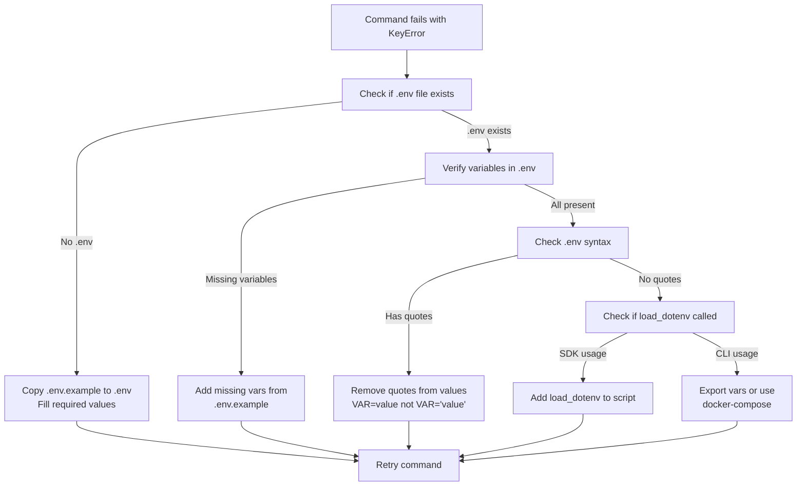

**Required Variables by Role**:

<Table>

| Role | Required Variables | Purpose |
|------|-------------------|---------|
| Validator | `CHUTES_API_KEY` | Validate miner Chutes deployments |
| Validator | `BT_WALLET_COLD`, `BT_WALLET_HOT` | Set weights on blockchain |
| Validator | `SUBTENSOR_ENDPOINT` | Connect to Bittensor network |
| Miner | `CHUTES_API_KEY` | Deploy models to Chutes |
| Miner | `CHUTE_USER` | Chutes username for deployment |
| Miner | `HF_TOKEN` | Upload to HuggingFace |
| SDK User | `API_URL` | Connect to Affine API (optional) |

</Table>


Sources: <SourceLink text="affine/src/miner/commands.py:23-26" href="https://github.com/AffineFoundation/affine-cortex/blob/main/affine/src/miner/commands.py#L23-L26" />, <SourceLink text="affine/cli/main.py:1-60" href="https://github.com/AffineFoundation/affine-cortex/blob/main/affine/cli/main.py#L1-L60" />

---

## Backend Services Troubleshooting

### Service Startup and Health Checks

**Issue**: Backend services fail to start or remain unhealthy.

**Service Dependency Chain**:

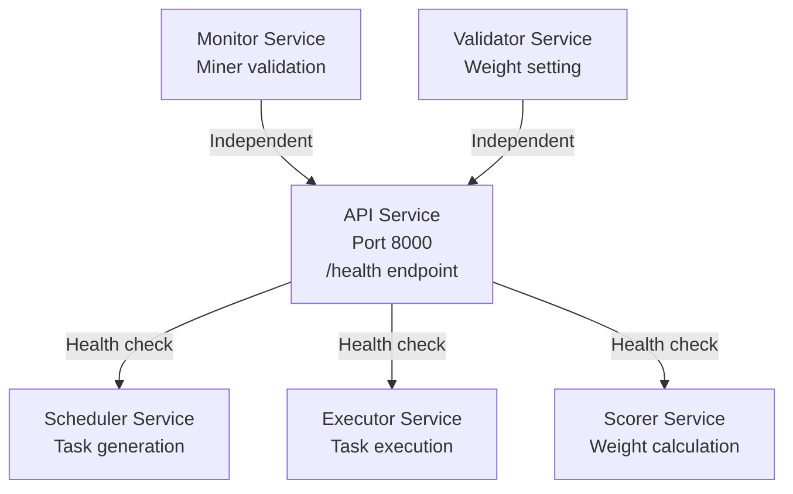

**Common Service Errors**:

<Table>

| Service | Error | Cause | Solution |
|---------|-------|-------|----------|
| API | `Failed to connect to DynamoDB` | AWS credentials missing | Set AWS environment variables |
| Monitor | `Failed to get metagraph` | Subtensor unreachable | Check `SUBTENSOR_ENDPOINT` |
| Scheduler | `No valid miners found` | Monitor hasn't run yet | Wait for Monitor to complete first cycle |
| Executor | `Docker socket not accessible` | Missing volume mount | Add `/var/run/docker.sock:/var/run/docker.sock` |
| Scorer | `No samples found` | Executor hasn't completed tasks | Wait for tasks to be executed |
| Validator | `Failed to set weights` | Wallet not accessible | Check wallet files mounted correctly |

</Table>


**Debugging Steps**:
```bash
# Check service logs
docker-compose logs -f api
docker-compose logs -f monitor
docker-compose logs -f scheduler
docker-compose logs -f executor
docker-compose logs -f scorer
docker-compose logs -f validator

# Test API health
curl http://localhost:8000/health

# Check service status
docker-compose ps
```

Sources: <SourceLink text="affine/cli/main.py:72-140" href="https://github.com/AffineFoundation/affine-cortex/blob/main/affine/cli/main.py#L72-L140" />, <SourceLink text="affine/api/routers/samples.py:27-28" href="https://github.com/AffineFoundation/affine-cortex/blob/main/affine/api/routers/samples.py#L27-L28" />

### Validator Service Weight Setting Failures

**Error Flow Diagram**:

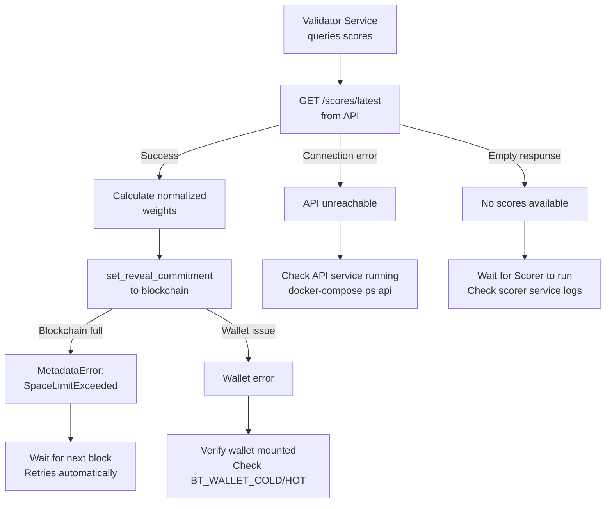

**Common Errors**:

<Table>

| Error | Cause | Solution |
|-------|-------|----------|
| `Failed to connect to API` | API service not running | Start: `docker-compose up -d api` |
| `No scores available` | Scorer hasn't run yet | Wait for Scorer service to complete first cycle |
| `MetadataError: SpaceLimitExceeded` | Blockchain metadata full | Automatically retried with `wait_for_block()` |
| `Wallet not found` | Wallet files not accessible | Check wallet files in `~/.bittensor/wallets/` |
| `Insufficient funds` | Hotkey has no TAO | Fund hotkey for transaction fees |

</Table>


**Verification**:
```bash
# Check validator service logs
docker-compose logs -f validator

# Check API accessibility
curl http://localhost:8000/scores/latest

# Verify weights on blockchain
btcli subnet metagraph --netuid 64 | grep <your_uid>
```

Sources: <SourceLink text="affine/cli/main.py:132-140" href="https://github.com/AffineFoundation/affine-cortex/blob/main/affine/cli/main.py#L132-L140" />, <SourceLink text="affine/src/miner/commands.py:396-463" href="https://github.com/AffineFoundation/affine-cortex/blob/main/affine/src/miner/commands.py#L396-L463" />

### Monitor Service Issues

**Issue**: Monitor service fails to discover or validate miners.

**Monitor Validation Pipeline**:

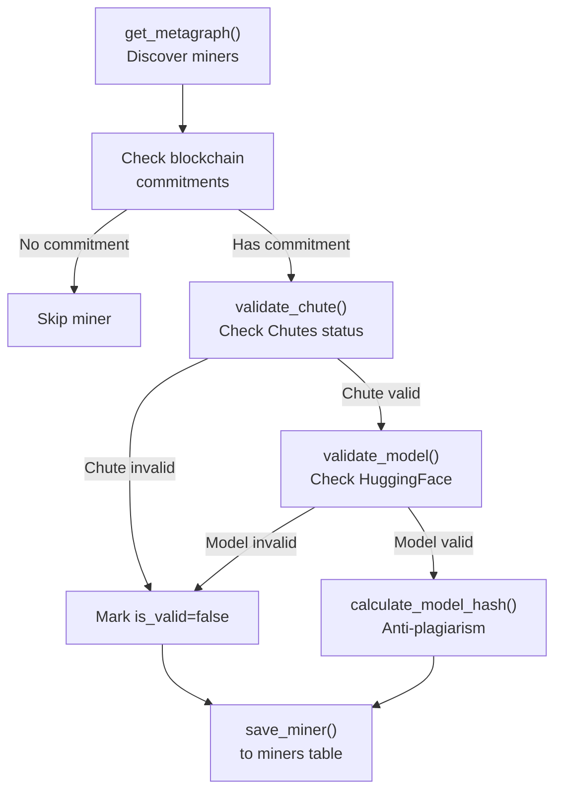

**Common Errors**:

<Table>

| Error | Cause | Solution |
|-------|-------|----------|
| `Failed to get metagraph` | Subtensor unreachable | Check `SUBTENSOR_ENDPOINT` configuration |
| `Chutes API error` | Invalid `CHUTES_API_KEY` | Verify API key in environment |
| `HuggingFace error` | Invalid `HF_TOKEN` | Check token permissions |
| `Template safety check failed` | LLM audit service down | Check DeepSeek-V3 availability |
| `Model hash calculation timeout` | Large model download | Increase timeout or check network |

</Table>


**Debugging**:
```bash
# Check monitor service logs
docker-compose logs -f monitor

# Verify Chutes API access
curl https://api.chutes.ai/chutes -H "Authorization: Bearer $CHUTES_API_KEY"

# Check miners table
aws dynamodb scan --table-name miners --max-items 10
```

Sources: <SourceLink text="affine/cli/main.py:102-110" href="https://github.com/AffineFoundation/affine-cortex/blob/main/affine/cli/main.py#L102-L110" />

### Scheduler Service Issues

**Issue**: Tasks not being generated or distributed to miners.

**Task Generation Flow**:

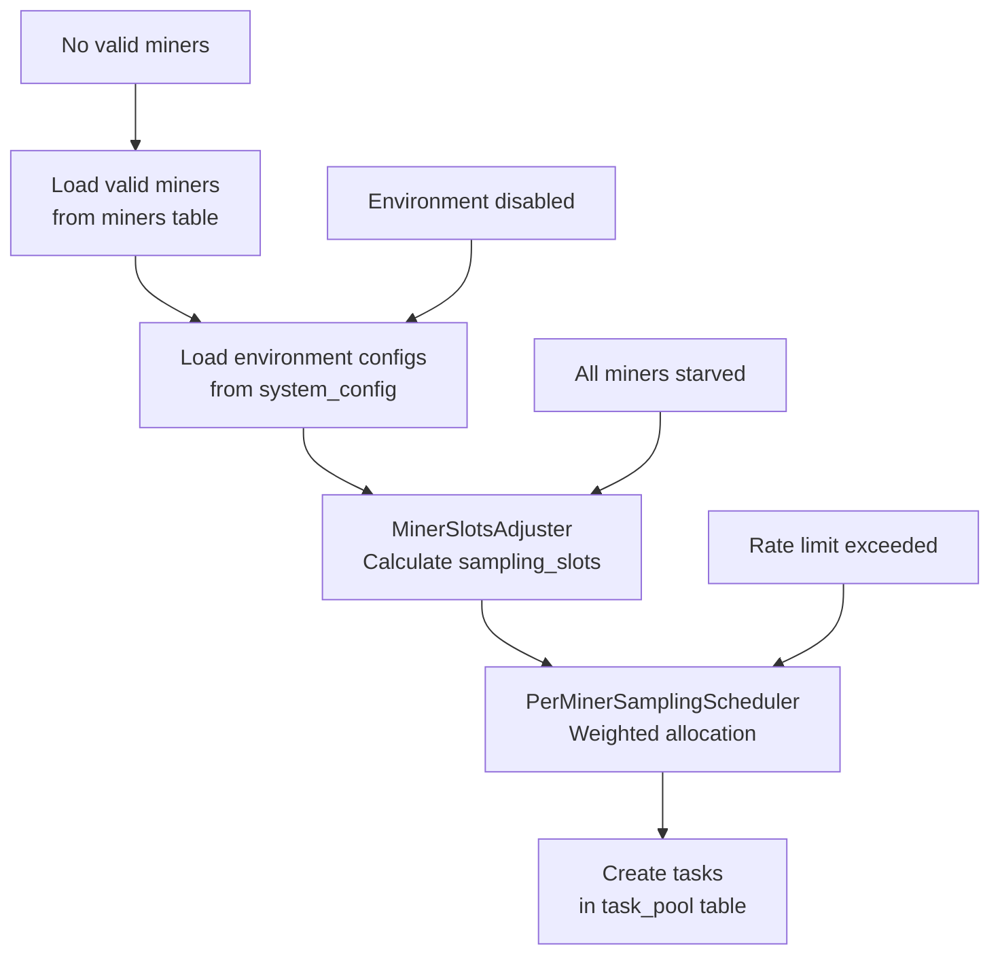

**Common Errors**:

<Table>

| Error | Cause | Solution |
|-------|-------|----------|
| `No valid miners found` | Monitor hasn't validated miners | Wait for Monitor service |
| `Environment disabled` | Config has `enabled: false` | Update system_config |
| `Anti-starvation triggered` | Miner has 0 active tasks | System working correctly - reserves slot |
| `Rate limit exceeded` | Too many recent allocations | Wait for rotation period |

</Table>


**Debugging**:
```bash
# Check scheduler logs
docker-compose logs -f scheduler

# Query task_pool
aws dynamodb query --table-name task_pool --key-condition-expression "miner_hotkey = :hotkey"

# Check system_config
aws dynamodb get-item --table-name system_config --key '{"param_name": {"S": "environments"}}'
```

Sources: <SourceLink text="affine/cli/main.py:122-130" href="https://github.com/AffineFoundation/affine-cortex/blob/main/affine/cli/main.py#L122-L130" />

### Executor Service Issues

**Issue**: Tasks not being executed or execution failing.

**Execution Pipeline**:

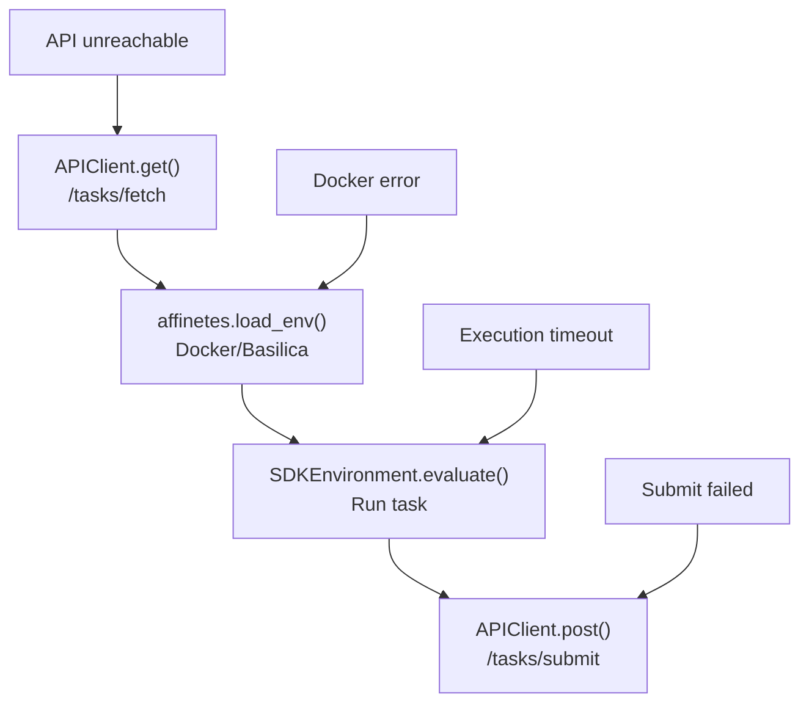

**Common Errors**:

<Table>

| Error | Cause | Solution |
|-------|-------|----------|
| `Failed to fetch tasks` | API service down | Check API service status |
| `Docker socket not accessible` | Missing volume mount | Add `-v /var/run/docker.sock:/var/run/docker.sock` |
| `Container failed to start` | Docker daemon issue | Check `docker ps` and daemon logs |
| `Execution timeout` | Task takes too long | Check environment timeout configuration |
| `Failed to submit results` | API rate limit | Reduce executor concurrency |

</Table>


**Debugging**:
```bash
# Check executor logs
docker-compose logs -f executor

# Test Docker access
docker ps

# Check environment containers
docker ps --filter "label=affinetes"

# Test API accessibility
curl http://localhost:8000/tasks/fetch -X POST
```

Sources: <SourceLink text="affine/cli/main.py:91-100" href="https://github.com/AffineFoundation/affine-cortex/blob/main/affine/cli/main.py#L91-L100" />

### Scorer Service Issues

**Issue**: Scores not being calculated or weights not updating.

**Scoring Pipeline**:

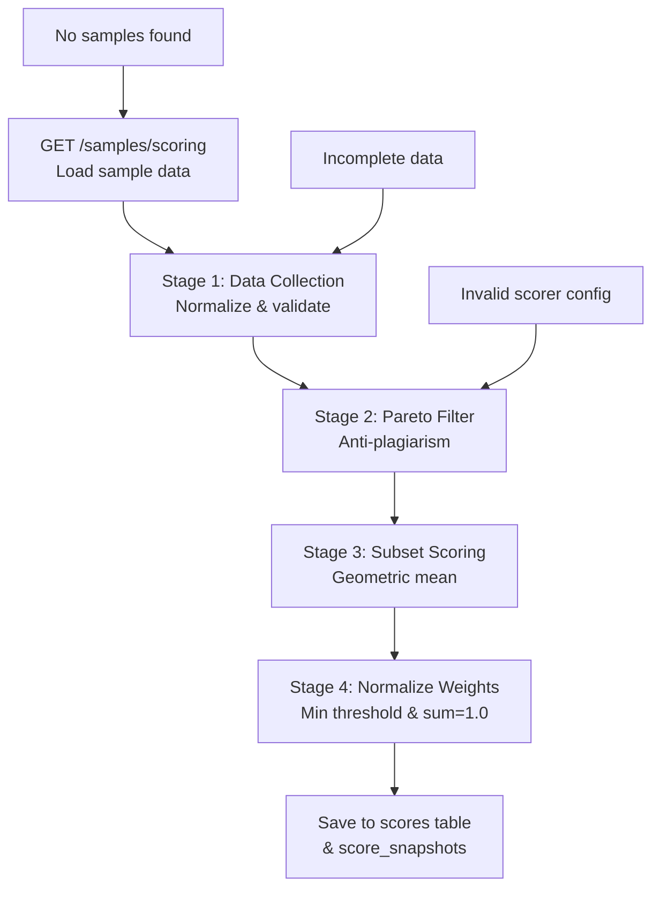

**Common Errors**:

<Table>

| Error | Cause | Solution |
|-------|-------|----------|
| `No samples found` | Executor hasn't completed tasks | Wait for executions |
| `Incomplete data` | Samples below `min_completeness` | Check environment configuration |
| `Invalid ScorerConfig` | Bad configuration in system_config | Verify scorer parameters |
| `Failed to save scores` | DynamoDB write error | Check AWS credentials |

</Table>


**Debugging**:
```bash
# Check scorer logs
docker-compose logs -f scorer

# Verify samples exist
curl http://localhost:8000/samples/scoring

# Check scores table
aws dynamodb scan --table-name scores --max-items 10

# Check latest snapshot
curl http://localhost:8000/scores/latest
```

Sources: <SourceLink text="affine/cli/main.py:112-120" href="https://github.com/AffineFoundation/affine-cortex/blob/main/affine/cli/main.py#L112-L120" />

---

## Miner Troubleshooting

### Chutes Deployment Failures

**Deployment Flow and Failure Points**:

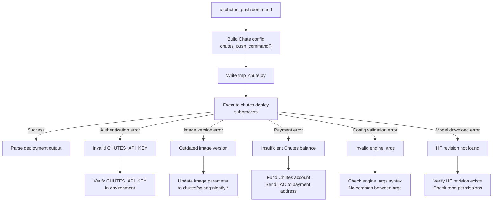

**Error Detection**: [affine/src/miner/commands.py:359-366]() uses regex to parse deployment output for ERROR log level.

**Common Errors**:

<Table>

| Error Message | Cause | Solution |
|--------------|-------|----------|
| `Must use image="chutes/sglang:..."` | Outdated Docker image | Update image parameter in deployment config |
| `Invalid engine_args` | Syntax error in config | Remove trailing commas, verify string quoting |
| `Payment address has insufficient balance` | No TAO in Chutes account | Fund Chutes payment address |
| `Model repo not found` | Private HF repo or invalid revision | Verify repo is public or token has access |
| `Chute deployment timeout` | GPU unavailable | Try different node selector or reduce concurrency |

</Table>


**Debugging Steps**:
1. Check deployment logs: Parse subprocess output
2. Verify Chute config: Inspect `tmp_chute.py` generated during deployment
3. Test Chutes CLI directly: `chutes list` to verify authentication
4. Check HuggingFace access: `curl -H "Authorization: Bearer $HF_TOKEN" https://huggingface.co/api/models/<repo>`

**Environment Variables**:
- `CHUTES_API_KEY`: Required for deployment authentication
- `CHUTE_USER`: Chutes username for deployment
- `HF_TOKEN`: HuggingFace token for private repos (optional)

Sources: <SourceLink text="affine/src/miner/commands.py:277-394" href="https://github.com/AffineFoundation/affine-cortex/blob/main/affine/src/miner/commands.py#L277-L394" />, <SourceLink text="affine/cli/main.py:184-192" href="https://github.com/AffineFoundation/affine-cortex/blob/main/affine/cli/main.py#L184-L192" />

### Chute Stays Cold (Inactive)

**Issue**: Deployed Chute shuts down and doesn't receive validator requests.

**Root Cause**: Chutes shutdown after inactivity period defined by `shutdown_after_seconds` parameter in deployment configuration.

**Validator Sampling Timing**:
- Monitor service validates Chutes periodically
- Only "hot" (active) Chutes marked as valid
- Cold Chutes are marked `is_valid=false` and excluded from sampling

**Solutions**:
1. **Increase shutdown timeout**:
   ```python
   # In Chute deployment config
   shutdown_after_seconds=28800,  # 8 hours
   ```

2. **Keep-alive script**:
   ```bash
   # Query your own Chute every 5 minutes
   while true; do
     curl -X POST https://llm.chutes.ai/v1/completions \
       -H "Content-Type: application/json" \
       -d '{"model": "your-model", "prompt": "test", "max_tokens": 1}'
     sleep 300
   done
   ```

3. **Adjust scaling**:
   ```python
   # In deployment config
   max_instances=2,
   scaling_threshold=0.5,  # Lower threshold = stays hot longer
   ```

**Verification**:
```bash
# Get chute status
chute_id=<your_chute_id>
curl https://api.chutes.ai/chutes/$chute_id \
  -H "Authorization: Bearer $CHUTES_API_KEY" | jq .status

# Check miner validation status
curl http://localhost:8000/miners/uid/<your_uid> | jq .is_valid
```

Sources: <SourceLink text="affine/src/miner/commands.py:307-330" href="https://github.com/AffineFoundation/affine-cortex/blob/main/affine/src/miner/commands.py#L307-L330" />

### Commitment Failures

**Issue**: `af commit` command fails or commitment not visible on blockchain.

**Commit Process**: <SourceLink text="affine/src/miner/commands.py:396-463" href="https://github.com/AffineFoundation/affine-cortex/blob/main/affine/src/miner/commands.py#L396-L463" /> calls `set_reveal_commitment` with retry logic for `SpaceLimitExceeded` errors.

**Error Types**:

<Table>

| Error | Cause | Solution |
|-------|-------|----------|
| `MetadataError: SpaceLimitExceeded` | Blockchain metadata full | Automatically retried with `wait_for_block()` |
| `Invalid commitment data` | Malformed JSON | Verify repo, revision, chute_id are valid strings |
| `Wallet not found` | Invalid coldkey/hotkey | Check wallet files in `~/.bittensor/wallets/` |
| `Insufficient funds` | Hotkey has no TAO | Fund hotkey for transaction fees |

</Table>


**Verification**:
```bash
# Check commitment on-chain
btcli wallet overview --wallet.name <coldkey> --wallet.hotkey <hotkey>

# Query metagraph for your UID
btcli subnet metagraph --netuid 64 | grep <your_uid>

# Verify commitment data structure
# Should be: {"model": "<repo>", "revision": "<sha>", "chute_id": "<id>"}
```

**Data Format**: [affine/src/miner/commands.py:425-429]() constructs JSON with `model`, `revision`, and `chute_id` keys.

**Private Repo Workflow**:
For additional security, use `--private-repo` flag with `af miner-deploy` to:
1. Upload to private HuggingFace repo
2. Pre-generate chute_id deterministically
3. Commit to blockchain FIRST
4. Make repo public AFTER commit
5. Deploy to Chutes

This prevents other miners from copying your model before your commit is on-chain.

Sources: [affine/src/miner/commands.py:396-463](), <SourceLink text="affine/src/miner/main.py:64-79" href="https://github.com/AffineFoundation/affine-cortex/blob/main/affine/src/miner/main.py#L64-L79" />

### Model Not Appearing on Leaderboard

**Issue**: Committed model doesn't show in evaluation results or leaderboard.

**Evaluation Timeline**:
1. Commitment on-chain → ~1 block (12 seconds)
2. Monitor discovers new miner → Next Monitor cycle (varies)
3. Miner validated → Marked `is_valid=true` in miners table
4. Scheduler generates tasks → Based on weighted allocation
5. Executor completes tasks → Results in sample_results table
6. Scorer calculates weights → After sufficient samples accumulated
7. Validator sets weights → Every scoring interval

**Diagnosis Checklist**:

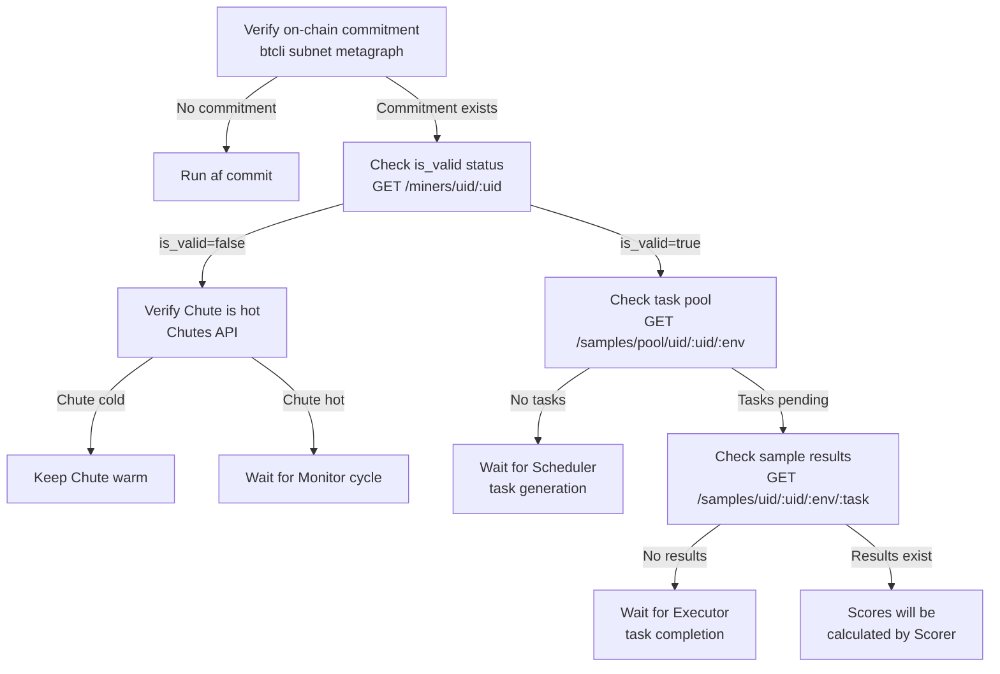

**Common Issues**:
1. **Revision mismatch**: Committed revision doesn't match deployed Chute
2. **Chute unreachable**: Monitor can't validate Chute status
3. **Model fails inference**: Executor gets errors, results not stored
4. **Blacklisted**: UID in system_config blacklist
5. **Invalid model**: Doesn't meet Qwen3-32B requirements

**Debugging Commands**:
```bash
# Check miner status
curl http://localhost:8000/miners/uid/<your_uid>

# Check if tasks are assigned
curl http://localhost:8000/samples/pool/uid/<your_uid>/affine:sat

# Check for results
curl http://localhost:8000/samples/uid/<your_uid>/affine:sat/0

# Check scores
curl http://localhost:8000/scores/uid/<your_uid>
```

Sources: <SourceLink text="affine/api/routers/samples.py:92-189" href="https://github.com/AffineFoundation/affine-cortex/blob/main/affine/api/routers/samples.py#L92-L189" />, <SourceLink text="affine/api/routers/samples.py:221-343" href="https://github.com/AffineFoundation/affine-cortex/blob/main/affine/api/routers/samples.py#L221-L343" />

---

## Environment & Execution Issues

### Docker Environment Failures

**Issue**: Environment evaluation fails with container errors.

**Affinetes Integration**: Affine uses [Affinetes](https://github.com/AffineFoundation/affinetes) for container orchestration. Environments are pre-built Docker images managed by the Executor service.

**Common Errors**:

<Table>

| Error | Source Environment | Solution |
|-------|-------------------|----------|
| `Container failed to start` | Any | Check Docker daemon: `docker ps` |
| `Image pull failed` | Any environment | Pull manually or check network |
| `Docker socket not accessible` | Executor service | Ensure `/var/run/docker.sock` mounted |
| `Port conflict` | Multiple environments | Affinetes handles ports automatically |
| `OOM killed` | Memory-intensive envs | Increase Docker memory limits |

</Table>


**Executor Service Docker Requirements**:
- Docker socket must be mounted: `/var/run/docker.sock:/var/run/docker.sock`
- Executor uses `affinetes.load_env()` to spawn containers
- Containers use labels for tracking: `label=affinetes`

**Debugging**:
```bash
# List running environment containers
docker ps --filter "label=affinetes"

# Check environment logs
docker logs <container_id>

# Test Docker access from executor
docker exec -it affine-executor docker ps

# Check executor logs for container errors
docker-compose logs -f executor | grep -i docker
```

**Environment Configuration**:
Environments configured in `system_config` table under `environments` parameter. Each environment specifies:
- Docker image to use
- Execution timeout
- Resource limits
- Sampling configuration

Sources: <SourceLink text="affine/cli/main.py:91-100" href="https://github.com/AffineFoundation/affine-cortex/blob/main/affine/cli/main.py#L91-L100" />

### Evaluation Timeout Issues

**Issue**: Task evaluations timeout or hang indefinitely.

**Timeout Configuration**:
- Default task timeout varies by environment
- Controlled by environment's timeout parameter in `system_config`
- Executor has overall timeout per task execution

**Common Causes**:
1. **Model too slow**: Inference takes longer than configured timeout
2. **Chutes rate limit**: Too many concurrent requests to same Chute
3. **Docker resource starvation**: Container CPU/memory limits
4. **Network latency**: High latency to Chutes endpoints

**Solutions**:
1. **Increase environment timeout**: Update environment config in system_config table
2. **Reduce concurrency**: Lower `concurrency` in Chute deployment config
3. **Scale Chute instances**: Increase `max_instances` in deployment
4. **Check Chutes status**: Monitor at https://chutes.ai/dashboard

**Debugging**:
```bash
# Check executor logs for timeouts
docker-compose logs executor | grep -i timeout

# Query environment configuration
curl http://localhost:8000/config/environments | jq '.[].timeout'

# Check Chute status
curl https://api.chutes.ai/chutes/<chute_id> \
  -H "Authorization: Bearer $CHUTES_API_KEY" | jq .status
```

Sources: <SourceLink text="affine/src/miner/commands.py:307-330" href="https://github.com/AffineFoundation/affine-cortex/blob/main/affine/src/miner/commands.py#L307-L330" />

### Task Pool Issues

**Issue**: Tasks not being generated or task_pool table growing unbounded.

**Task Pool Architecture**:

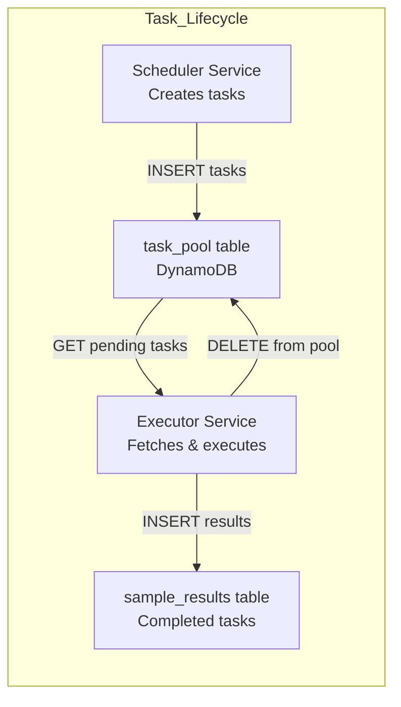

**Common Issues**:

<Table>

| Issue | Cause | Solution |
|-------|-------|----------|
| No tasks created | Scheduler not running | Check `docker-compose ps scheduler` |
| Tasks stuck in pending | Executor not fetching | Check executor service logs |
| Pool growing unbounded | Executor failing to delete | Check executor database permissions |
| Duplicate tasks | Race condition | System handles with composite keys |

</Table>


**Task Pool Query**:
Use CLI to check task pool status:
```bash
# Check task pool for specific miner/env
af get-pool <uid> <env>

# Example output shows:
# - sampled_task_ids: Completed tasks
# - pool_task_ids: Pending in task_pool
# - missing_task_ids: Not yet assigned
```

**Debugging**:
```bash
# Check scheduler logs
docker-compose logs -f scheduler

# Check executor logs
docker-compose logs -f executor

# Query task pool via API
curl "http://localhost:8000/samples/pool/uid/100/affine:sat"

# Check task counts in DynamoDB
aws dynamodb scan --table-name task_pool --select COUNT
```

Sources: <SourceLink text="affine/api/routers/samples.py:221-343" href="https://github.com/AffineFoundation/affine-cortex/blob/main/affine/api/routers/samples.py#L221-L343" />, <SourceLink text="affine/src/miner/main.py:153-169" href="https://github.com/AffineFoundation/affine-cortex/blob/main/affine/src/miner/main.py#L153-L169" />

---

## SDK Usage Issues

### Import Errors

**Issue**: `ImportError: cannot import name 'SAT' from 'affine'`

**Root Cause**: Package not installed or installed incorrectly.

**Solutions**:
```bash
# Reinstall in editable mode
cd affine-cortex
uv pip install -e .

# Verify installation
python -c "import affine; print(affine.__file__)"

# Check available exports
python -c "import affine; print(dir(affine))"
```

**Expected Exports**: `affine/__init__.py` exports environment factories, task utilities, and miner query functions.

**Common Import Patterns**:
```python
import affine

# Environment factories
env = affine.SAT()
env = affine.DED_V2()

# Miner queries (async)
miner = await affine.miners(uid)

# Task listing
tasks = affine.tasks.list_available_environments()
```

Sources: <SourceLink text="affine/cli/main.py:156-158" href="https://github.com/AffineFoundation/affine-cortex/blob/main/affine/cli/main.py#L156-L158" />

### Async Context Errors

**Issue**: `RuntimeError: no running event loop` or `RuntimeWarning: coroutine was never awaited`

**Root Cause**: SDK functions and CLI commands are async but called without proper async context.

**Incorrect**:
```python
import affine
miner = affine.miners(160)  # Missing await
```

**Correct**:
```python
import affine
import asyncio

async def main():
    miner = await affine.miners(160)
    print(miner)

asyncio.run(main())
```

**All Async Functions**:
SDK and CLI commands use async/await extensively:
- `env.evaluate_miner()` - Run miner evaluation
- `env.evaluate_model()` - Run model evaluation  
- Miner CLI commands internally use `asyncio.run()`

**CLI Commands Handle Async Internally**:
CLI commands at [affine/src/miner/main.py]() wrap async functions with `asyncio.run()`, so you don't need to manage event loops when using the CLI.

Sources: <SourceLink text="affine/src/miner/main.py:37-46" href="https://github.com/AffineFoundation/affine-cortex/blob/main/affine/src/miner/main.py#L37-L46" />, <SourceLink text="affine/src/miner/commands.py:168-239" href="https://github.com/AffineFoundation/affine-cortex/blob/main/affine/src/miner/commands.py#L168-L239" />

### Miner Query Errors

**Issue**: API queries for miner data return errors or empty results.

**Using CLI Commands**:
```bash
# Get miner info by UID
af get-miner 160

# Get miner info with stats
af get-miner 160

# Check scores
af get-score 160

# Check task pool
af get-pool 160 affine:sat
```

**Using API Directly**:
```bash
# Query miner by UID
curl http://localhost:8000/miners/uid/160

# Query with stats
curl http://localhost:8000/miners/uid/160/stats

# Query scores
curl http://localhost:8000/scores/uid/160
```

**Common Causes of Empty Results**:
1. **UID not registered**: No blockchain commitment for this UID
2. **Miner not validated**: Monitor service hasn't validated yet (`is_valid=false`)
3. **No commitment**: Miner exists but hasn't committed model
4. **API service down**: Check `docker-compose ps api`

**Verification**:
```bash
# Check on-chain registration
btcli subnet metagraph --netuid 64 | grep 160

# Check if miner is in database
curl http://localhost:8000/miners/uid/160 | jq .is_valid

# Check Monitor service logs
docker-compose logs monitor | grep "UID 160"
```

**UID Parameter Type**:
The CLI uses <SourceLink text="affine/cli/types.py:8-54" href="https://github.com/AffineFoundation/affine-cortex/blob/main/affine/cli/types.py#L8-L54" /> for UID parsing, supporting negative UIDs with 'n' prefix:
```bash
af get-miner 160    # UID 160
af get-miner n1     # UID -1
```

Sources: <SourceLink text="affine/src/miner/main.py:98-113" href="https://github.com/AffineFoundation/affine-cortex/blob/main/affine/src/miner/main.py#L98-L113" />, [affine/cli/types.py:8-54](), <SourceLink text="affine/api/routers/samples.py:92-189" href="https://github.com/AffineFoundation/affine-cortex/blob/main/affine/api/routers/samples.py#L92-L189" />

---

## Docker & Deployment Issues

### Docker Compose Startup Failures

**Backend Services Architecture**:

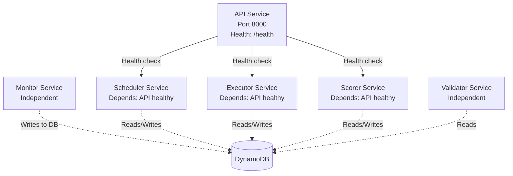

**Common Errors**:

<Table>

| Error | Cause | Solution |
|-------|-------|----------|
| `API unhealthy` | DynamoDB connection failed | Check AWS credentials |
| `Scheduler waiting for API` | API not started yet | Wait for API health check |
| `Executor Docker error` | Socket not mounted | Add `-v /var/run/docker.sock:/var/run/docker.sock` |
| `Volume mount denied` | Permission issues | Check `~/.bittensor/wallets` ownership |
| `Port 8000 already in use` | Port conflict | Change API_PORT in environment |

</Table>


**Debugging Commands**:
```bash
# Check all services
docker-compose ps

# Check API health
curl http://localhost:8000/health

# View service logs
docker-compose logs -f api
docker-compose logs -f monitor
docker-compose logs -f scheduler
docker-compose logs -f executor
docker-compose logs -f scorer
docker-compose logs -f validator

# Restart specific service
docker-compose restart api

# Rebuild all services
docker-compose down
docker-compose up -d --build
```

Sources: <SourceLink text="affine/cli/main.py:66-140" href="https://github.com/AffineFoundation/affine-cortex/blob/main/affine/cli/main.py#L66-L140" />

### Out of Memory (OOM) Errors

**Issue**: Container killed with exit code 137 or `OOMKilled` status.

**Memory Allocation**: Docker Compose sets memory limits per service.

**Diagnosis**:
```bash
# Check memory usage
docker stats

# Check container exit code
docker inspect affine-validator | jq '.[0].State'

# If OOMKilled is true:
# "OOMKilled": true
```

**Solutions**:
1. **Increase memory limit**: Edit docker-compose.yml
2. **Force recreate**: `docker-compose up -d --force-recreate`
3. **Reduce concurrency**: Lower worker count in scheduler config
4. **Clear cache**: `rm -rf ~/.cache/affine/` to free memory

**Default Limits**: Validator and Runner typically get 6GB reserved, 8GB limit.

Sources: <SourceLink text="README.md:59-62" href="https://github.com/AffineFoundation/affine-cortex/blob/main/README.md#L59-L62" />

### Watchtower Not Auto-Updating

**Issue**: Services don't update when new images are pushed.

**Watchtower Monitoring**: Watches image repositories and automatically restarts services on update.

**Diagnosis**:
```bash
# Check watchtower logs
docker logs affine-watchtower

# Look for update checks
docker logs affine-watchtower 2>&1 | grep "Checking"

# Verify monitored containers
docker inspect affine-watchtower | jq '.[0].Config.Labels'
```

**Common Issues**:
1. **No internet access**: Watchtower can't reach Docker Hub
2. **Rate limited**: Too many image checks
3. **Label mismatch**: Container labels don't match watchtower filter
4. **Manual override**: Local compose file prevents updates

**Manual Update**:
```bash
# Pull latest images and restart
docker-compose down
docker-compose pull
docker-compose up -d
```

Sources: <SourceLink text="README.md:54-58" href="https://github.com/AffineFoundation/affine-cortex/blob/main/README.md#L54-L58" />

---

## Common Error Messages Reference

### Error Message Lookup Table

<Table>

| Error Message | Component | File Location | Typical Cause | Solution |
|--------------|-----------|---------------|---------------|----------|
| `KeyError: 'CHUTES_API_KEY'` | Miner/Monitor | Config | Missing env var | Add to .env file |
| `MetadataError: SpaceLimitExceeded` | Commit | [affine/src/miner/commands.py:440-445]() | Blockchain full | Auto-retries with wait |
| `Must use image=chutes/sglang:...` | Chutes deploy | [affine/src/miner/commands.py:359]() | Outdated image | Update image parameter |
| `Payment address has insufficient balance` | Chutes deploy | Chutes API | No TAO in account | Fund Chutes payment address |
| `RuntimeError: no running event loop` | SDK/CLI | User code | Async without await | Use `await` in async context |
| `OOMKilled` | Docker | Docker daemon | Memory limit exceeded | Increase memory limit |
| `Container failed to start` | Executor | Docker | Docker issue | Check Docker daemon |
| `Failed to connect to API` | Services | HTTP client | API down | Start API service |
| `No valid miners found` | Scheduler | Database | Monitor hasn't run | Wait for Monitor |
| `Docker socket not accessible` | Executor | Mount | Missing volume mount | Add Docker socket mount |
| `Invalid UID` | CLI | [affine/cli/types.py:40-50]() | Bad UID format | Use numeric or n-prefix |
| `Environment not found` | API | [affine/api/routers/samples.py:119-138]() | Invalid env name | Check available envs |

</Table>


### HTTP Status Code Reference

**API Service Endpoints**:

<Table>

| Status | Endpoint | Meaning | Action |
|--------|----------|---------|--------|
| 200 | `/health` | Service healthy | API operational |
| 200 | `/miners/uid/:uid` | Miner found | Return miner data |
| 404 | `/miners/uid/:uid` | Miner not found | UID not registered |
| 200 | `/samples/uid/:uid/:env/:task` | Sample found | Return sample data |
| 404 | `/samples/uid/:uid/:env/:task` | Sample not found | Check task_pool |
| 200 | `/scores/latest` | Scores available | Return score data |
| 500 | Any | Server error | Check service logs |

</Table>


**Chutes API**:

<Table>

| Status | Endpoint | Meaning | Action |
|--------|----------|---------|--------|
| 200 | Deploy | Deployment successful | Proceed to commit |
| 401 | Any | Invalid API key | Verify CHUTES_API_KEY |
| 402 | Deploy | Payment required | Fund Chutes account |
| 404 | Query chute | Chute not found | Verify chute_id |
| 429 | Any | Rate limited | Reduce request frequency |
| 500 | Any | Server error | Retry with backoff |

</Table>


**Error Classes**:

Affine uses custom error classes defined in <SourceLink text="affine/utils/errors.py:1-35" href="https://github.com/AffineFoundation/affine-cortex/blob/main/affine/utils/errors.py#L1-L35" />:
- `AffineError`: Base exception class
- `NetworkError`: Network request failures (timeouts, connection errors)
- `ValidationError`: Data validation failures
- `ApiResponseError`: API error responses (non-2xx or malformed)

Sources: <SourceLink text="affine/api/routers/samples.py:30-90" href="https://github.com/AffineFoundation/affine-cortex/blob/main/affine/api/routers/samples.py#L30-L90" />, [affine/utils/errors.py:1-35](), <SourceLink text="tests/test_error_handling.py:1-85" href="https://github.com/AffineFoundation/affine-cortex/blob/main/tests/test_error_handling.py#L1-L85" />

---

## Frequently Asked Questions

### General Questions

**Q: What backend services need to be running?**

A: For a full validator setup, you need:
- **API Service** (`af servers api`): Core REST API for data access
- **Monitor Service** (`af servers monitor`): Validates miners and Chutes
- **Scheduler Service** (`af servers scheduler`): Generates tasks for miners
- **Executor Service** (`af servers executor`): Executes tasks and stores results
- **Scorer Service** (`af servers scorer`): Calculates weights from results
- **Validator Service** (`af servers validator`): Sets weights on blockchain

Use `docker-compose` to run all services: `docker-compose -f compose/docker-compose.backend.yml up -d`

**Q: Can I run services individually?**

A: Yes. Install dependencies with `uv pip install -e .` and run commands:
```bash
af servers api
af servers monitor
af servers scheduler
af servers executor
af servers scorer
af servers validator
```

However, you still need Docker daemon for Executor (environment execution). Production deployment with `docker-compose` is recommended.

**Q: How do I check service health?**

A: Query the API health endpoint:
```bash
curl http://localhost:8000/health
```

Check individual service logs:
```bash
docker-compose logs -f <service_name>
```

### Configuration Questions

**Q: What's the minimum hardware requirement?**

A: 
- CPU: 4+ cores recommended
- RAM: 16GB minimum (8GB for validator, 8GB for runner + environments)
- Disk: 50GB for Docker images and cache
- Network: Stable connection with low latency to Chutes.ai

**Q: How many concurrent evaluations should I run?**

A: Default worker count handles ~10-20 concurrent evaluations. Adjust based on hardware:
- Light load: 10 workers, concurrency 10
- Medium load: 20 workers, concurrency 20
- Heavy load: 30+ workers, requires 24GB+ RAM

Configure in SamplingConfig class.

**Q: Should I use R2 weights or local computation?**

A:
- **R2 mode** (`USE_R2_WEIGHTS=true`): Lower CPU, faster, consistent with other validators. Lags by ~180 blocks.
- **Local mode** (`USE_R2_WEIGHTS=false`): More current weights, higher CPU usage, requires reading full dataset from R2.

Most validators use R2 mode. Use local mode only if you need most recent weights or custom weight algorithms.

### Miner Questions

**Q: How much does it cost to run a miner?**

A: Costs are entirely on Chutes.ai:
- GPU rental: ~$1-3/hour depending on GPU type (H100, A100)
- Idle time: ~$0 if `shutdown_after_seconds` works properly
- Scale factor: Multiply by `max_instances` for concurrent serving

Monitor costs at https://chutes.ai/dashboard

**Q: Can I update my model without changing the chute_id?**

A: No. You must:
1. Upload new model to HuggingFace (new revision SHA)
2. Deploy new Chute with `af chutes_push`
3. Commit new chute_id with `af commit`

Existing Chute with old chute_id will continue serving until you commit new one. No downtime needed.

**Q: How do I debug why my model performs poorly?**

A: 
1. Test locally with SDK:
   ```python
   env = af.SAT()
   result = await env.evaluate(model="your-model", base_url="your-chute-url")
   print(result.extra)  # Detailed execution trace
   ```
2. Check result details in R2 dataset for specific task failures
3. Compare responses with top-performing miners
4. Verify inference parameters (temperature, max_tokens) match expectations

### Troubleshooting Questions

**Q: Validator keeps restarting every 15 minutes. Why?**

A: Watchdog timeout default is 900s (15 min). Main loop is stalled. Check:
1. Subtensor connectivity: `ping entrypoint-finney.opentensor.ai`
2. Signer health: `curl http://localhost:8080/healthz`
3. R2 connectivity: `curl https://pub-bf429ea7a5694b99adaf3d444cbbe64d.r2.dev/`

Increase timeout: `AFFINE_WATCHDOG_TIMEOUT=1800`

**Q: Why are my evaluation results not appearing in R2?**

A: Results upload via `sink()` function. Check:
1. `R2_WRITE_ACCESS_KEY_ID` and `R2_WRITE_SECRET_ACCESS_KEY` in `.env`
2. Runner logs for upload errors: `docker logs affine-runner | grep sink`
3. Signer health for batch signing: `curl http://localhost:8080/healthz`
4. Network connectivity to R2: `curl -I https://pub-bf429ea7a5694b99adaf3d444cbbe64d.r2.dev/`

**Q: How do I know if a specific UID is being evaluated?**

A: Query monitoring API:
```bash
curl http://localhost:8765/status/miners | jq '.miners[] | select(.uid == 160)'
```

Shows samples collected, last evaluation time, and whether miner is paused.

**Q: What does "Chutes error detected, pausing" mean?**

A: Scheduler automatically pauses miners when Chutes returns repeated errors (timeouts, 500 errors, etc). Miner resumes after cooldown period. Check:
1. Chute status: `chutes list`
2. Chute logs: Query via Chutes API with instance ID
3. Model health: Test inference directly

Sources: <SourceLink text="README.md" href="https://github.com/AffineFoundation/affine-cortex/blob/main/README.md" />, <SourceLink text="FAQ.md" href="https://github.com/AffineFoundation/affine-cortex/blob/main/FAQ.md" />, <SourceLink text="affine/cli.py" href="https://github.com/AffineFoundation/affine-cortex/blob/main/affine/cli.py" />

---

## Getting Help

### Log Collection

When reporting issues, include:

```bash
# Validator logs
docker logs affine-validator --tail 100 > validator.log

# Runner logs  
docker logs affine-runner --tail 100 > runner.log

# Signer logs
docker logs affine-signer --tail 100 > signer.log

# System info
docker stats --no-stream > system.log
docker ps -a >> system.log
```

### Support Channels

- **Discord**: [Affine Discord](https://discord.com/invite/3T9X4Yn23e) - Primary support channel
- **GitHub Issues**: Report bugs at https://github.com/AffineFoundation/affine/issues
- **Documentation**: [FAQ.md]() for common questions

### Related Documentation

- [Installation & Dependencies](/subnets/getting-started/installation-dependencies#2.1) - Setup and installation
- [Configuration](/subnets/getting-started/configuration#2.2) - Environment variables and config
- [Validator Overview](/subnets/for-validators/validator-overview#5.1) - Understanding validator role
- [Miner Overview](/subnets/for-miners/miner-overview#4.1) - Understanding miner role
- [Monitoring & Observability](/subnets/for-validators/monitoring-observability#5.5) - Monitoring API reference
- [Docker Deployment](/subnets/deployment-guide/docker-deployment#10.1) - Production deployment guide

Sources: <SourceLink text="README.md:1-6" href="https://github.com/AffineFoundation/affine-cortex/blob/main/README.md#L1-L6" />, <SourceLink text="FAQ.md:1-100" href="https://github.com/AffineFoundation/affine-cortex/blob/main/FAQ.md#L1-L100" />
