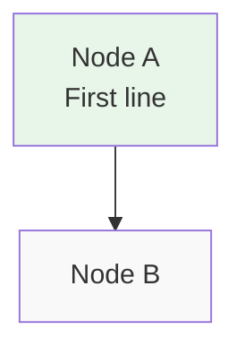

# 3.1 System Participants and Roles

**Overview.** The system has three participant roles defined in §5.1 and described in Section 3.2.

This table shows the roles:

| Role | Description | Reference |
|------|-------------|-----------|
| Miner | Trains models | Section 7.1 |
| Validator | Sets weights | Section 6.1 |

The scoring threshold must be <=5% and response time <100ms.



Some code:

```
def hello():
    print("world")
```

Inline code with braces: use `{key: value}` for config.

Outside code: weights {game: 2.0, lgc: 1.0} are applied.

Section 3.4 does not exist and should stay as plain text.

Reference to §10.6 should link to conclusion.
