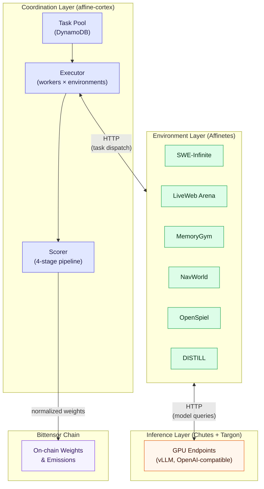

# 4.1 Architectural Overview

**Separation of concerns.** Affine's operational architecture separates two concerns that most benchmark systems conflate:

- **Environment execution** — running tasks, computing scores
- **Model inference** — generating predictions from neural networks

> **Why this matters:** This separation is not merely organizational — it enables independent scaling, resource-appropriate hardware allocation, and clean substitution of infrastructure components as the system evolves.

Figure 3 provides the architectural overview.

**Figure 3. Three-Layer System Architecture**

**Three layers.** The system comprises three layers, each with a distinct responsibility:

1. **The environment layer** (Affinetes) packages evaluation environments as isolated, containerized services. Each environment:
   - Runs in its own Docker container
   - Exposes a standardized HTTP interface
   - Is managed through a unified orchestration API

   Affinetes handles image building, container lifecycle, inter-process communication, load balancing, and automatic cleanup.

2. **The inference layer** (currently Chutes) serves model predictions via OpenAI-compatible HTTP endpoints. Miners deploy their models as serverless inference endpoints on Chutes, which handles:
   - GPU allocation
   - Request routing
   - Auto-scaling

   The environment layer communicates with the inference layer exclusively through HTTP, with no shared state or tight coupling.

3. **The coordination layer** (affine-cortex) runs the scoring pipeline, task pool management, and executor processes described in Section 3. It orchestrates evaluation by:
   - Dispatching tasks from the task pool to environment instances
   - Environment instances in turn invoke miner models through the inference layer

**Backend substitutability.** Building on the three-layer design above, this architecture means that replacing the inference backend — for example, migrating from Chutes to Targon-backed or Affine-operated GPU clusters — requires no changes to environment code, scoring logic, or task management. The only modification is the base URL passed to environment instances.
