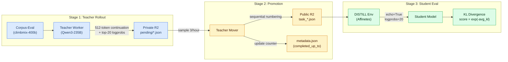

# 5.6 DISTILL: Distributional Alignment via KL Divergence

**Capability target.** DISTILL evaluates a fundamentally different dimension of model quality than the five interactive environments above. Rather than measuring task-completion capability — whether a model can fix a bug, navigate a website, or win a game — DISTILL measures **distributional alignment**: how closely a student model's internal token-level predictions match those of a stronger teacher model across diverse natural-language continuations. This targets the quality of the model's learned representations, not merely its behavioral outputs.

## Why Behavioral Scoring Alone Is Insufficient

Interactive environments provide rich task-level reward signals, but they share a limitation: two models can achieve identical task scores through very different internal strategies — one through robust understanding, another through brittle pattern matching.

> **Why this matters:** A model that produces the right bug fix for the wrong reasons will score identically to one that genuinely understands the codebase. Distributional alignment provides a complementary signal that penetrates beyond behavioral equivalence.

The distributional signal has two key advantages over task-level rewards:

- **Representation quality** — A student whose per-token probability distribution closely matches a stronger teacher's has likely learned similar internal representations, not just similar surface outputs
- **Smoother gradient** — Incremental improvements in distributional alignment are detectable even when they do not yet produce measurable gains on pass/fail evaluation

## Architecture Overview

DISTILL operates through a three-stage pipeline that separates teacher rollout generation, storage promotion, and student evaluation. Each stage is independently operated, allowing the pipeline to scale and evolve without cross-stage coupling.

**Figure 4. DISTILL Three-Stage Pipeline**

### Stage 1: Teacher Rollout Generation

An independent teacher worker process runs alongside the main executor. Its pipeline:

1. **Sample task IDs** from the Corpus-Eval environment — a prompt source backed by `karpathy/climbmix-400b-shuffle` that provides deterministic raw-corpus prompts rather than curated benchmark questions, eliminating contamination risk
2. **Generate continuations** — the teacher model (e.g., Qwen3-235B) produces a 512-token continuation with `collect_logprobs=True`, yielding per-position top-20 token probability distributions
3. **Upload rollouts** — the resulting rollout (containing the full conversation text, token positions, and teacher logprob dictionaries) is uploaded to a private R2 bucket (`pending/{env}/{epoch_ms}.json`)

> **Efficiency optimization:** The teacher worker walks segment-aligned task IDs (64-task segments matching Corpus-Eval's LRU shard boundaries), allowing bursts of rollouts to reuse cached corpus shards rather than triggering fresh ~92 MB downloads per rollout.

### Stage 2: Rollout Promotion

A separate teacher mover process periodically promotes rollouts from the private to a public R2 bucket. On each tick, it:

1. Reads the DISTILL configuration from SystemConfig (DynamoDB)
2. Lists pending rollouts across all source environments
3. Samples a configurable number of candidates (default: 3 per rotation, hourly)
4. Copies them to sequentially numbered public files (`task_{next_id:011d}.json`)
5. Updates `metadata.json` with the new `completed_up_to` counter

> **Dynamic dataset expansion:** The `completed_up_to` counter drives automatic dataset range expansion. The DISTILL sampling configuration auto-expands its task range by fetching the latest counter from the public metadata endpoint, ensuring the evaluation pool grows continuously without code changes. Promotion cadence is operator-tunable from a single DynamoDB entry.

### Stage 3: Student Evaluation

The DISTILL environment itself is a containerized service (`affinefoundation/distill:latest`) deployed via Affinetes. For each evaluation task, it:

1. Loads the corresponding teacher rollout from R2 (with local filesystem caching to avoid repeated downloads)
2. Performs a student forward pass using the vLLM completions API with `echo=True` and `logprobs=20` — recovering the student's top-20 token distribution at every position in the teacher's continuation
3. Computes per-position KL divergence between teacher and student distributions
4. Returns a scalar score

## KL Divergence Scoring

The scoring algorithm implements two paths depending on the rollout format.

### Top-K Path (Primary)

This is the standard scoring path. For each position *i* in the teacher continuation where the teacher provides a top-20 distribution, the following steps are applied:

1. Extract the teacher's top-20 tokens and their log-probabilities
2. Extract the student's top-20 log-probabilities at the same position
3. For tokens in the teacher's support set but absent from the student's top-20, assign a conservative fallback: the minimum of the student's top-20 log-probabilities
4. Renormalize both distributions onto the teacher's support set via log-softmax
5. Compute KL divergence on this restricted simplex:

**KL_i = sum_t exp(p_t) * (p_t - q_t)**

Where:

- **p_t** = renormalized teacher log-probability for token *t*
- **q_t** = renormalized student log-probability for token *t*
- The sum runs over all tokens in the teacher's top-20 support set

6. Clip KL_i to [0, 10.0] to guard against outliers

### Legacy Path (Single-Sample Fallback)

For older rollouts that store only the chosen token's log-probability, the environment uses Schulman's k3 estimator — a single-sample, unbiased, non-negative KL estimate:

**r = exp(s_lp - t_lp);  kl_i = (r - 1) - log(r)**

Where:

- **s_lp** = student log-probability of the chosen token
- **t_lp** = teacher log-probability of the chosen token

### Score Mapping

The final score maps average clipped KL to a [0, 1] range via the exponential:

**score = exp(-avg_kl)**

What this means in practice:

- A **perfect distributional match** yields 1.0
- An **average KL of 1.0** yields approximately 0.37
- Scores **approach 0** as divergence increases

> **Why the exponential mapping:** This provides a smooth, continuous reward signal where every incremental improvement in distributional alignment produces a detectable score increase — unlike binary task rewards where small improvements may be invisible.

## Integration with Scoring Pipeline

DISTILL scores enter the standard scoring pipeline through Stage 1 collection, where they are treated as any other environment score — contributing to the geometric mean that determines miner rankings.

Key integration parameters:

- **min_completeness = 0.6** (lower than the 90% threshold for interactive environments, reflecting the pipeline's younger rollout supply)
- DISTILL scores factor into Pareto filtering, ELO ratings, and weight distribution

> **Why the geometric mean matters here:** Because the geometric mean collapses toward zero when any environment score is near zero, a miner cannot achieve high overall weight without maintaining reasonable distributional alignment alongside strong task performance.

## Dual-Purpose Data Flow

The logprob data collected during DISTILL evaluation also feeds into the anti-copy detector's logprob signal (Section 3.5), creating a dual-purpose data flow: the same per-token distributions used for scoring also power forensic plagiarism detection.

## Key Advantages

DISTILL offers five structural advantages as a complementary evaluation signal:

- **Complementary signal** — measures internal distributional quality, not just behavioral task success; catches models that pass tasks through brittle strategies
- **Smooth gradient** — exponential KL mapping provides continuous reward where task-level signals are sparse or binary
- **Contamination-resistant** — teacher rollouts sourced from raw corpus data (climbmix-400b-shuffle), not curated benchmarks
- **Self-expanding** — dynamic dataset range auto-grows as the teacher pipeline produces new rollouts, without code changes
- **Dual-purpose data** — logprob distributions serve both scoring and anti-copy detection

## Current Limitations

- **Teacher ceiling** — the pipeline depends on a specific teacher model (currently Qwen3-235B) whose quality upper-bounds the training signal; a student that surpasses the teacher receives no further guidance
- **Top-20 support restriction** — probability mass outside both models' top-20 tokens is unaccounted for, introducing a systematic underestimate of true KL divergence
- **Legacy path variance** — the single-sample path (k3 estimator) has higher variance than the top-K path, creating measurement inconsistency across rollout formats during the transition period
- **Lower completeness threshold** — at 60% vs. 90% for other environments, DISTILL scores can enter the pipeline with fewer data points, potentially increasing scoring noise
