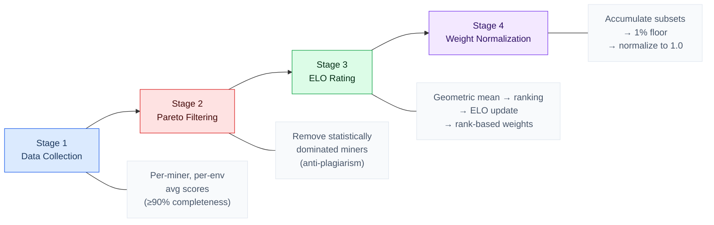

# 6.1 The Scoring Pipeline

**Four-stage pipeline.** Affine computes miner weights through a four-stage pipeline that transforms raw per-task scores into normalized blockchain weights (Figure 2). Each stage addresses a distinct concern:

1. **Data Collection** -- aggregate and normalize raw scores
2. **Pareto Filtering** -- remove statistically dominated miners (anti-plagiarism)
3. **ELO Rating** -- rank survivors, update temporal ratings, and assign weights
4. **Weight Normalization** -- enforce a minimum threshold and normalize to 1.0

**Figure 2. Four-Stage Scoring Pipeline**



## Stage 1: Data Collection

**Score aggregation.** The collector parses raw evaluation data from the backend API, computing per-miner, per-environment average scores. The processing steps are:

- Environment-specific score ranges are normalized.
- Only miners meeting the **90% completeness threshold** proceed to subsequent stages.
- The output is a set of `MinerData` objects, each containing a map of environment scores with averages, sample counts, and per-task score vectors.

## Stage 2: Pareto Frontier Filtering

Building on the clean score data from Stage 1, this stage identifies and removes miners whose performance is statistically dominated by an earlier submission -- the primary defense against model plagiarism at the scoring level.

**Dominance testing.** For each pair of miners (A, B) where A committed to the blockchain first, the system tests whether A dominates B across all environments. The following formula computes the improvement threshold using a binomial confidence interval:

> **What this means:** the threshold represents the minimum score B must exceed to prove it is genuinely better than A, not merely a copy with random variance.

```
SE = sqrt(p * (1 - p) / n)
gap = z * SE
gap = clamp(gap, MIN_IMPROVEMENT, MAX_IMPROVEMENT)
threshold = min(prior_score + gap, 1.0)
```

Where:

- `p` -- miner A's score
- `n` -- the number of common tasks
- `z` -- the z-score (default 2.0, corresponding to approximately 95.4% confidence)
- `gap` -- bounded between a 2% floor and a 10% ceiling

> **Key implication:** Miner A dominates B only if B fails to exceed A's threshold in *every* environment in the evaluated subset. This ensures that a copy -- which will perform nearly identically to the original -- is filtered out, while a genuinely improved model that exceeds the statistical threshold survives.

**First-commit ordering.** The first-commit advantage is enforced by sorting miners by `first_block` before applying dominance tests. An earlier submission can only be dominated by a later one that demonstrates statistically significant improvement, not by random variance.

## Stage 3: ELO Rating and Weight Distribution

After Pareto filtering removes copies in Stage 2, the remaining miners are ranked and assigned weights through a multi-step process.

**Geometric mean ranking.** Surviving miners are ranked within each scoring round using a geometric mean of their environment scores:

> **What this means:** a single zero-score environment collapses the aggregate, forcing miners to maintain competence across *all* environments rather than specializing narrowly.

```
GM = ((v1 + e) * (v2 + e) * ... * (vn + e))^(1/n) - e
```

Where:

- `v1 ... vn` -- per-environment scores
- `e` (epsilon) = 0.1 -- smoothing constant to prevent a single zero from collapsing the product

**ELO temporal smoothing.** Rankings feed into an ELO rating system that tracks miner performance across scoring rounds, providing temporal smoothing that a single-round ranking cannot. The key parameters are:

- **Base rating**: 1200 -- deliberately below average to prevent new-key spam from immediately competing for emissions.
- **K-factor**: 96 for provisional miners (first 48 rounds), decaying to 32 for established miners. At the default scoring interval, the provisional period spans approximately one to two days. The higher provisional K-factor allows genuinely strong new entrants to converge quickly while established miners are not dislodged by noise.

**Absence decay.** Miners that do not participate in a scoring round -- due to incomplete sampling, Pareto filtering, or being offline -- experience accelerating rating decay:

> **What this means:** early missed rounds cost little, but sustained absence accelerates rapidly -- stale ratings converge to the base within approximately 18 hours, preventing inactive miners from occupying weight slots indefinitely.

```
rating = BASE + excess * 0.95^(rounds^1.4)
```

Where:

- `BASE` -- the base rating (1200)
- `excess` -- the miner's rating above the base
- `rounds` -- consecutive missed rounds
- A two-round grace period (approximately one hour) prevents brief outages from triggering decay
- The super-linear exponent (1.4) drives the accelerating decay

**Weight distribution** follows a rank-based decay model:

- The top-ranked miner receives a base weight.
- Each subsequent rank receives 50% of the previous rank's weight: `weight = 0.5^(rank - 1)`.
- All miners with at least one ELO round played receive weight, not only those participating in the current round.

The following table consolidates all ELO and weight parameters. Look for the interplay between the provisional K-factor and absence decay -- together they create a system where new entrants can rise quickly but cannot persist without ongoing participation.

**Table 2. ELO Rating and Weight Distribution Parameters**

| Parameter | Value | Rationale |
|---|---|---|
| Base rating | 1200 | Below average; prevents new-key spam from immediately competing |
| K-factor (provisional) | 96 | High responsiveness for first 48 rounds (~1-2 days) |
| K-factor (established) | 32 | Stability for long-running miners |
| Absence decay rate | 0.95^(rounds^1.4) | Super-linear: early misses cost little, sustained absence converges to base in ~18 hours |
| Grace period | 2 rounds (~1 hour) | Prevents brief outages from triggering decay |
| Weight decay per rank | 0.5^(rank - 1) | Top miner gets 1.0, rank 2 gets 0.5, rank 3 gets 0.25, etc. |
| Minimum weight threshold | 1% | Below-threshold weight redistributed to UID 0 |

> **Legend:** "~" indicates approximate real-time durations that depend on the current scoring interval.

## Stage 4: Weight Normalization

The final stage converts raw weight assignments from Stage 3 into blockchain-ready values. It performs three operations:

1. Accumulates subset weight contributions per miner.
2. Applies a **1% minimum weight threshold** -- miners below this floor have their weight redistributed to UID 0.
3. Normalizes the remaining weights to sum to 1.0.

> **Why UID 0 redistribution matters:** The team also uses this mechanism deliberately to burn emissions during periods of infrastructure instability, security incidents, or scoring corrections.
