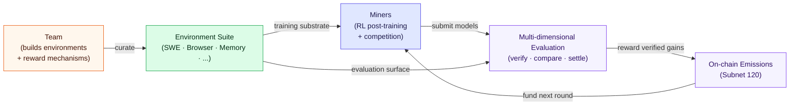

```mermaid
flowchart LR
    T["Team<br/>(builds environments<br/>+ reward mechanisms)"]
    E["Environment Suite<br/>(SWE · Browser · Memory · ...)"]
    M["Miners<br/>(RL post-training<br/>+ competition)"]
    S["Multi-dimensional Evaluation<br/>(verify · compare · settle)"]
    W["On-chain Emissions<br/>(Subnet 120)"]

    T -->|"curate"| E
    E -->|"training substrate"| M
    M -->|"submit models"| S
    E -->|"evaluation surface"| S
    S -->|"reward verified gains"| W
    W -->|"fund next round"| M

    classDef team fill:#fff7ed,stroke:#ea580c,color:#431407
    classDef env fill:#dcfce7,stroke:#16a34a,color:#052e16
    classDef miner fill:#e0e7ff,stroke:#4f46e5,color:#1e1b4b
    classDef chain fill:#f5f3ff,stroke:#7c3aed,color:#2e1065

    class T team
    class E env
    class M miner
    class S,W chain
```
