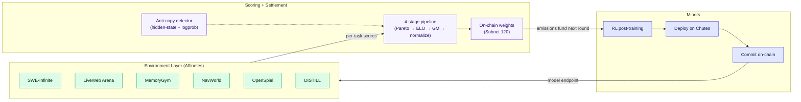

```mermaid
flowchart LR
    subgraph MinerSide["Miners"]
        MT["RL post-training"]
        MD["Deploy on Chutes"]
        MC["Commit on-chain"]
        MT --> MD --> MC
    end

    subgraph Envs["Environment Layer (Affinetes)"]
        E1["SWE-Infinite"]
        E2["LiveWeb Arena"]
        E3["MemoryGym"]
        E4["NavWorld"]
        E5["OpenSpiel"]
        E6["DISTILL"]
    end

    subgraph Settle["Scoring + Settlement"]
        SC["4-stage pipeline<br/>(Pareto → ELO → GM → normalize)"]
        AC["Anti-copy detector<br/>(hidden-state + logprob)"]
        W["On-chain weights<br/>(Subnet 120)"]
        SC --> W
        AC -.-> SC
    end

    MC -->|"model endpoint"| Envs
    Envs -->|"per-task scores"| SC
    W -->|"emissions fund next round"| MT

    classDef miner fill:#e0e7ff,stroke:#4f46e5,color:#1e1b4b
    classDef env fill:#dcfce7,stroke:#16a34a,color:#052e16
    classDef settle fill:#f5f3ff,stroke:#7c3aed,color:#2e1065

    class MT,MD,MC miner
    class E1,E2,E3,E4,E5,E6 env
    class SC,AC,W settle
```
