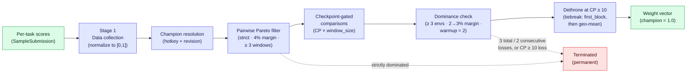

```mermaid
flowchart LR
    IN["Per-task scores<br/>(SampleSubmission)"]
    S1["Stage 1<br/>Data collection<br/>(normalize to [0,1])"]
    CR["Champion resolution<br/>(hotkey + revision)"]
    PF["Pairwise Pareto filter<br/>(strict · 4% margin ·<br/>≥ 3 windows)"]
    CG["Checkpoint-gated<br/>comparisons<br/>(CP × window_size)"]
    DOM["Dominance check<br/>(≥ 3 envs · 2→3% margin ·<br/>warmup = 2)"]
    DT["Dethrone at CP ≥ 10<br/>(tiebreak: first_block,<br/>then geo-mean)"]
    OUT["Weight vector<br/>(champion = 1.0)"]
    TERM["Terminated<br/>(permanent)"]

    IN --> S1 --> CR --> PF
    PF --> CG --> DOM --> DT --> OUT
    PF -.->|"strictly dominated"| TERM
    DOM -.->|"3 total / 2 consecutive<br/>losses, or CP ≥ 10 loss"| TERM

    classDef stage fill:#e0e7ff,stroke:#4f46e5,color:#1e1b4b
    classDef io fill:#dcfce7,stroke:#16a34a,color:#052e16
    classDef term fill:#fee2e2,stroke:#dc2626,color:#450a0a

    class S1,CR,PF,CG,DOM,DT stage
    class IN,OUT io
    class TERM term
```
