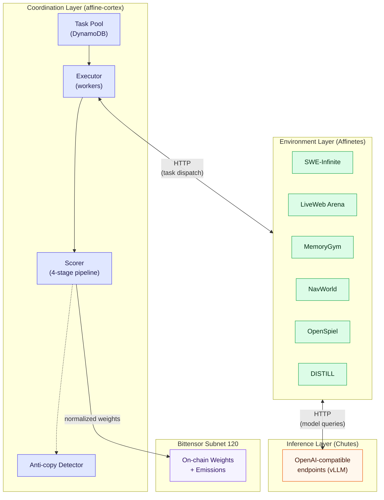

```mermaid
flowchart TB
    subgraph Coordination["Coordination Layer (affine-cortex)"]
        TP["Task Pool<br/>(DynamoDB)"]
        EX["Executor<br/>(workers)"]
        SC["Scorer<br/>(4-stage pipeline)"]
        AC["Anti-copy Detector"]
        TP --> EX
        EX --> SC
        SC -.-> AC
    end

    subgraph Environment["Environment Layer (Affinetes)"]
        SWE["SWE-Infinite"]
        LW["LiveWeb Arena"]
        MG["MemoryGym"]
        NW["NavWorld"]
        OS["OpenSpiel"]
        DIS["DISTILL"]
    end

    subgraph Inference["Inference Layer (Chutes)"]
        GPU["OpenAI-compatible<br/>endpoints (vLLM)"]
    end

    subgraph Chain["Bittensor Subnet 120"]
        W["On-chain Weights<br/>+ Emissions"]
    end

    EX <-->|"HTTP<br/>(task dispatch)"| Environment
    Environment <-->|"HTTP<br/>(model queries)"| GPU
    SC -->|"normalized weights"| W

    classDef coord fill:#e0e7ff,stroke:#4f46e5,color:#1e1b4b
    classDef env fill:#dcfce7,stroke:#16a34a,color:#052e16
    classDef infra fill:#fff7ed,stroke:#ea580c,color:#431407
    classDef chain fill:#f5f3ff,stroke:#7c3aed,color:#2e1065

    class TP,EX,SC,AC coord
    class SWE,LW,MG,NW,OS,DIS env
    class GPU infra
    class W chain
```
