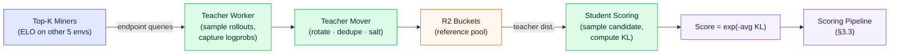

```mermaid
flowchart LR
    TM["Top-K Miners<br/>(ELO on other 5 envs)"]
    TW["Teacher Worker<br/>(sample rollouts,<br/>capture logprobs)"]
    MV["Teacher Mover<br/>(rotate · dedupe · salt)"]
    R2["R2 Buckets<br/>(reference pool)"]
    SS["Student Scoring<br/>(sample candidate,<br/>compute KL)"]
    OUT["Score = exp(-avg KL)"]
    SP["Scoring Pipeline<br/>(§3.3)"]

    TM -->|"endpoint queries"| TW
    TW --> MV --> R2
    R2 -->|"teacher dist."| SS
    SS --> OUT --> SP

    classDef miner fill:#e0e7ff,stroke:#4f46e5,color:#1e1b4b
    classDef pipe fill:#dcfce7,stroke:#16a34a,color:#052e16
    classDef store fill:#fff7ed,stroke:#ea580c,color:#431407
    classDef out fill:#f5f3ff,stroke:#7c3aed,color:#2e1065

    class TM miner
    class TW,MV,SS pipe
    class R2 store
    class OUT,SP out
```
